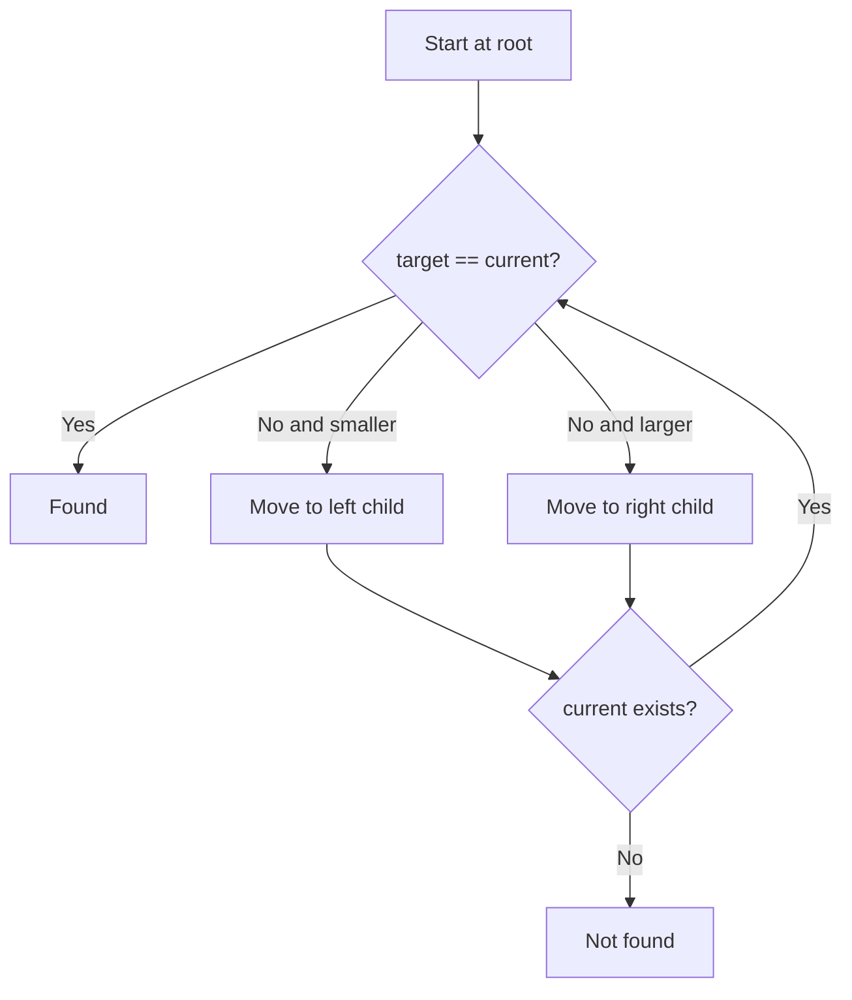

# Data Structures - Lecture 8

## Binary Search Tree Definition

A **binary search tree** or **BST** is a binary tree that satisfies an ordering rule at every node.

The lecture states these conditions:

1. the key of the root is greater than every key in the left subtree
2. the key of the root is less than every key in the right subtree
3. the left and right subtrees are also binary search trees

Each comparison lets you ignore one whole subtree.

| Term              | Exam meaning                                        |
| ----------------- | --------------------------------------------------- |
| **BST**           | A binary tree with ordered left and right subtrees. |
| **Key**           | The value used for comparison and placement.        |
| **Left subtree**  | Contains only smaller keys than the current node.   |
| **Right subtree** | Contains only larger keys than the current node.    |

_Important caution:_ a tree may be binary but still not be a BST. The shape alone is not enough; the ordering property must hold at every node.

## Searching in a BST

Searching starts at the root and repeats this decision:

- if the target key equals the current key, it is found
- if the target key is smaller, move left
- if the target key is larger, move right
- if you reach `nullptr`, the item is not present

This is why absent values can be rejected quickly.



## Smallest and Largest Values

- the **smallest** value is found by going left as far as possible
- the **largest** value is found by going right as far as possible

| Goal         | Direction         |
| ------------ | ----------------- |
| Find minimum | Keep moving left  |
| Find maximum | Keep moving right |

These rules are reused during deletion.

## Inserting a New Key

To insert a key:

1. create a new node
2. if the tree is empty, make it the root
3. otherwise search downward exactly as in BST search
4. stop when the current pointer becomes `nullptr`
5. attach the new node to the last visited node

```cpp
// Iterative BST insertion as shown by the lecture idea.
using EntryType = int;

struct NodeType {
  EntryType info;
  NodeType* left;
  NodeType* right;
};

using TreeType = NodeType*;

void Insert(TreeType* t, EntryType item) {
  NodeType* p = new NodeType;
  p->info = item;
  p->left = nullptr;
  p->right = nullptr;

  if (!(*t)) {
    *t = p;
  } else {
    NodeType* pre = nullptr;
    NodeType* cur = *t;

    while (cur) {
      pre = cur;
      if (item < cur->info) {
        cur = cur->left;
      } else {
        cur = cur->right;
      }
    }

    if (item < pre->info) {
      pre->left = p;
    } else {
      pre->right = p;
    }
  }
}
```

_Exam note:_ the lecture shows insertion iteratively.

## Deleting from a BST

Deletion first locates the node and its parent.

The lecture summarizes the cases this way:

- if the item is not present: do nothing
- if the item is in a leaf: remove the leaf
- if the item is in a non-leaf with one child: replace the node with its child
- if the item is in a non-leaf with two children: replace it with the largest item in the left subtree, then remove that moved node

The slides also note that the smallest item in the right subtree could be used instead.

## Delete Search Phase

The main `Delete` function keeps two pointers:

- `q`: the current node being examined
- `r`: the parent of `q`

```cpp
int Delete(TreeType* t, EntryType k) {
  int found = 0;
  NodeType* q = *t;
  NodeType* r = nullptr;

  while (q && !(found = (k == q->info))) {
    r = q;
    if (k < q->info) {
      q = q->left;
    } else {
      q = q->right;
    }
  }

  if (found) {
    if (!r) {
      DeleteNode(t);
    } else if (k < r->info) {
      DeleteNode(&r->left);
    } else {
      DeleteNode(&r->right);
    }
  }

  return found;
}
```

### Why the Parent Pointer Matters

If `r == nullptr`, the deleted node is the root.

## DeleteNode Cases

### Case 1: No Left Child

If the node has no left child, replace it with its right child.

### Case 2: No Right Child

If the node has no right child, replace it with its left child.

### Case 3: Two Children

If the node has two children:

1. move to the left subtree
2. keep moving right to find the largest key there
3. copy that key into the node being deleted
4. relink the predecessor's parent
5. delete the predecessor node

```cpp
void DeleteNode(TreeType* pt) {
  NodeType* q = *pt;

  if (!q->left) {
    *pt = q->right;
  } else if (!q->right) {
    *pt = q->left;
  } else {
    NodeType* r = nullptr;
    q = q->left;

    while (q->right) {
      r = q;
      q = q->right;
    }

    (*pt)->info = q->info;

    if (r) {
      r->right = q->left;
    } else {
      (*pt)->left = q->left;
    }
  }

  delete q;
}
```

_Critical idea:_ in the two-child case, the node value is replaced first, then the predecessor node is deleted.

## Why the Predecessor Works

The largest item in the left subtree is the **inorder predecessor**. It is safe because:

- it stays smaller than the original right subtree
- it remains the largest valid value from the left side
- it preserves BST ordering after replacement

The lecture also allows using the smallest item in the right subtree instead.

## High-Yield Comparisons

| Operation             | Main idea                                                        |
| --------------------- | ---------------------------------------------------------------- |
| Search                | Compare, then move left or right                                 |
| Find minimum          | Follow left links only                                           |
| Find maximum          | Follow right links only                                          |
| Insert                | Search for a null child position, then attach a new node         |
| Delete leaf           | Remove it directly                                               |
| Delete one-child node | Replace it with its only child                                   |
| Delete two-child node | Replace by predecessor or successor, then delete that moved node |

## Final Review Points

- A BST keeps smaller keys on the left and larger keys on the right.
- Search, insert, and delete depend on repeated comparisons.
- The minimum is the leftmost node; the maximum is the rightmost node.
- Deletion has leaf, one-child, and two-child cases.
- The lecture uses the largest value in the left subtree for the two-child case.
