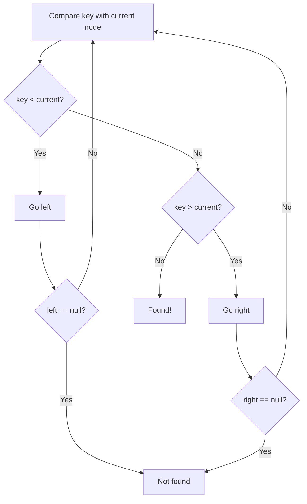
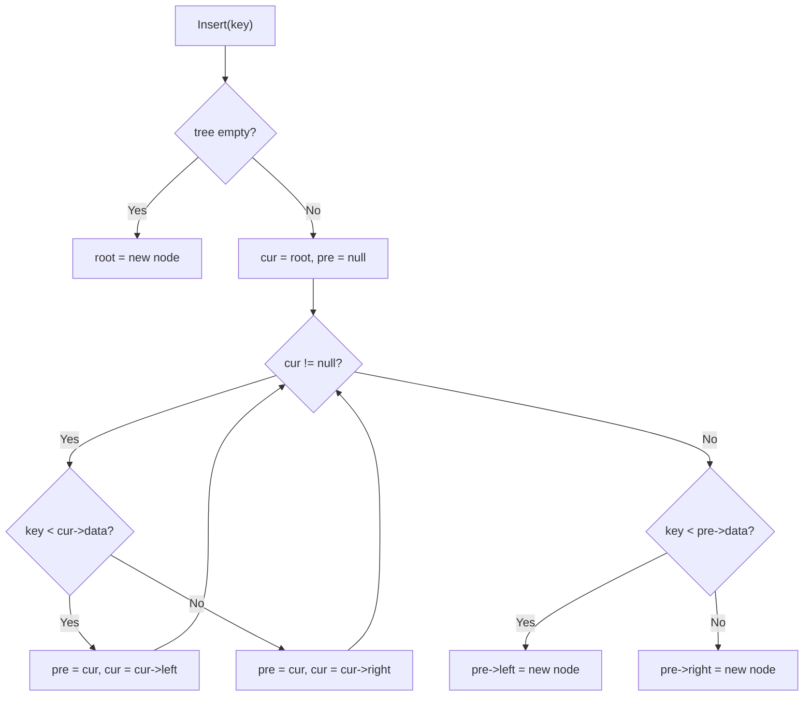
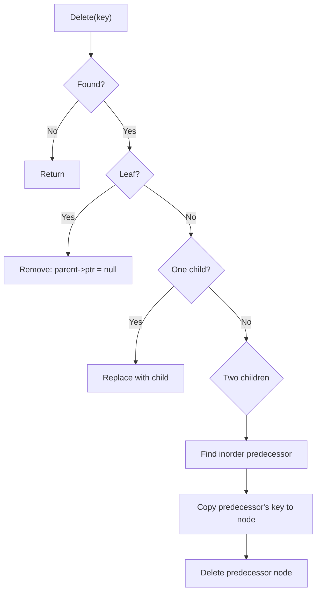

# Data Structures - Lecture 8

## Binary Search Tree Definition

A **binary search tree (BST)** is a binary tree where every node has a **key** and satisfies: 

1. all keys in the left subtree are less than the root's key.
2. all keys in the right subtree are greater.
3. left and right subtrees are themselves BSTs.

This ordering property enables efficient search by eliminating half the remaining nodes at each comparison.

## BST Search

To find a key: compare with current node — go left if smaller, right if larger. Repeat until found or a null pointer is reached. **Smallest** value is the leftmost node; **largest** is the rightmost.



## BST Insert

Traverse the tree comparing keys until a null child is reached, then attach the new node there. Insertion uses an iterative approach — recursion adds stack overhead without benefit since we only traverse one path.



## BST Delete

**Four cases** when deleting a node with key `k`:

| Case  | Condition     | Action                                                                                                  |
| ----- | ------------- | ------------------------------------------------------------------------------------------------------- |
| **1** | Key not found | Do nothing                                                                                              |
| **2** | Leaf node     | Remove it (set parent pointer to null)                                                                  |
| **3** | One child     | Replace node with its child                                                                             |
| **4** | Two children  | Find **inorder predecessor** (largest in left subtree), copy its key, then delete that predecessor node |

> [!WARNING]
> When deleting a node with two children, you can also use the **inorder successor** (smallest in right subtree) instead of the predecessor. Both preserve BST ordering.



## BST Implementation

```cpp
struct Node {
  char data;
  Node* left;
  Node* right;
};

class BST {
private:
  Node* root;

public:
  BST() { this->root = nullptr; }

  void insert(char key) {
    Node* p = new Node;
    p->data = key;
    p->left = nullptr;
    p->right = nullptr;

    if (!this->root) {
      this->root = p;
      return;
    }

    Node* cur = this->root;
    Node* pre = nullptr;
    while (cur) {
      pre = cur;
      if (key < cur->data) cur = cur->left;
      else cur = cur->right;
    }

    if (key < pre->data) pre->left = p;
    else pre->right = p;
  }

  void remove(char key) {
    this->root = removeHelper(this->root, key);
  }

private:
  Node* removeHelper(Node* t, char key) {
    if (!t) return nullptr;

    if (key < t->data) {
      t->left = removeHelper(t->left, key);
    } else if (key > t->data) {
      t->right = removeHelper(t->right, key);
    } else {
      // Case 1 & 2: no children or one child
      if (!t->left) return t->right;
      if (!t->right) return t->left;

      // Case 3: two children — find inorder predecessor
      Node* pred = t->left;
      Node* predParent = nullptr;
      while (pred->right) {
        predParent = pred;
        pred = pred->right;
      }

      t->data = pred->data;
      if (predParent) predParent->right = pred->left;
      else t->left = pred->left;

      delete pred;
    }
    return t;
  }
};
```

> [!NOTE]
> The `remove` method is recursive — it uses the call stack to track the path from root to the target node, then unlinks on the way back up. The `insert` method is iterative (no recursion) to avoid unnecessary stack overhead.

---

_5 min read (source: 4 min)_
