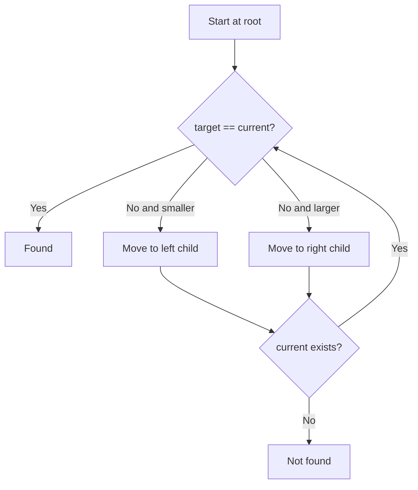

# Trees II: Binary Search Trees

## Binary Search Tree Definition

A **binary search tree** or **BST** is a binary tree that satisfies an ordering rule at every node:

1. the root key is greater than every key in the left subtree
2. the root key is less than every key in the right subtree
3. the left and right subtrees are also BSTs

Each comparison lets you ignore one whole subtree.

| Term              | Exam meaning                                        |
| ----------------- | --------------------------------------------------- |
| **BST**           | A binary tree with ordered left and right subtrees. |
| **Key**           | The value used for comparison and placement.        |
| **Left subtree**  | Contains only smaller keys than the current node.   |
| **Right subtree** | Contains only larger keys than the current node.    |

_Important caution:_ a tree may be binary but still not be a BST.

## Searching in a BST

Searching starts at the root and repeats this logic:

- if the target key equals the current key, it is found
- if the target key is smaller, move left
- if the target key is larger, move right
- if you reach `nullptr`, the item is not present

This is why absent values can be rejected quickly.

## Smallest and Largest Values

- the **smallest** value is found by going left as far as possible
- the **largest** value is found by going right as far as possible

These rules are reused during deletion.

## Inserting a New Key

Insertion follows the same directional comparisons as search. The new node is attached when a null child position is found.

_Exam note:_ the lecture showed insertion iteratively.

## Deleting from a BST

Deletion first locates the node and its parent, then applies one of three cases:

- **not present**: do nothing
- **leaf**: remove it directly
- **one child**: replace the node with its only child
- **two children**: replace it with the **largest value in the left subtree**, then remove that moved node

The lecture also notes that the smallest value in the right subtree could be used instead.

_Critical idea:_ in the two-child case, the node value is replaced first, then the predecessor node is deleted.

## Why the Predecessor Works

The largest item in the left subtree is the **inorder predecessor**. It is safe because it remains:

- smaller than the original right subtree
- the largest valid choice/value from the left side
- consistent with BST ordering after replacement

## High-Yield Comparisons

| Operation             | Main idea                                                        |
| --------------------- | ---------------------------------------------------------------- |
| Search                | Compare, then move left or right                                 |
| Find minimum          | Follow left links only                                           |
| Find maximum          | Follow right links only                                          |
| Insert                | Search for a null child position, then attach a new node         |
| Delete leaf           | Remove it directly                                               |
| Delete one-child node | Replace it with its only child                                   |
| Delete two-child node | Replace by predecessor or successor, then delete that moved node |

## Final Review Points

- A BST keeps smaller keys on the left and larger keys on the right.
- Search, insert, and delete depend on repeated comparisons.
- The minimum is the leftmost node; the maximum is the rightmost node.
- Deletion has leaf, one-child, and two-child cases.
- The lecture uses the largest value in the left subtree for the two-child case.
