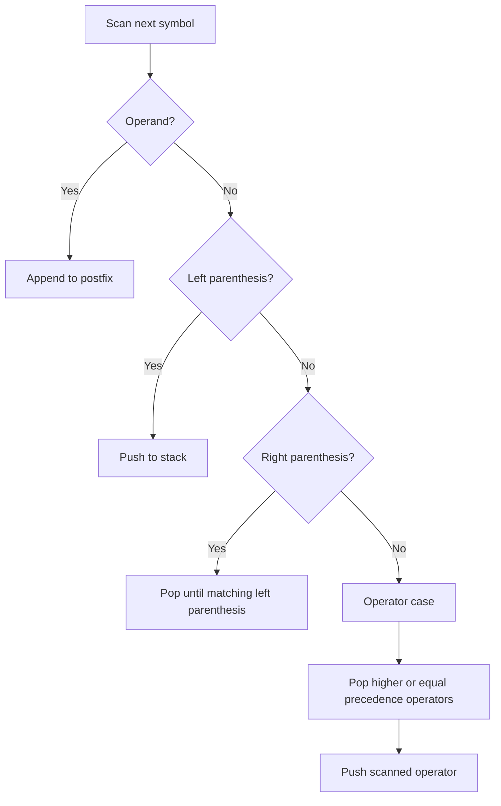

# Data Structures - Lecture 9

## Stack Applications Overview

This lecture is about **applications of stack**. The OCR-recovered slides are internally labeled `LECTURE NO. 8: APPLICATIONS ON STACK`, but the source file is `Lecture-9.pdf`, so this note follows the file number.

The lecture lists these stack applications:

- **balancing symbols**
- **expression evaluation**
- **reversal of sequences**
- **backtracking** such as game playing, path finding, and exhaustive search
- **function calls**
- **page-visited history** in a web browser
- **undo sequence** in a text editor

The main focus is expression conversion and postfix evaluation.

| Term                  | Meaning                                                         |
| --------------------- | --------------------------------------------------------------- |
| **Operand**           | A value, variable, or address on which an operator acts.        |
| **Operator**          | A symbol that performs a task such as `+`, `-`, `*`, or `/`.    |
| **Expression**        | A collection of operands and operators that represents a value. |
| **Stack application** | A problem where LIFO order helps solve processing steps.        |

## Expression Basics

The lecture defines an **expression** as a collection of operators and operands that represents a specific value.

- operators perform operations
- operands are the values the operator works on
- operands may be constants, variables, or addresses

## Expression Forms

One expression can be written in different forms.

| Infix   | Postfix | Prefix  |
| ------- | ------- | ------- |
| `A+B-C` | `AB+C-` | `-+ABC` |

The lecture states that we can convert between forms such as:

- infix to postfix
- infix to prefix
- postfix to prefix

## General Conversion Idea

The lecture gives this manual method:

1. find the operators in the infix expression
2. determine the order of evaluation using precedence
3. convert each operator in that order to the required form

For `A + B * C`:

- operators are `+` and `*`
- `*` has higher precedence than `+`
- so `*` is converted before `+`

## Infix to Postfix Conversion Rules

The lecture gives these rules for manual conversion:

1. parenthesize the expression from left to right
2. parenthesize higher-precedence operators first
3. once part of the expression is converted to postfix, treat it as one operand
4. remove the parentheses at the end

Example:

- `A+B*C` becomes `A+(B*C)`
- convert `B*C` to `BC*`
- then convert `A+(BC*)` to `ABC*+`

Another lecture example:

| Infix         | Postfix   |
| ------------- | --------- |
| `A+B`         | `AB+`     |
| `A+B-C`       | `AB+C-`   |
| `(A+B)*(C-D)` | `AB+CD-*` |

## Infix to Prefix Examples

The lecture also gives infix-to-prefix examples.

| Infix   | Prefix  |
| ------- | ------- |
| `A+B`   | `+AB`   |
| `A+B-C` | `-+ABC` |

_Important idea:_ infix puts the operator between operands, postfix after, and prefix before.

## Operator Precedence

Expression evaluation depends on **precedence**.

The lecture gives this priority order:

| Priority | Operators                  | Note                           |
| -------- | -------------------------- | ------------------------------ |
| Highest  | parentheses                | grouped part first             |
| Next     | exponentiation, unary sign | before multiplication/division |
| Next     | `*`, `/`, `%`              | left to right                  |
| Lowest   | `+`, `-`                   | left to right                  |

## Infix to Postfix Using a Stack

The lecture then gives the stack-based algorithm.

1. scan the infix expression from left to right
2. if the symbol is an operand, append it to the postfix output
3. if the symbol is an operator:
4. push it if the stack is empty, or if it has higher precedence than the operator on top of the stack, or if the top is a left parenthesis
5. otherwise pop operators of greater or equal precedence and append them, then push the scanned operator
6. if the symbol is a left parenthesis, push it
7. if the symbol is a right parenthesis, pop and output until the matching left parenthesis is found, then discard the pair
8. after scanning ends, pop the remaining operators



```cpp
// Infix to postfix conversion using a stack of operators.
void InfixToPostfix(const string& infix, string& postfix) {
  StackType stk;
  CreateStack(&stk);
  Push(&stk, '(');

  string expr = infix + ")";

  for (char symb : expr) {
    if (isalnum(symb)) {
      postfix += symb;
    } else if (symb == '(') {
      Push(&stk, symb);
    } else if (IsOperator(symb)) {
      while (!StackEmpty(stk) && IsOperator(StackTop(stk)) &&
             Precedence(StackTop(stk)) >= Precedence(symb)) {
        char op;
        Pop(&stk, &op);
        postfix += op;
      }
      Push(&stk, symb);
    } else if (symb == ')') {
      char op;
      Pop(&stk, &op);
      while (op != '(') {
        postfix += op;
        Pop(&stk, &op);
      }
    }
  }
}
```

This C++ version keeps the lecture logic in cleaner form.

## Example: `(A+B)*(C-D)`

Key steps:

- push `(` when it appears
- append operands directly: `A`, `B`, `C`, `D`
- when `)` is reached, pop until `(`
- after the first pair, output becomes `AB+`
- after the second pair, output becomes `AB+CD-`
- finally pop `*`

So the postfix form is:

```text
AB+CD-*
```

## Postfix Evaluation Using a Stack

The lecture rule is:

1. read the postfix expression from left to right
2. if the symbol is an operand, push it onto the operand stack
3. if the symbol is an operator, pop **two** operands
4. apply the operator
5. push the result back
6. after the scan ends, the final pop is the answer

_Critical order rule:_ the first pop is the **second operand** and the second pop is the **first operand**.

## Postfix Evaluation Algorithm

```cpp
// Evaluate a postfix expression using a stack of operands.
int EvaluatePostfix(const string& expr) {
  StackType opndstk;
  CreateStack(&opndstk);

  for (char symb : expr) {
    if (isdigit(symb)) {
      Push(&opndstk, symb - '0');
    } else {
      int opnd2;
      int opnd1;
      Pop(&opndstk, &opnd2);
      Pop(&opndstk, &opnd1);

      int value = Apply(symb, opnd1, opnd2);
      Push(&opndstk, value);
    }
  }

  int result;
  Pop(&opndstk, &result);
  return result;
}
```

## Example: `5 3 + 8 2 - *`

| Read symbol | Stack action                | Meaning                    |
| ----------- | --------------------------- | -------------------------- |
| `5`         | push `5`                    | start first operand        |
| `3`         | push `3`                    | second operand ready       |
| `+`         | pop `3`, pop `5`, push `8`  | computes `5+3`             |
| `8`         | push `8`                    | begin second subexpression |
| `2`         | push `2`                    | second operand ready       |
| `-`         | pop `2`, pop `8`, push `6`  | computes `8-2`             |
| `*`         | pop `6`, pop `8`, push `48` | computes `(5+3)*(8-2)`     |

Final result:

```text
48
```

## High-Yield Distinctions

| Idea               | What to remember                           |
| ------------------ | ------------------------------------------ |
| Infix              | Operator is between operands               |
| Prefix             | Operator comes before operands             |
| Postfix            | Operator comes after operands              |
| Conversion stack   | Usually stores operators                   |
| Evaluation stack   | Usually stores operands or partial results |
| Postfix evaluation | Pop two operands for each binary operator  |

## Final Review Points

- The lecture uses stacks for conversion and evaluation of expressions.
- Infix, postfix, and prefix are different notations for the same expression structure.
- Operator precedence controls conversion and evaluation order.
- In infix-to-postfix conversion, operands go directly to output.
- Operators are pushed and popped according to precedence and parentheses.
- In postfix evaluation, each operator combines the top two stack values.
- Operand order matters: `opnd1 op symb opnd2`, not the reverse.
