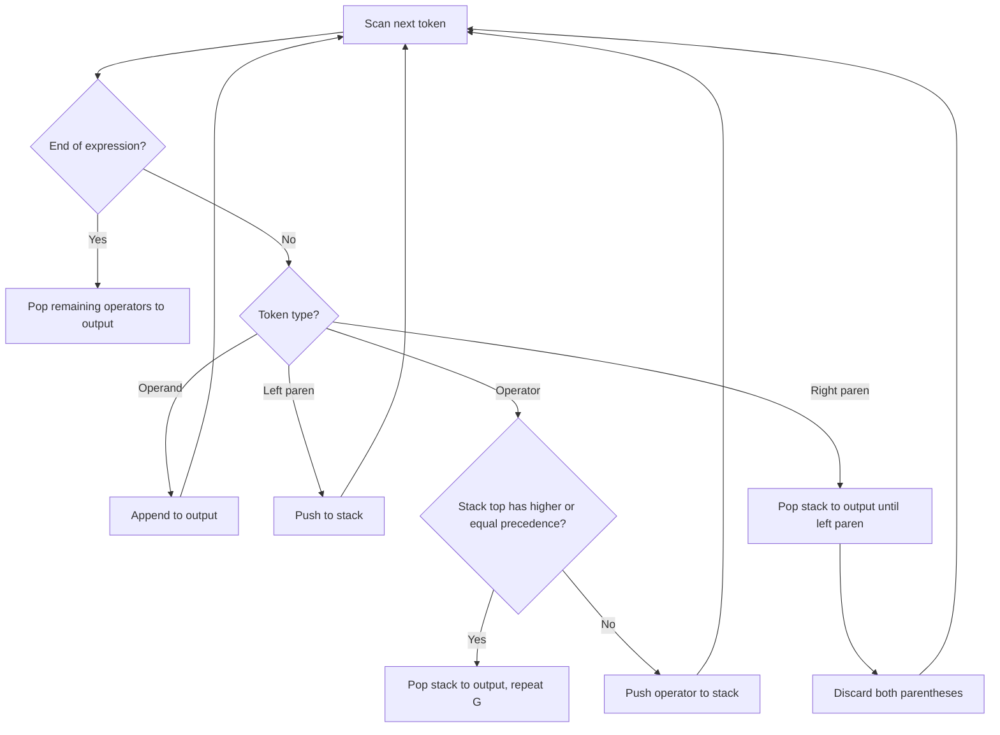
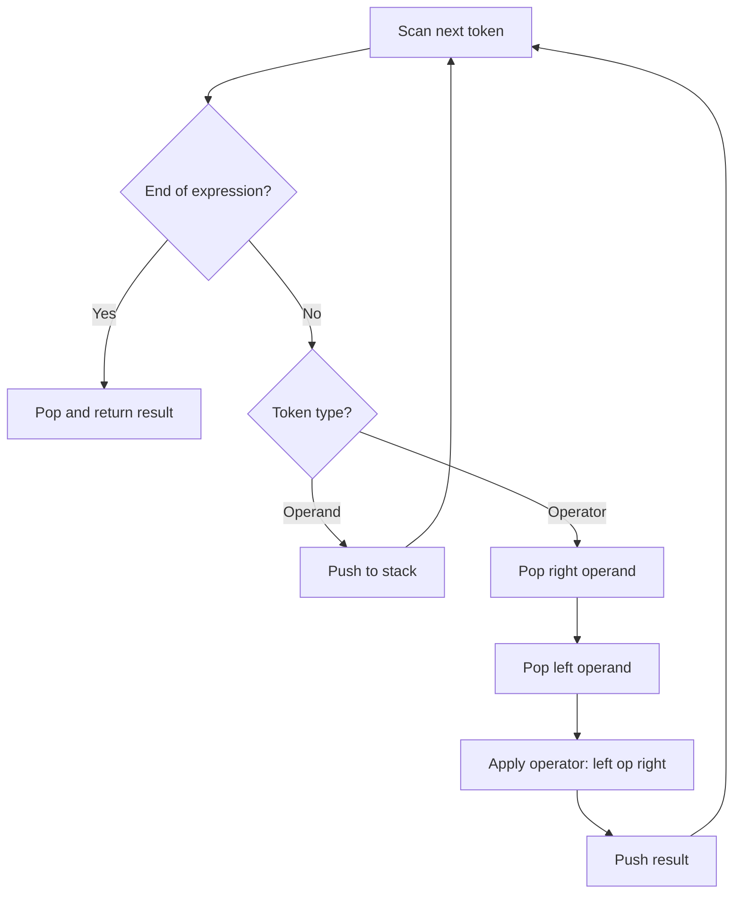

# Data Structures - Lecture 9

## Stack Applications

Stacks are used for: **balancing symbols**, **expression evaluation**, **reversal of sequences**, **backtracking** (games, pathfinding, exhaustive search), **function calls** (call stack), **browser history**, and **undo sequences**.

## Expression Types

An **expression** combines operators and operands to represent a value. Three notations:

| Notation            | Format                   | Example of `A + B` |
| ------------------- | ------------------------ | ------------------ |
| **Infix**           | operand operator operand | `A + B`            |
| **Postfix** (RPN)   | operand operand operator | `AB+`              |
| **Prefix** (Polish) | operator operand operand | `+AB`              |

**Operator precedence** (highest to lowest):

| Priority | Operators                       | Associativity |
| -------- | ------------------------------- | ------------- |
| 1        | `() [] {}`                      | —             |
| 2        | `^` (exponentiation), unary `-` | Right to left |
| 3        | `* / %`                         | Left to right |
| 4        | `+ -`                           | Left to right |

## Infix to Postfix Conversion (Stack Algorithm)

Scan left to right. **Operands** go directly to output. **Operators** are pushed to stack after popping any stacked operators with equal or higher precedence. **Left parentheses** are pushed. **Right parentheses** pop until the matching left parenthesis (both discarded).

### Conversion Examples

| Infix               | Postfix           |
| ------------------- | ----------------- |
| `A+B`               | `AB+`             |
| `A+B*C`             | `ABC*+`           |
| `(A+B)*C`           | `AB+C*`           |
| `(A+B)*(C-D)`       | `AB+CD-*`         |
| `A^B*C-D+E/F/(G+H)` | `AB^C*D-EF/GH+/+` |

## Postfix Evaluation (Stack Algorithm)

Scan left to right. **Operands** are pushed. **Operators** pop two operands (first pop = right operand, second pop = left operand), compute, push result. Final pop is the answer.

### Evaluation Example

**Postfix:** `5 3 + 8 2 - *` -> evaluates to **48**

| Symbol | Stack After | Operation    |
| ------ | ----------- | ------------ |
| `5`    | `5`         | push         |
| `3`    | `5, 3`      | push         |
| `+`    | `8`         | `5 + 3 = 8`  |
| `8`    | `8, 8`      | push         |
| `2`    | `8, 8, 2`   | push         |
| `-`    | `8, 6`      | `8 - 2 = 6`  |
| `*`    | `48`        | `8 * 6 = 48` |

> [!WARNING]
> When popping for an operator, the **first pop** is operand2 and the **second pop** is operand1. Order matters for non-commutative operators like `-` and `/`.

---

_3 min read (source: 18 min)_
