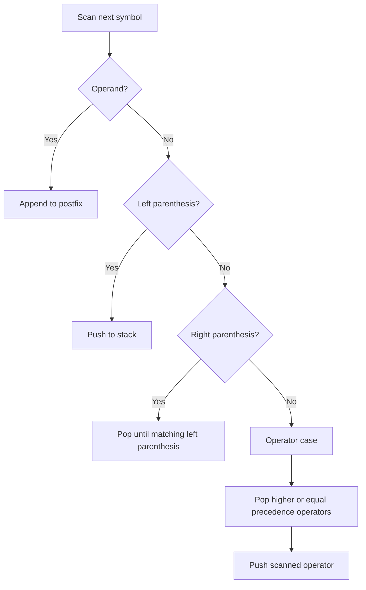

# Stacks II: Stack Applications and Expressions

## Stack Applications Overview

This lecture focuses on **applications of stack**. The OCR-recovered slides are internally labeled `LECTURE NO. 8: APPLICATIONS ON STACK`, but the authoritative source file is `Lecture-9.pdf`, so this note follows the file number.

The lecture lists these applications:

- **balancing symbols**
- **expression evaluation**
- **reversal of sequences**
- **backtracking** such as game playing, path finding, and exhaustive search
- **function calls**
- **browser history**
- **undo sequence**

The main focus is expression conversion and postfix evaluation.

## Expression Basics

An **expression** is a collection of **operators** and **operands** that represents a value.

| Term           | Meaning                                                   |
| -------------- | --------------------------------------------------------- |
| **Operand**    | value, variable, or address on which an operator acts     |
| **Operator**   | symbol such as `+`, `-`, `*`, or `/`                      |
| **Expression** | collection of operators and operands representing a value |

## Expression Forms

One expression can be written in different notations.

| Infix   | Postfix | Prefix  |
| ------- | ------- | ------- |
| `A+B-C` | `AB+C-` | `-+ABC` |

The key difference is operator placement:

- **infix**: operator between operands
- **postfix**: operator after operands
- **prefix**: operator before operands

## Infix to Postfix Conversion Rules

The lecture gives these rules for manual conversion:

1. parenthesize by evaluation order
2. parenthesize higher-precedence operators first
3. once part of the expression is converted to postfix, treat it as one operand
4. remove parentheses at the end

Example:

- `A+B*C` becomes `A+(B*C)`
- convert `B*C` to `BC*`
- then convert `A+(BC*)` to `ABC*+`

Example mappings include:

| Infix         | Postfix   |
| ------------- | --------- |
| `A+B`         | `AB+`     |
| `A+B-C`       | `AB+C-`   |
| `(A+B)*(C-D)` | `AB+CD-*` |

## Operator Precedence

Expression evaluation depends on **precedence**.

The lecture priority order is:

| Priority | Operators                  | Note                           |
| -------- | -------------------------- | ------------------------------ |
| Highest  | parentheses                | grouped part first             |
| Next     | exponentiation, unary sign | before multiplication/division |
| Next     | `*`, `/`, `%`              | left to right                  |
| Lowest   | `+`, `-`                   | left to right                  |

## Infix to Postfix Using a Stack

The lecture algorithm scans from left to right:

1. operands go directly to output
2. left parentheses are pushed
3. right parentheses trigger popping until the matching left parenthesis
4. operators are pushed or cause popping based on precedence
5. remaining operators are popped at the end

## Postfix Evaluation Using a Stack

The lecture rule is:

1. read the postfix expression from left to right
2. if operand, push it onto the operand stack
3. when an operator appears, pop **two** operands
4. apply the operator
5. push the result back
6. the final remaining value is the answer

> [!CAUTION]
> In postfix evaluation, the first popped value is the **second operand**, and the second popped value is the **first operand**.

## High-Yield Distinctions

| Idea               | What to remember                           |
| ------------------ | ------------------------------------------ |
| Infix              | Operator is between operands               |
| Prefix             | Operator comes before operands             |
| Postfix            | Operator comes after operands              |
| Conversion stack   | Usually stores operators                   |
| Evaluation stack   | Usually stores operands or partial results |
| Postfix evaluation | Pop two operands for each binary operator  |

## Final Review Points

- The lecture uses stacks for conversion and evaluation of expressions.
- Infix, postfix, and prefix are different notations for the same expression structure.
- Operator precedence controls conversion and evaluation order.
- In infix-to-postfix conversion, operands go directly to output.
- Operators are pushed and popped according to precedence and parentheses.
- In postfix evaluation, each operator combines the top two stack values.
- Operand order matters: `opnd1 op symb opnd2`, not the reverse.
