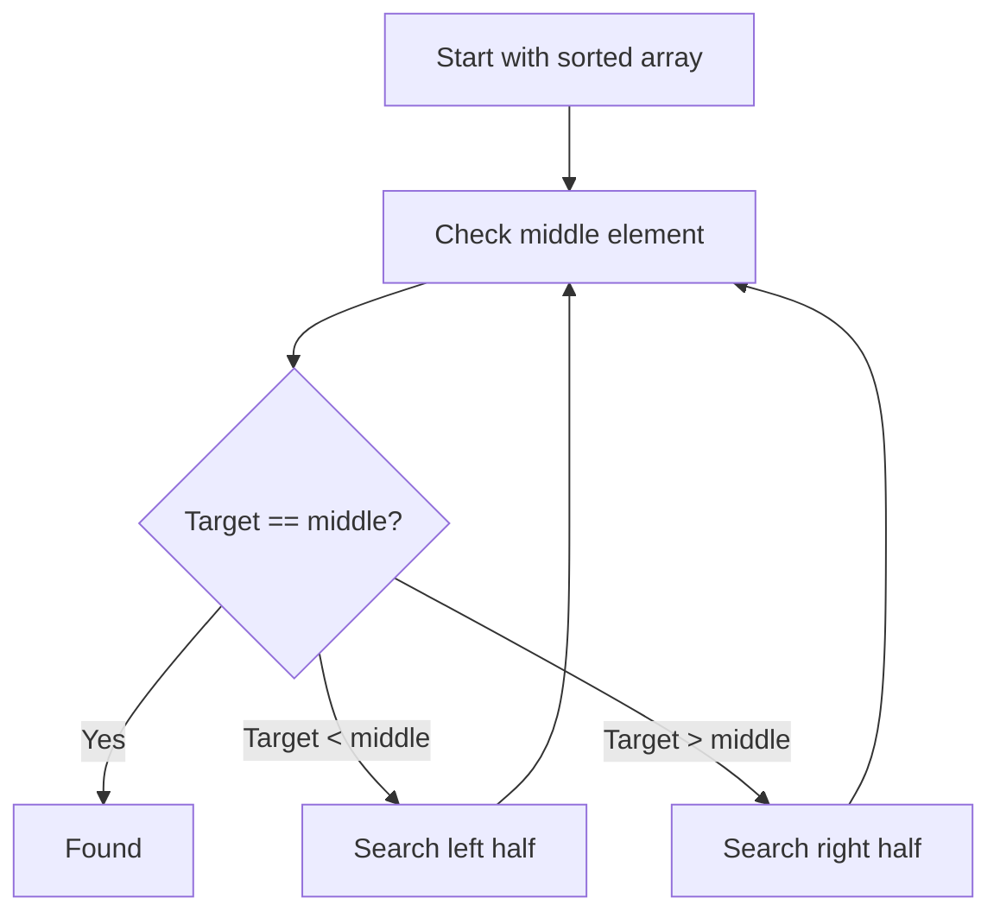

---
prev:
  text: "Section 6"
  link: "/College/yearTwo/secondTerm/DataStructures/Sections/Section-6"
next: false
title: Section 7
---

## Searching and Scope

**Searching** is the operation of locating a target element inside a **data structure**. The section scope is narrow: it covers **linear search** and **binary search** in arrays, and only names **hashing** and **tree-based searching** as other search families without explaining them. That boundary matters in exams: if the question asks for methods discussed in detail here, the answer is linear and binary search, not hashing internals or tree traversal rules. Searching is used in **databases**, **file systems**, and **AI and Machine Learning** because these systems repeatedly test whether a required item exists and where it is stored. The core exam idea is that search algorithms differ mainly by the assumptions they require about the data before searching begins.

> [!IMPORTANT]
> **Binary search** is excluded from unsorted arrays. If the array is not sorted, its elimination logic is invalid.

## Linear Search: Definition, Boundary, and Logic

**Linear search** is a **sequential search method** that checks elements one by one from the beginning until the target is found or the array ends. It works on **unsorted arrays**, which is its key boundary: it does not require prior ordering, but it pays for that flexibility by potentially examining every element. It starts at index `0`, compares the current element with the target, then moves forward exactly one position at a time. This works because it makes no assumptions about element order; the only safe way to guarantee finding the target in arbitrary data is to inspect each candidate in sequence.

### Active Recall Path

1. Start from the **first element**.
2. **Compare** it with the target value.
3. If equal, **return the index**.
4. If not equal, move to the **next element**.
5. Repeat until the target is found or the **end is reached**.

_Common trap:_ reaching the end means the item is **not found**; it does not mean the last checked index should be returned.

## Binary Search: Preconditions and Divide-and-Conquer

**Binary search** is a faster search algorithm that works on **sorted arrays only** and uses **divide-and-conquer**. Instead of checking every element, it checks the **middle element** and eliminates half of the remaining data after each comparison. This is faster because each step removes a large part of the search space rather than only one element. The method depends completely on sorted order: if values increase consistently, then a target smaller than the middle can only be in the left half, and a target larger than the middle can only be in the right half.



> [!CAUTION]
> If the array is unsorted, the left-half/right-half decision is unreliable, so **binary search** can miss an existing value.

## Step Order and Why It Matters

The procedural order in **binary search** is testable because each step depends on the previous one being correct.

1. Find the **middle element**.
2. **Compare** the middle element with the target.
3. If equal, the target is **found**.
4. If the target is smaller, search the **left half**.
5. If the target is larger, search the **right half**.
6. Repeat on the remaining half.

This order matters because choosing a half before comparing the middle would be baseless. The comparison is the rule that justifies discarding data. In contrast, **linear search** never discards a block; it only advances one position, so its order is simpler but slower. Exam questions often test this exact contrast: one algorithm narrows by **one step**, the other narrows by **halves**.

## Linear Search vs. Binary Search

| Feature          | **Linear Search**             | **Binary Search**                     |
| ---------------- | ----------------------------- | ------------------------------------- |
| Data requirement | Works on **unsorted arrays**  | Requires **sorted arrays**            |
| Main idea        | Check elements **one by one** | Check **middle**, then eliminate half |
| Strategy type    | **Sequential**                | **Divide-and-conquer**                |
| Best case        | **O(1)**                      | **O(1)**                              |
| Average case     | **O(n)**                      | _Not stated in the source_            |
| Worst case       | **O(n)**                      | **O(log n)**                          |
| Main advantage   | No preprocessing assumption   | Much faster on sorted data            |
| Main limitation  | Can inspect all elements      | Fails logically on unsorted data      |

The best case is **O(1)** for both because the target may be found immediately: first element in linear search, middle element in binary search. The worst case differs because linear search may inspect all `n` elements, while binary search keeps shrinking the candidate range.

## Complexity, Exam Traps, and Named Search Families

**Time complexity** describes how running time grows as input size grows. For **linear search**, the source gives **Best Case: O(1)**, **Worst Case: O(n)**, and **Average Case: O(n)**. For **binary search**, the source gives **Best Case: O(1)** and **Worst Case: O(log n)** and states it is much faster than linear search. The exam trap is not just memorizing symbols, but linking them to behavior: `O(n)` means growth proportional to the number of elements checked, while `O(log n)` means growth proportional to repeated halving.

- **Search algorithm families named in the section**:
  - **Linear Search**
  - **Binary Search**
  - **Hashing** _(advanced only; no mechanism given here)_
  - **Tree-based searching** _(named only; no detailed procedure given here)_

> [!NOTE]
> Do not invent extra steps or formulas for **hashing** or **tree-based searching** from outside knowledge if the exam asks "according to this section."

## Hashing Fundamentals

The lecture on hashing makes **hashing** the next major search family after linear and binary search. It is a technique that retrieves a value using an index obtained from a key, without performing an ordinary search through all stored elements.

| Structure idea           | Access logic                   | Typical time in the lecture |
| ------------------------ | ------------------------------ | --------------------------- |
| **Balanced search tree** | Follow comparisons down levels | **O(log n)**                |
| **Hash table**           | Compute index from key         | **O(1)**                    |

### Map, Hash Table, and Hash Function

A **map** stores entries made of a **key** and a **value**. The array that stores entries is the **hash table**, and the rule that maps a key to an index is the **hash function**.

The lecture separates two stages:

1. convert the key into an integer **hash code**
2. compress that hash code into a valid table index

> [!CAUTION]
> A **hash code** is not automatically the final array index. It usually must be compressed into the table range.

## Collision Handling

A **collision** occurs when two keys map to the same hash-table index.

### Open Addressing

In **open addressing**, a collided entry is moved to another table cell based on a probe rule.

| Method                | Probe idea                                   | Main effect                   |
| --------------------- | -------------------------------------------- | ----------------------------- |
| **Linear probing**    | use consecutive cells                        | simple, but causes clustering |
| **Quadratic probing** | add `j^2`                                    | reduces clustering            |
| **Double hashing**    | use a second hash function for the step size | spreads probes better         |

Lecture example:

```text
h'(k) = 7 - k % 7
```

### Separate Chaining

In **separate chaining**, collided entries remain at the same hash index inside a **bucket**, where one bucket can hold multiple entries.

| Strategy              | Where collided entries go  |
| --------------------- | -------------------------- |
| **Open addressing**   | other cells in the table   |
| **Separate chaining** | same index inside a bucket |

## Hash-Based Design Direction

The lecture connects hashing to implementing both maps and sets.

```cpp
// Purpose: show the lecture's class-design relationship for hashing.
class MyMap {
public:
  // Map behavior lives here.
};

class MyHashMap : public MyMap {
public:
  // Hashing-based map implementation lives here.
};

class MySet {
public:
  // Set behavior lives here.
};

class MyHashSet : public MySet {
public:
  // Hashing-based set implementation lives here.
};
```

The lecture objectives also name **load factor** and **rehashing** as important ideas, but the extracted lecture pages available here do not provide their full procedures or formulas.
