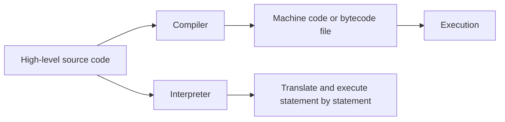
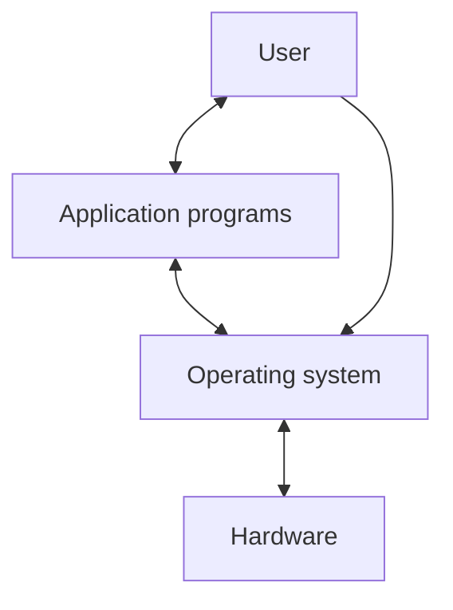
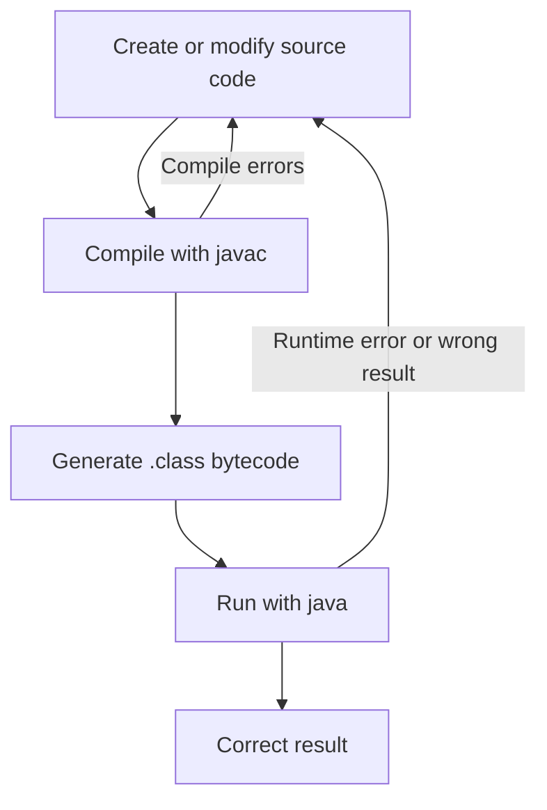
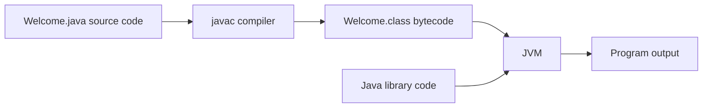

## Programming And Computer Basics

**Programming** means creating **software**, which consists of instructions that tell a computer or computerized device what to do. A **program** solves a problem by giving the computer precise steps. Learning Java matters less than memorizing one language; the transferable skill is learning how to solve problems in a programming style.

**Hardware** includes the physical parts of a computer. **Software** provides the invisible instructions that control that hardware. A computer stores and processes data through these major components:

| Component | Role |
|---|---|
| **CPU** | Retrieves instructions from memory and executes them. |
| **Memory** | Stores programs and working data while the CPU uses them. |
| **Storage devices** | Store programs and data permanently. |
| **Input devices** | Send data to the computer, such as keyboard and mouse input. |
| **Output devices** | Show or print results, such as monitors and printers. |
| **Communication devices** | Connect computers to networks, such as modems, NICs, and Wi-Fi adapters. |

The **bus** connects computer components through the motherboard. Data and power move between components through this shared communication path.

## CPU, Bits, Bytes, And Memory

The **central processing unit (CPU)** acts as the computer's instruction executor. Its **control unit** coordinates component actions, and its **arithmetic/logic unit (ALU)** performs arithmetic operations and comparisons.

**Clock speed** measures how many timing pulses the CPU uses per second. **1 hertz (Hz)** equals one pulse per second, **1 megahertz (MHz)** equals about one million pulses per second, and **1 gigahertz (GHz)** equals about one billion pulses per second. A **core** reads and executes instructions; a **multicore CPU** contains two or more independent cores in one processor.

Computers store data with two-state switches. A switch set to on represents `1`; a switch set to off represents `0`.

| Term | Meaning |
|---|---|
| **Bit** | One binary digit, either `0` or `1`. |
| **Byte** | Eight bits. It is the minimum addressable storage unit discussed in the chapter. |
| **Encoding scheme** | Rules that translate characters and numbers into bit patterns. |
| **ASCII** | An encoding scheme where the character `C` is represented as `01000011`. |

Memory capacity uses byte multiples:

| Unit | Approximate Size |
|---|---:|
| **KB** | 1,000 bytes |
| **MB** | 1,000,000 bytes |
| **GB** | 1,000,000,000 bytes |
| **TB** | 1,000,000,000,000 bytes |

> A typical one-page Word document takes ~20 KB. 1 MB stores ~50 pages, and 1 GB stores ~50,000 pages. A typical two-hour high-resolution movie takes ~8 GB.

**Memory**, or **RAM**, stores programs and data that the CPU currently uses. RAM is **random access** because the computer can access bytes in any order through their addresses. RAM is **volatile** because it loses data when power turns off. A memory byte is never empty, but its initial content may contain meaningless data for your program. Writing new data into a byte replaces the old content. When new information is placed in a memory byte, its current content is lost — there is no way to recover the overwritten data.

**Storage devices** preserve programs and data after power turns off. The computer moves stored programs and data into RAM before the CPU can execute or process them.

| Storage Type | Key Point |
|---|---|
| **Hard disk** | Stores large amounts of data permanently, often 1 to 4 TB in newer computers. |
| **CD-ROM** | Prepressed compact disc, read-only. |
| **CD-R** | Recordable once, readable many times. |
| **CD-RW** | Rewritable compact disc. |
| **DVD** | Similar to a CD but holds more data, commonly 4.7 GB. |
| **USB flash drive** | Portable storage connected through USB. |
| **Cloud storage** | Stores files on Internet services and allows access from connected devices. |

## Input, Output, And Communication Devices

**Input devices** let users send information to the computer. A **keyboard** enters text and commands. A **mouse** moves a pointer called a **cursor** and selects on-screen objects.

**Output devices** present computer results. A **monitor** displays text and graphics. **Screen resolution** gives the number of horizontal and vertical **pixels**. Higher resolution can make images sharper. **Dot pitch** measures the space between pixels; smaller dot pitch gives a sharper display.

**Touchscreens** combine input and output because you can view results and control the interface by touching the display.

Communication devices connect computers to networks:

| Device | Function |
|---|---|
| **Dial-up modem** | Uses a phone line and can transfer up to 56,000 bps. |
| **DSL modem** | Uses a phone line and transfers much faster than dial-up. |
| **Cable modem** | Uses a cable line and is often faster than DSL. |
| **NIC** | Connects a computer to a local area network. |
| **Wi-Fi adapter** | Connects devices wirelessly to a network. |

## Programming Languages

Computers execute machine instructions, not English. Programming languages let people write programs at different levels of abstraction, then tools translate those programs into code the computer can execute.

| Level | Form | Translator | Boundary |
|---|---|---|---|
| **Machine language** | Binary primitive instructions built into a CPU | None | Native to one computer type. |
| **Assembly language** | Mnemonics such as `add` and `sub` | **Assembler** | Easier than machine language but still machine dependent. |
| **High-level language** | English-like statements such as `area = 5 * 5 * 3.14159;` | **Compiler** or **interpreter** | Easier to write and often platform independent. |

A program written in a high-level language is **source code** or a **source program**. A **statement** is an instruction in a high-level language.

**Interpreters** and **compilers** translate source code differently:

| Tool | How It Works | Exam Trap |
|---|---|---|
| **Interpreter** | Translates and executes one statement at a time. | Execution happens right after each translated statement. |
| **Compiler** | Translates the entire source program into a machine-code or bytecode file before execution. | Compilation can succeed before runtime errors appear. |



## Operating Systems

An **operating system (OS)** manages and controls a computer's activities. Common operating systems include **Windows**, **macOS**, and **Linux**. Application programs such as browsers and word processors depend on an OS to access hardware.



The OS handles three major responsibilities:

| Responsibility | Meaning |
|---|---|
| **Control and monitoring** | Recognizes input, sends output, tracks files, controls devices, and protects the system. |
| **Resource allocation** | Assigns CPU time, memory, disks, and input/output devices to programs. |
| **Scheduling** | Orders program activities so system resources get used efficiently. |

Scheduling concepts often appear together but mean different things:

| Concept | Scope | Meaning |
|---|---|---|
| **Multiprogramming** | Multiple programs, one CPU shared | Lets several programs run by using CPU idle time. |
| **Multithreading** | Multiple tasks inside one program | Lets one program perform tasks concurrently, such as editing and saving. |
| **Multiprocessing** | Multiple programs, multiple processors | Uses multiple processors to run programs concurrently. |

## Java And The Web

**Java** is a general-purpose, object-oriented programming language created by a team led by **James Gosling** at **Sun Microsystems**. Oracle bought Sun in 2010, so Oracle owns Java now. Java started as **Oak** in 1991 for embedded chips, then became Java in 1995 for web applications.

Java became popular because of the idea **write once, run anywhere**. Java programs can run on different platforms when those platforms have a Java runtime environment. Java runs on desktop computers, servers, mobile devices, and embedded systems. Android applications have historically used Java heavily.

**Applets** were Java programs that ran inside web browsers. Browsers no longer allow Java applets because of security concerns. Java remains common for server-side web applications that process data, perform computations, and generate dynamic web pages.

Java's design characteristics include **simple**, **object oriented**, **distributed**, **interpreted**, **robust**, **secure**, **architecture neutral**, **portable**, **high performance**, **multithreaded**, and **dynamic**.

## Java Specification, API, JDK, JRE, And IDE

Java standards separate language rules, libraries, and development tools:

| Term | Meaning |
|---|---|
| **Java language specification** | Defines Java syntax and semantics. |
| **Java API** | Defines Java's library of predefined classes and interfaces. |
| **Java SE** | Java Standard Edition, used for desktop/client-side applications and as the base for other editions. |
| **Java EE** | Java Enterprise Edition, used for server-side applications such as servlets, JSP, and JSF. |
| **Java ME** | Java Micro Edition, used for mobile and embedded devices. |
| **JDK** | Java Development Toolkit; includes command-line tools for compiling, running, and testing Java programs. |
| **JRE** | Java Runtime Environment; runs Java programs. |
| **IDE** | Integrated development environment; combines editing, compiling, building, debugging, and help in one GUI. |

NetBeans and Eclipse are **IDEs**, not separate Java languages, dialects, or extensions. They help you write and run Java programs faster, but the program still follows Java syntax and uses Java tools.

## First Java Program

Every Java program needs at least one **class**. A Java program starts execution from the **main method** when you run that class.

```java
public class Welcome {
  public static void main(String[] args) {
    // Display a message on the console.
    System.out.println("Welcome to Java!");
  }
}
```

Key parts:

| Code | Meaning |
|---|---|
| `public class Welcome` | Defines a class named `Welcome`. Class names usually start uppercase. |
| `public static void main(String[] args)` | Defines the entry point where execution begins. |
| `System.out.println(...)` | Displays output on the **console** and moves to the next line. |
| `System.out.print(...)` | Displays output without moving to the next line. |
| `"Welcome to Java!"` | A **string**, which is a sequence of characters in double quotes. |
| `;` | Statement terminator. Every Java statement ends with one. |

> [!WARNING]
> Java is **case sensitive**. `main` and `Main` are different names. `String` and `string` are different names.

**Keywords** have special meanings to the compiler and cannot be used for other purposes. Examples from the first program include `public`, `class`, `static`, and `void`.

## Comments, Blocks, And Special Characters

**Comments** document code for humans. The compiler ignores them.

| Comment Type | Syntax | Use |
|---|---|---|
| **Line comment** | `// comment` | Comment from `//` to the end of the line. |
| **Block comment** | `/* comment */` | Comment one or more lines. |
| **Javadoc comment** | `/** comment */` | Document a class or method so the `javadoc` tool can extract HTML documentation. |

```java
// Line comment
/* Block comment */
/** Javadoc comment for a class or method. */
```

A **block** groups program components or statements between braces. A class has a class block. A method has a method block. Blocks can be nested.

| Character | Name | Use |
|---|---|---|
| `{}` | Braces | Enclose a block. |
| `()` | Parentheses | Used with methods. |
| `[]` | Brackets | Denote an array. |
| `//` | Double slashes | Start a line comment. |
| `""` | Quotation marks | Enclose a string. |
| `;` | Semicolon | Ends a statement. |

> [!NOTE]
> Type the closing brace `}` immediately after typing `{`. This prevents the common missing-brace error.

## Creating, Compiling, And Running Java Programs

The Java development loop repeats until the program compiles, runs, and produces the intended result.



Java source files and bytecode files follow strict naming rules:

| File | Meaning | Rule |
|---|---|---|
| `Welcome.java` | Java source-code file | Must match the public class name exactly. |
| `Welcome.class` | Java bytecode file | Generated by the compiler. |

Compile with `javac`:

```bash
javac Welcome.java
```

Run with `java`:

```bash
java Welcome
```

> [!CAUTION]
> Run `java Welcome`, not `java Welcome.class`. If you include `.class`, Java looks for `Welcome.class.class`.

In JDK 11, a single-file source-code program can also be compiled and run with one command:

```bash
java Welcome.java
```

This shortcut applies to a file containing one class, which matches the early programs in the book.

## Bytecode, JVM, Class Loader, And Verifier

The Java compiler converts source code into **bytecode**. Bytecode resembles machine instructions but stays **architecture neutral**, so any computer with a **Java Virtual Machine (JVM)** can execute it.



The **JVM** interprets bytecode one instruction at a time into the target machine's language. When execution starts, the **class loader** loads the class bytecode into memory. If the program uses other classes, the class loader loads them when needed. The **bytecode verifier** checks that loaded bytecode is valid and does not violate Java security restrictions.

Common execution errors:

| Error | Likely Cause |
|---|---|
| **NoClassDefFoundError** | You tried to run a class file that does not exist or Java cannot find it. |
| **NoSuchMethodError** | The class has no valid `main` method, or you mistyped it as something like `Main`. |

## Programming Style And Documentation

Good style helps humans read, debug, and maintain code. A program can compile even if written on one line, but that style hides structure and makes mistakes harder to find.

Use these guidelines:

| Guideline | Reason |
|---|---|
| Put a summary comment near the start of a program. | Readers learn what the program does before reading details. |
| Use `/** ... */` for class and method documentation. | The `javadoc` tool can extract it. |
| Use `//` for steps inside a method. | Step comments stay close to the code they explain. |
| Indent nested code at least two spaces. | Indentation shows block structure. |
| Put spaces around binary operators. | `3 + 4 * 4` reads better than `3+4*4`. |
| Use one block style consistently. | Mixed brace styles distract readers and can hide mistakes. |

Two common block styles are acceptable:

```java
public class Test {
  public static void main(String[] args) {
    System.out.println("End-of-line style");
  }
}
```

```java
public class Test
{
  public static void main(String[] args)
  {
    System.out.println("Next-line style");
  }
}
```

The book uses **end-of-line style**, where the opening brace stays on the same line as the class or method header.

## Programming Errors

Java beginner errors fall into three major categories:

| Error Type | Detected By | Meaning | Example |
|---|---|---|---|
| **Syntax error** or **compile error** | Compiler | Code violates Java grammar. | Missing `void`, semicolon, brace, or quotation mark. |
| **Runtime error** | Runtime environment | Program starts but terminates during execution. | Integer division by zero, invalid input type. |
| **Logic error** | Programmer/testing | Program runs but produces the wrong result. | Using `9 / 5` instead of `9.0 / 5` in Fahrenheit conversion. |

Fix syntax errors from the top of the compiler output downward. One early mistake can cause several reported errors later in the file.

### Canonical Error Examples

The textbook's three canonical programs demonstrate each error type:

**ShowSyntaxErrors.java** — missing `void` before `main`, and a string literal missing its closing `"`:
```java
public class ShowSyntaxErrors {
  public static void main(String[] args) {  // Error: missing void
    System.out.println("Welcome to Java);    // Error: missing closing "
  }
}
```
The compiler reports four errors, but only two actual problems. Fix from the top down.

**ShowRuntimeErrors.java** — integer division by zero causes `ArithmeticException`:
```java
public class ShowRuntimeErrors {
  public static void main(String[] args) {
    System.out.println(1 / 0);  // Runtime error: ArithmeticException
  }
}
```

**ShowLogicErrors.java** — integer truncation gives the wrong result:
```java
public class ShowLogicErrors {
  public static void main(String[] args) {
    System.out.println((9 / 5) * 35 + 32);  // 67, not 95.0
  }
}
```
`9 / 5` evaluates to `1` (integer division), so `(9 / 5) * 35 + 32` gives `67` instead of the expected `95.0`. Use `9.0 / 5` to keep the fractional part.

> [!WARNING]
> In integer division, Java drops the fractional part. `9 / 5` evaluates to `1`, so `(9 / 5) * 35 + 32` gives `67`, not `95.0`. Use `9.0 / 5` when the calculation needs a decimal result.

### Common Newcomer Errors

| Error | Faulty Pattern | Fix |
|---|---|---|
| Missing brace | Open `{` with no matching `}` | Type the closing brace immediately. |
| Missing semicolon | `System.out.println("Done")` | Add `;` after the statement. |
| Missing quote | `"Problem Driven` | Close the string with `"`. |
| Misspelled name | `Main`, `string` | Use exact Java casing: `main`, `String`.

## NetBeans And Eclipse Workflow

NetBeans and Eclipse let you edit, compile, run, and debug Java programs in one interface. Both IDEs organize work into a **project**, then you create a **class**, edit source code, and run it.

NetBeans flow:

1. Create a Java project.
2. Create a Java class such as `Welcome`.
3. Edit `Welcome.java`.
4. Run the file with **Run File** or `Shift + F6`.

Eclipse flow:

1. Create a Java project.
2. Create a class such as `Welcome`.
3. Check the option to generate `public static void main(String[] args)` when useful.
4. Run the class as a Java application.

Both IDEs automatically compile when you run changed code. IDEs also help by inserting matching braces and quotation marks, but you still need to understand the generated Java code.

## Exercise-Level Review Points

Chapter 1 exercises focus on output statements, arithmetic expressions, and translating formulas into Java. You do not need variables yet for many of them; you can place expressions directly inside `System.out.println(...)`.

Use decimal literals when division must keep the fractional part:

```java
System.out.println(5 / 4);   // 1, integer division truncates
System.out.println(5.0 / 4); // 1.25, floating-point division
```

> **Integer division formal rule**: When both operands of a division are integers, the result of the division is the quotient and the fractional part is truncated. `5 / 2` yields `2`, not `2.5`. `-5 / 2` yields `-2`, not `-2.5`. To perform floating-point division, at least one operand must be a floating-point number.

Common formulas from the exercise set:

| Task | Formula |
|---|---|
| Circle perimeter | `2 * radius * PI` |
| Circle area | `radius * radius * PI` |
| Rectangle area | `width * height` |
| Rectangle perimeter | `2 * (width + height)` |
| Average speed | `distance / time` with units converted first. |
| Population yearly seconds | `365 * 24 * 60 * 60` |
| Net population change | births plus immigrants minus deaths. |

Cramer's rule for a 2 by 2 linear system:

$$
\begin{matrix}
ax + by = e \\
cx + dy = f
\end{matrix}
\qquad
x = \frac{ed - bf}{ad - bc}
\qquad
y = \frac{af - ec}{ad - bc}
$$

> [!CAUTION]
> Cramer's rule requires `ad - bc` to be nonzero. If the denominator is zero, the formula cannot compute a valid unique solution.

The chapter's programming exercises train these habits:

1. Write complete class and `main` method structure from memory.
2. Use `System.out.println` for each required output line.
3. Translate math symbols into Java operators: `*` for multiplication, `/` for division, parentheses for grouping.
4. Use decimals such as `1.0`, `5.0`, or `9.0` when integer division would lose needed precision.
5. Compile, fix syntax errors, run, then check the output against the requirement.

## Key Terms

| Term | Short Definition |
|---|---|
| **API** | Library of predefined Java classes and interfaces. |
| **Assembler** | Translates assembly language into machine code. |
| **Bytecode** | Architecture-neutral compiled Java code stored in `.class` files. |
| **Class loader** | Loads class bytecode into memory for the JVM. |
| **Compiler** | Translates source code into a compiled file. |
| **Console** | Text input and output environment. |
| **IDE** | Tool that integrates editing, compiling, running, debugging, and help. |
| **Interpreter** | Translates and executes code one statement or instruction at a time. |
| **JDK** | Toolkit for compiling, running, and testing Java programs. |
| **JRE** | Runtime environment for running Java programs. |
| **JVM** | Program that executes Java bytecode. |
| **Keyword** | Reserved word with compiler-defined meaning. |
| **Logic error** | Program runs but computes the wrong result. |
| **Runtime error** | Program terminates abnormally while running. |
| **Syntax error** | Code violates Java grammar and fails compilation. |

---

*20 min read. Original: 85 min read.*
