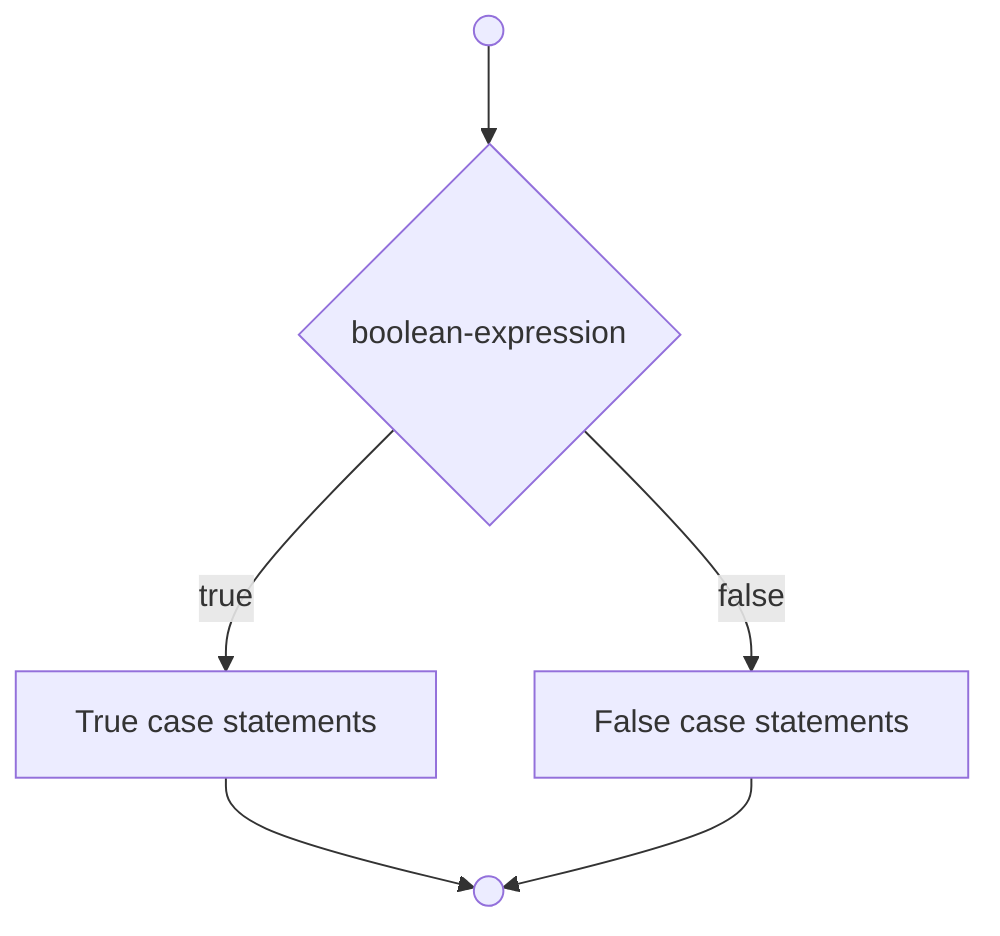
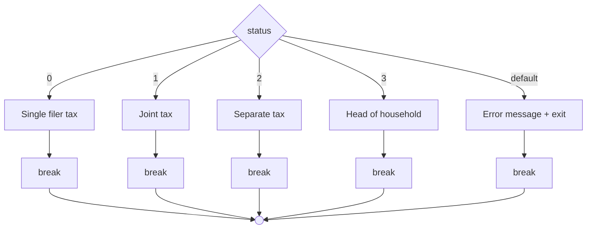

# Java - Chapter 3

## boolean Data Type and Relational Operators

A **boolean** variable holds only `true` or `false`. Six relational operators compare values and produce a Boolean result:

| Operator | Name                     | Example (`radius = 5`) | Result  |
| -------- | ------------------------ | ---------------------- | ------- |
| `<`      | Less than                | `radius < 0`           | `false` |
| `<=`     | Less than or equal to    | `radius <= 0`          | `false` |
| `>`      | Greater than             | `radius > 0`           | `true`  |
| `>=`     | Greater than or equal to | `radius >= 0`          | `true`  |
| `==`     | Equal to                 | `radius == 0`          | `false` |
| `!=`     | Not equal to             | `radius != 0`          | `true`  |

> [!WARNING]
> Equality uses `==` (two equals signs). A single `=` is assignment, not comparison. Using `=` in a condition is a logic error with no compile warning.

`true` and `false` are reserved literals, not keywords.

```java
boolean lightsOn = true;
System.out.println(radius > 0); // displays true or false
```

## if Statements

A **one-way `if` statement** executes a block only if the condition is `true`:

```java
if (boolean-expression) {
  statement(s);
}
```

Braces can be omitted for a single statement but doing so invites errors when code is later modified.

```mermaid
graph TD
  Start(( )) --> Cond{boolean-expression}
  Cond -- false --> End(( ))
  Cond -- true --> Stmt[Statement(s)]
  Stmt --> End
```

## Two-Way if-else Statements

An **`if-else` statement** chooses between two paths:

```java
if (boolean-expression) {
  true-case statements;
} else {
  false-case statements;
}
```



## Nested if and Multi-Way if-else

An `if` statement can contain another `if` inside it (nested). The multi-way pattern is preferred for multiple alternatives:

```java
if (score >= 90)
  System.out.print("A");
else if (score >= 80)
  System.out.print("B");
else if (score >= 70)
  System.out.print("C");
else if (score >= 60)
  System.out.print("D");
else
  System.out.print("F");
```

Conditions are tested top-down. The first `true` condition wins. A condition is tested only when all above it are `false`.

## Common Errors and Pitfalls

1. **Missing braces** — Omitting braces when adding multiple statements to an `if` block causes the extra statements to execute unconditionally.
2. **Wrong semicolon** — A semicolon after `if (condition);` creates an empty block; the intended body always executes. Use end-of-line block style to avoid this.
3. **Redundant boolean testing** — Write `if (even)` not `if (even == true)`. The latter can become `if (even = true)` which always evaluates to `true` (an assignment, not comparison).
4. **Dangling else** — An `else` always matches the nearest unmatched `if` in the same block. Use braces to force a different match.

   ```java
   int i = 1, j = 2, k = 3;
   if (i > j)
     if (i > k)
       System.out.println("A");
   else
     System.out.println("B");
   ```

   The `else` matches the **second** `if` (nothing prints here since `i > j` is false). Fix with braces around the inner `if`.

5. **Floating-point equality** — Do not test `double` values with `==`. Use `Math.abs(x - y) < EPSILON` instead, with `EPSILON = 1E-14` for `double`, `1E-7` for `float`.

   ```java
   final double EPSILON = 1E-14;
   if (Math.abs(x - 0.5) < EPSILON) { ... }
   ```

6. **Boolean variable assignment** — Simplify `if (count % 10 == 0) newLine = true; else newLine = false;` to `newLine = (count % 10 == 0);`.
7. **Duplicate code** — Pull duplicated statements (e.g., `System.out.println(...)`) out of both branches instead of repeating them.

## Generating Random Numbers

`Math.random()` returns a `double` in `[0.0, 1.0)`. Common patterns:

| Expression                       | Result |
| -------------------------------- | ------ |
| `(int)(Math.random() * 10)`      | 0–9    |
| `(int)(Math.random() * 10) + 10` | 10–19  |
| `(int)(Math.random() * 41) + 10` | 10–50  |

`Math.random()` is preferred over `System.currentTimeMillis() % 10` for generating random numbers.

### Case Study: SubtractionQuiz

```java
int number1 = (int)(Math.random() * 10);
int number2 = (int)(Math.random() * 10);

if (number1 < number2) {
  int temp = number1;    // swap so number1 >= number2
  number1 = number2;
  number2 = temp;
}

System.out.print("What is " + number1 + " - " + number2 + "? ");
int answer = input.nextInt();

if (number1 - number2 == answer)
  System.out.println("You are correct!");
else
  System.out.println("Wrong. Answer is " + (number1 - number2));
```

## Logical Operators

| Operator | Name | true when                      |
| -------- | ---- | ------------------------------ |
| `!`      | NOT  | operand is `false`             |
| `&&`     | AND  | both operands are `true`       |
| `\|\|`   | OR   | at least one operand is `true` |
| `^`      | XOR  | operands differ                |

**Short-circuit evaluation:** For `&&`, if the first operand is `false`, the second is never evaluated. For `||`, if the first operand is `true`, the second is never evaluated.

**De Morgan's laws:**

- `!(condition1 && condition2) = !condition1 || !condition2`
- `!(condition1 || condition2) = !condition1 && !condition2`

Concrete Java transformations:

- `!(number % 2 == 0 && number % 3 == 0)` -> `number % 2 != 0 || number % 3 != 0`
- `!(number == 2 || number == 3)` -> `number != 2 && number != 3`

> [!WARNING] Chained comparisons
> In Java, `28 <= days <= 31` is invalid because `28 <= days` yields a `boolean`, which cannot be compared to `31`. Use `28 <= days && days <= 31`.

### Case Study: Leap Year

A year is a leap year if divisible by 4 but not by 100, or divisible by 400:

```java
boolean isLeapYear = (year % 4 == 0 && year % 100 != 0) || (year % 400 == 0);
```

### Case Study: Lottery

Generates a two-digit lottery number. Compares exact match -> all digits -> one digit -> no match:

```java
int lottery = (int)(Math.random() * 100);
int lotteryDigit1 = lottery / 10;
int lotteryDigit2 = lottery % 10;

int guessDigit1 = guess / 10;
int guessDigit2 = guess % 10;

if (guess == lottery)
  System.out.println("Exact match: $10,000");
else if (guessDigit2 == lotteryDigit1 && guessDigit1 == lotteryDigit2)
  System.out.println("All digits match: $3,000");
else if (guessDigit1 == lotteryDigit1 || guessDigit1 == lotteryDigit2
      || guessDigit2 == lotteryDigit1 || guessDigit2 == lotteryDigit2)
  System.out.println("One digit match: $1,000");
else
  System.out.println("Sorry, no match");
```

## switch Statements

A `switch` statement selects execution based on the value of a `char`, `byte`, `short`, `int`, or `String` expression:

```java
switch (status) {
  case 0: compute tax for single filers; break;
  case 1: compute tax for married jointly; break;
  case 2: compute tax for married separately; break;
  case 3: compute tax for head of household; break;
  default: System.out.println("Error: invalid status"); System.exit(1);
}
```

**Fall-through:** Omitting `break` causes execution to continue into the next case. This is intentional for grouping cases (e.g., cases 1–5 print "Weekday") but otherwise a common bug. Comment `// fall through` when omitting `break` on purpose.



### Case Study: ComputeTax

`System.exit(status)` terminates the program — status `0` = normal, non-zero = abnormal. Tax variable must be initialized to `0` before the `if` blocks, otherwise "variable might not have been initialized" compile error.

> [!IMPORTANT] Testing strategy
> Test all 4 statuses × 6 brackets = **24 cases** to cover every code path.

### Case Study: Chinese Zodiac

Uses `switch` with `year % 12` to map years to animals:

```java
switch (year % 12) {
  case 0:  animal = "monkey";  break;
  case 1:  animal = "rooster"; break;
  case 2:  animal = "dog";     break;
  case 3:  animal = "pig";     break;
  case 4:  animal = "rat";     break;
  case 5:  animal = "ox";      break;
  case 6:  animal = "tiger";   break;
  case 7:  animal = "rabbit";  break;
  case 8:  animal = "dragon";  break;
  case 9:  animal = "snake";   break;
  case 10: animal = "horse";   break;
  case 11: animal = "sheep";   break;
}
```

> [!WARNING] Switch case values
> Case values must be **compile-time constants** — they cannot contain variables (e.g., `case x + 1` is invalid).

## Conditional (Ternary) Operator

The only ternary operator in Java: `boolean-expression ? expression1 : expression2`

```java
max = (num1 > num2) ? num1 : num2;
System.out.println((num % 2 == 0) ? "even" : "odd");
status = (n1 > n2) ? 1 : (n1 == n2 ? 0 : -1);   // nested
```

## Operator Precedence and Associativity

| Precedence  | Operators                                   |
| ----------- | ------------------------------------------- |
| 1 (highest) | `var++`, `var--` (postfix)                  |
| 2           | `+`, `-` (unary), `++var`, `--var` (prefix) |
| 3           | `(type)` (casting)                          |
| 4           | `!` (NOT)                                   |
| 5           | `*`, `/`, `%`                               |
| 6           | `+`, `-` (binary)                           |
| 7           | `<`, `<=`, `>`, `>=` (relational)           |
| 8           | `==`, `!=` (equality)                       |
| 9           | `^` (XOR)                                   |
| 10          | `&&` (AND)                                  |
| 11          | `\|\|` (OR)                                 |
| 12          | `?:` (ternary)                              |
| 13 (lowest) | `=`, `+=`, `-=`, `*=`, `/=`, `%=`           |

All binary operators except assignment are left-associative. Assignment operators are right-associative.

## Debugging

**Logic errors (bugs)** are the hardest to find. Strategies:

- **Hand-tracing** — Walk through code manually with sample inputs
- **Print statements** — Insert `System.out.println()` to show variable values and flow
- **Debugger** — Supports single-step execution, breakpoints, variable inspection, call stack tracing, and variable modification. Available in all major IDEs (Eclipse, NetBeans) and via `jdb` (command-line)

**Incremental development:** Write a small amount of code, test it, then add more. This isolates errors to the code you just added.

### Key Terms

`boolean` data type, Boolean expression/value, conditional operator, dangling else ambiguity, debugging, fall-through behavior, flowchart, lazy operator, operator associativity/precedence, selection statement, short-circuit operator

---

_Read time: 13 min (source: 106 min)_
