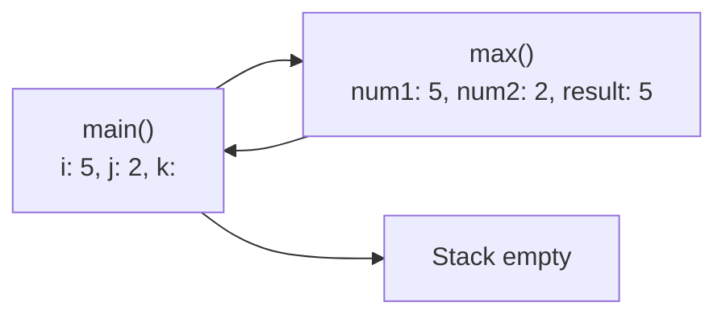
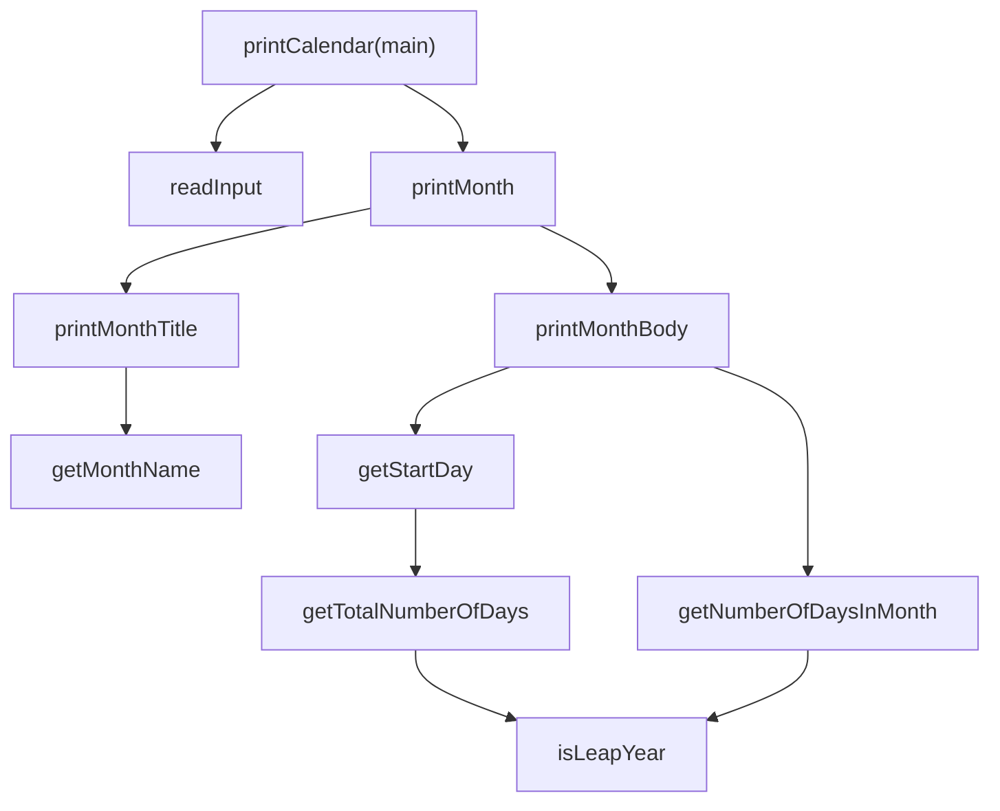

# Java - Chapter 6

# Chapter 6 - Methods (Liang)

## Defining a Method

A **method** is a collection of statements grouped to perform an operation. Method definition syntax:

```java
modifier returnValueType methodName(list of parameters) {
  // Method body;
}
```

**Method components:**

- **Method header**: modifiers, return value type, method name, parameters
- **Modifier**: `static` is used for all methods in this chapter (explained in Ch. 9)
- **Return value type**: data type of returned value, or `void` if none
- **Method name**: descriptive identifier
- **Formal parameters** (parameters): variables in method header, act as placeholders
- **Parameter list**: type, order, and number of parameters
- **Method signature**: method name + parameter list (distinguishes methods)
- **Method body**: statements that implement the method

> [!CAUTION]
> In the method header, declare each parameter separately. `max(int num1, int num2)` is correct; `max(int num1, num2)` is wrong.

> [!NOTE]
> A value-returning method is called a _function_ in some languages; a void method is called a _procedure_. In Java, both are called methods.

## Calling a Method

The caller invokes the method. Two ways to call:

- **Value-returning method**: the call is treated as a value (e.g., `int larger = max(3, 4);` or `System.out.println(max(3, 4));`
- **Void method**: the call must be a statement (e.g., `printGrade(78.5);`)

> [!NOTE]
> A value-returning method can also be invoked as a statement in Java — the caller simply ignores the return value.

When a method is called, program control transfers to the called method. Control returns when a `return` statement executes or the method-ending closing brace is reached.

### Call Stack

Each method invocation creates an **activation record** (storing parameters and variables) placed in a **call stack** (also known as execution stack, runtime stack). Activations follow LIFO — the method invoked last is removed first.



> [!WARNING]
> A `return` statement is required for a value-returning method. The compiler must see a path that guarantees a return. An `if-else if` without a final `else` may cause a compile error even if logically complete.

**`sign(int n)` compile-error pattern** — a method that looks logically complete can still fail to compile:

```java
// WRONG — compiler thinks method "might not return a value"
public static int sign(int n) {
  if (n > 0) return 1;
  else if (n == 0) return 0;
  else if (n < 0) return -1; // compiler sees this as conditional!
}
// CORRECT — replace the last else if with else
public static int sign(int n) {
  if (n > 0) return 1;
  else if (n == 0) return 0;
  else return -1;
}
```

The compiler must see a `return` that is **unconditionally reachable**. A trailing `else if` with a condition does not guarantee this — only a plain `else` or a `return` outside the `if` structure satisfies the compiler.

## void vs. Value-Returning Methods

| Feature            | void method                                | Value-returning method                             |
| ------------------ | ------------------------------------------ | -------------------------------------------------- |
| Return type        | `void`                                     | Specific data type (e.g., `int`, `double`, `char`) |
| `return` statement | Optional (can use `return;` to exit early) | Required (must return a value: `return value;`)    |
| Invocation         | Must be a statement                        | Can be used in expressions or as a statement       |
| Example            | `printGrade(78.5);`                        | `char grade = getGrade(78.5);`                     |

A `return` statement in a `void` method is useful for early termination (e.g., when input is invalid):

```java
public static void printGrade(double score) {
  if (score < 0 || score > 100) {
    System.out.println("Invalid score");
    return;  // terminate method early
  }
  // ... rest of method
}
```

## Passing Arguments by Values

Java uses **pass-by-value**: the value of the argument is copied to the parameter. The original variable is not affected by changes to the parameter inside the method.

```java
public static void main(String[] args) {
  int x = 1;
  increment(x);
  System.out.println(x);  // still 1!
}

public static void increment(int n) {
  n++;
}
```

**Key implication**: methods cannot swap variables permanently — the swap happens only on local copies.

Arguments must match parameters in **order, number, and compatible type**. Compatible type means no explicit casting needed (e.g., passing `int` to a `double` parameter is allowed).

## Modularizing Code

Encapsulating code in methods provides:

1. **Isolation** — logic is confined, making programs easier to read
2. **Narrowed debugging** — errors are confined to specific methods
3. **Reusability** — methods can be reused by other programs

**GCD example** — isolates GCD computation into a reusable method:

```java
public static int gcd(int n1, int n2) {
  int gcd = 1;
  int k = 2;
  while (k <= n1 && k <= n2) {
    if (n1 % k == 0 && n2 % k == 0)
      gcd = k;
    k++;
  }
  return gcd;
}
```

**Prime number example** — divides problem into `isPrime(number)` and `printPrimeNumbers(numberOfPrimes)`:

```java
public static boolean isPrime(int number) {
  for (int divisor = 2; divisor <= number / 2; divisor++) {
    if (number % divisor == 0)
      return false;
  }
  return true;
}
```

## Case Study: Hex to Decimal

Uses **Horner's algorithm** for efficient conversion:

```java
public static int hexToDecimal(String hex) {
  int decimalValue = 0;
  for (int i = 0; i < hex.length(); i++) {
    char hexChar = hex.charAt(i);
    decimalValue = decimalValue * 16 + hexCharToDecimal(hexChar);
  }
  return decimalValue;
}

public static int hexCharToDecimal(char ch) {
  if (ch >= 'A' && ch <= 'F')
    return 10 + ch - 'A';
  else  // ch is '0' through '9'
    return ch - '0';
}
```

Trace for `AB8C`: `((((0 × 16 + 10) × 16 + 11) × 16 + 8) × 16 + 12) = 43916`

## Method Overloading

**Overloading**: multiple methods with the same name but different parameter lists within one class. The Java compiler selects the best match based on the method signature.

```java
public static int max(int num1, int num2) { ... }
public static double max(double num1, double num2) { ... }
public static double max(double num1, double num2, double num3) { ... }
```

**Rules:**

- Overloaded methods **must** have different parameter lists
- Cannot overload based on different modifiers or return types only
- When an `int` and `double` are passed, `max(double, double)` is invoked (automatic type promotion)
- The compiler chooses the most specific match

**Ambiguous invocation** — compile error when two or more matches are equally specific, and neither is more specific than the other:

```java
public static double max(int num1, double num2) { ... }
public static double max(double num1, int num2) { ... }
// max(1, 2) — ambiguous! Compile error.
```

## Scope of Variables

A **local variable** is defined inside a method. Its scope starts at its declaration and continues to the end of the enclosing block.

**Rules:**

- A local variable must be declared and assigned before use
- A method parameter's scope covers the entire method
- A variable declared in a `for` loop header has scope in the entire loop
- A variable declared inside a `for` loop body has scope limited to that block
- A variable can be declared with the same name in **non-nested blocks** (e.g., separate `for` loops)
- A variable **cannot** be declared twice in the same block or in **nested blocks**

> [!CAUTION]
> Accessing a loop variable outside the loop causes a syntax error. `i` in `for (int i = 0; i < 10; i++)` is not accessible after the loop.

## Generating Random Characters

Random character between two characters `ch1` and `ch2` (where `ch1 < ch2`):

```java
(char)(ch1 + Math.random() * (ch2 - ch1 + 1))
```

**Specialized methods:**

```java
public static char getRandomCharacter(char ch1, char ch2) {
  return (char)(ch1 + Math.random() * (ch2 - ch1 + 1));
}

public static char getRandomLowerCaseLetter() {
  return getRandomCharacter('a', 'z');
}

public static char getRandomUpperCaseLetter() {
  return getRandomCharacter('A', 'Z');
}

public static char getRandomDigitCharacter() {
  return getRandomCharacter('0', '9');
}
```

> [!NOTE]
> The no-parameter overload `getRandomCharacter()` returns a random character from the **entire Unicode range** (`'\u0000'` to `'\uFFFF'`), unlike the parameterized versions which restrict to a specific subset.
>
> ```java
> public static char getRandomCharacter() {
>   return getRandomCharacter('\u0000', '\uFFFF');
> }
> ```

## Method Abstraction and Stepwise Refinement

**Method abstraction** separates the use of a method from its implementation. The client uses a method without knowing how it works. This is also called **information hiding** or **encapsulation** — the implementation is a "black box."

**Stepwise refinement** (divide-and-conquer): decompose a large problem into smaller subproblems, which can be further decomposed.

### PrintCalendar Case Study — Top-Down Design



**Key methods:**

- `isLeapYear(year)`: `year % 400 == 0 \|\| (year % 4 == 0 && year % 100 != 0)`
- `getNumberOfDaysInMonth(year, month)`: 31 for Jan/Mar/May/Jul/Aug/Oct/Dec, 30 for Apr/Jun/Sep/Nov, 28 or 29 for Feb
- `getTotalNumberOfDays(year, month)`: sums days from 1800 to the target month
- `getStartDay(year, month)`: `(totalNumberOfDays + START_DAY_FOR_JAN_1_1800) % 7`

### Implementation Approaches

| Approach      | Description                                                                                                                                                                      | Tool                                                |
| ------------- | -------------------------------------------------------------------------------------------------------------------------------------------------------------------------------- | --------------------------------------------------- |
| **Top-down**  | Implement methods from top of structure chart downward. Use **stubs** (incomplete method versions returning dummy values) for unimplemented methods to build the framework early | Stubs help test the program skeleton incrementally  |
| **Bottom-up** | Implement methods from bottom upward. Write a **driver** (test program) for each method as it's completed                                                                        | Drivers isolate and verify each method individually |

### Benefits of Stepwise Refinement

- **Simpler programs** — broken into smaller, readable methods
- **Code reuse** — methods like `isLeapYear` used by multiple callers
- **Easier debugging and testing** — errors isolated to individual methods
- **Better teamwork** — subproblems assigned to different programmers

---

> [!WARNING] Common exam error
> implementing a method's required specification incorrectly even when the main program output looks right. Always check that methods meet the stated requirements (return type, parameters, behavior).

> [!WARNING]
> The `swap` method does NOT work in Java for primitive types — pass-by-value copies the values, leaving originals unchanged.

<sup>Compressed from 103 min read (source: Liang, _Intro to Java_, Ch. 6)</sup>
