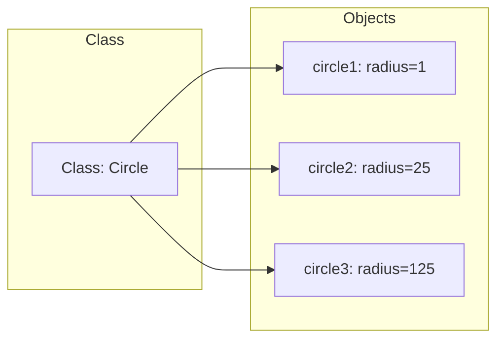
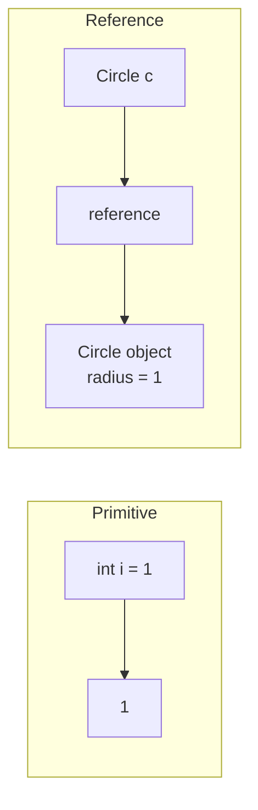

# Programming Essentials in Java — Chapter 9

## Objects and Classes

**Object-oriented programming (OOP)** organizes code around objects — entities with unique identity, state (data fields), and behavior (methods). A **class** is the template defining what objects of that type look like.



### UML Class Diagram Notation

| Element | Notation |
|---------|----------|
| Data field | `dataFieldName: dataFieldType` |
| Constructor | `ClassName(parameterName: parameterType)` |
| Method | `methodName(parameterName: parameterType): returnType` |
| Static members | Underlined |
| `+` | public |
| `-` | private |

```java
class Circle {
  double radius = 1;

  Circle() {}

  Circle(double newRadius) {
    radius = newRadius;
  }

  double getArea() {
    return radius * radius * Math.PI;
  }
}
```

### Constructors

- Same name as the class, **no return type** (not even `void`)
- Invoked with `new` operator
- Can be **overloaded** (multiple signatures)
- **No-arg constructor**: constructor with no parameters
- **Default constructor**: provided automatically **only if no constructors are defined** — it's a public no-arg constructor with empty body

> [!WARNING] Common mistake
> Putting `void` in front of a constructor makes it a regular method, not a constructor: `public void Circle() {}` — wrong.

> [!WARNING] Missing constructor error
> If you define any constructor (even with args), the default no-arg constructor is NOT provided. `new ClassName()` will fail if no no-arg constructor exists.

### One Public Class Per File

Only **one class per file** can be `public`, and that class name **must match the filename**. Other classes in the same file are package-private. Each class compiles to its own `.class` file.

```java
// File: TestCircle.java
public class TestCircle { ... }  // public, filename must match
class Circle { ... }             // package-private (default)
```

### Accessing Private Members from Within the Same Class

If code that accesses private members is inside the same class definition, it **is allowed** — even through another object reference of the same type. Private only blocks access from *other* classes, not code inside the class itself.

```java
public class Circle {
  private double radius;
  public static void main(String[] args) {
    Circle c = new Circle();
    System.out.println(c.radius);  // OK: inside Circle class
  }
}
// In another class:
// System.out.println(c.radius);  // ERROR: radius is private
```

### Reference Variables

- A class is a **reference type** — variables hold **references** to objects, not the objects themselves
- Declaration + creation: `Circle myCircle = new Circle();`
- **Dot operator (`.`)** accesses members: `myCircle.radius`, `myCircle.getArea()`
- **Anonymous object**: `new Circle(5).getArea()` — no variable assigned

> [!WARNING] NullPointerException
> A **null** reference variable holds no object. Invoking a method on a null reference causes `NullPointerException`. Reference-type data fields default to `null`.

### Default Values for Data Fields

| Type | Default |
|------|---------|
| Reference (`String`, etc.) | `null` |
| Numeric (`int`, `double`) | `0` / `0.0` |
| `boolean` | `false` |
| `char` | `'\u0000'` |

> [!WARNING] Local variables have NO default value — must be explicitly initialized before use.

### Primitive vs Reference Types

| Aspect | Primitive | Reference |
|--------|-----------|-----------|
| Value stored | Actual value | Reference (memory address) |
| Assignment `a = b` | Copies value | Copies reference — both point to same object |
| After `c1 = c2` | Independent | Both refer to same object; old `c1` object becomes **garbage** |

**Garbage collection**: JVM automatically reclaims memory of unreferenced objects. You can help by assigning `null` to references no longer needed.



### Java Library Classes

#### `java.util.Date`

| Constructor/Method | Description |
|--------------------|-------------|
| `Date()` | Current date/time |
| `Date(long elapsedTime)` | Date from ms since Jan 1, 1970 GMT |
| `getTime(): long` | Returns ms since epoch |
| `toString(): String` | String representation |
| `setTime(long): void` | Sets elapsed time |

#### `java.util.Random`

| Method | Returns |
|--------|---------|
| `nextInt()` | Random `int` |
| `nextInt(n)` | Random `int` in [0, n) |
| `nextDouble()` | `double` in [0.0, 1.0) |
| `nextBoolean()` | Random `boolean` |

Same seed = same sequence. Useful for testing reproducibility.

> [!NOTE] SecureRandom
> For non-deterministic, cryptographically secure random numbers, use `java.security.SecureRandom`.

#### `javafx.geometry.Point2D`

```java
Point2D p1 = new Point2D(x1, y1);
p1.distance(p2);      // Euclidean distance
p1.midpoint(p2);      // Midpoint point
```

> [!WARNING] Point2D requires JavaFX install to run.

### Static vs Instance Members

| | Instance | Static |
|--|----------|--------|
| **Belongs to** | Each object (separate copy) | The class (shared) |
| **Access** | `objectRef.member` | `ClassName.member` |
| **Can access from static method** | ❌ Cannot access instance fields/methods | ✅ Can access static fields/methods |
| **Can access from instance method** | ✅ Can access instance fields/methods | ✅ Can access static fields/methods |

```java
class Circle {
  double radius;                    // instance
  static int numberOfObjects;       // shared by all circles

  static int getNumberOfObjects() {
    return numberOfObjects;         // OK: static accesses static
    // return radius;               // ERROR: static can't access instance
  }
}
```

> [!WARNING] Common design error
> A method that doesn't depend on instance data (e.g., `factorial(int n)`) should be **static**. Defining it as an instance method when it doesn't use instance data is incorrect.

### Visibility Modifiers

| Modifier | Visibility |
|----------|------------|
| `public` | Any class |
| (default) | Same package only (package-private) |
| `private` | Same class only |

> [!WARNING] `private` modifier cannot be applied to local variables inside a method — only to class members.

**Private constructor**: prevents creating instances of a class (e.g., `Math` class).

### Data Field Encapsulation

Declare data fields `private` and provide public **getter** (accessor) and **setter** (mutator) methods.

```java
public class Circle {
  private double radius = 1;

  public double getRadius() {
    return radius;
  }

  public void setRadius(double newRadius) {
    radius = (newRadius >= 0) ? newRadius : 0;
  }
}
```

**Getter naming convention:**
- Non-boolean: `public returnType getPropertyName()`
- Boolean: `public boolean isPropertyName()`

**Setter naming convention:** `public void setPropertyName(dataType value)`

> [!NOTE] From now on, all data fields should be `private`, all constructors/methods `public` unless specified otherwise.

### Passing Objects to Methods

Java uses **pass-by-value** for everything. For objects, the value passed is the **reference** (semantically **pass-by-sharing**):

- **Primitive argument**: changes to parameter do NOT affect the caller's variable
- **Object argument**: changes to the object's properties DO affect the caller's object (same reference)
- **Reassigning the parameter** (e.g., `c = new Circle()`) does NOT affect the caller's reference

> [!WARNING] swap() doesn't work on object references — swapping the parameters inside the method swaps local copies of the references, not the original variables. But swapping the objects' data fields DOES work.

### Array of Objects

```java
Circle[] circleArray = new Circle[10];
for (int i = 0; i < circleArray.length; i++)
  circleArray[i] = new Circle();
```

An array of objects is an **array of reference variables** — each element defaults to `null` until explicitly assigned.

### Immutable Objects and Classes

An object whose contents cannot change after creation.

**Requirements for an immutable class:**
1. All data fields must be `private`
2. No setter (mutator) methods
3. No accessor can **return a reference** to a mutable data field

> [!WARNING] Having only private fields and no setters is NOT sufficient. If a getter returns a reference to a mutable object (e.g., `Date`), the caller can modify that object directly, breaking immutability.

### Scope of Variables

- **Instance/static variables**: scope = entire class, regardless of declaration order
- **Local variable**: scope = from declaration to end of enclosing block
- **Variable hiding**: if a local variable has the same name as a class field, the local variable takes precedence inside its scope

> [!WARNING] Do not reuse class variable names as local variable names — it creates confusion and bugs.

### The `this` Keyword

- **`this`** refers to the calling object inside an instance method
- Used to distinguish instance variables from parameters: `this.radius = radius;`
- Used to invoke another constructor: `this(1.0);` must be **the first statement** in the constructor

```java
public class Circle {
  private double radius;

  public Circle() {
    this(1.0);  // invokes Circle(double)
  }

  public Circle(double radius) {
    this.radius = radius;
  }
}
```

> [!WARNING] `this(arg-list)` must appear FIRST in the constructor, before any other executable statement.

---

> 9 min read from 111 min source. Chapter 10: Object-Oriented Thinking next.
