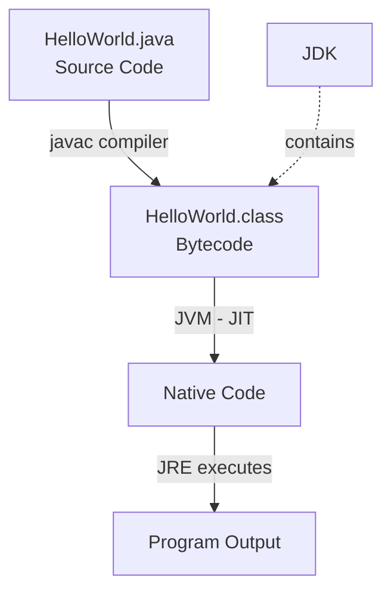

---
prev:
  text: "Lectures"
  link: "/College/yearTwo/secondTerm/Java/Lectures/index"
next:
  text: "Lecture 2"
  link: "/College/yearTwo/secondTerm/Java/Lectures/Lecture-2"
title: Lecture 1
---

# Java Programming - Lecture 1

## What Is Java?

**Java** is an **object-oriented, network-centric programming language** used to build mobile apps, software, and platforms. It is platform-independent — meaning code written once can run anywhere a **JVM** exists.

> [!note]
> **Boundary note:** "Just Another Virtual Accelerator" is a _common but incorrect_ backronym. Java has no official acronym expansion.

**Common Java IDEs:** Eclipse, NetBeans, IntelliJ, VS Code, BlueJ

## Java Architecture — The Compilation Pipeline



**Key distinction:** **Bytecode** is _not_ binary/native — it is intermediate code the CPU cannot execute directly. Only the **JVM** can read it.

| Term      | Full Name                | Role                                                  |
| --------- | ------------------------ | ----------------------------------------------------- |
| **JDK**   | Java Development Kit     | Full dev package: includes compiler + JRE             |
| **JRE**   | Java Runtime Environment | Runs programs: JVM + Class Libraries + Config Files   |
| **JVM**   | Java Virtual Machine     | Reads and executes Bytecode on the OS                 |
| **javac** | Java Compiler            | Converts `.java` -> `.class` (Bytecode)               |
| **JIT**   | Just-In-Time Compiler    | Converts Bytecode -> Native Code at runtime for speed |

> [!WARNING] **JRE != JDK.** JRE is for _end users_ who only run Java programs — it contains no compiler. JDK is for _developers_ — it wraps the JRE and adds `javac` and other tools. Installing only the JRE means you **cannot compile** code.

## JRE Internal Structure

The **JRE** contains exactly three components:

- **JVM** — interprets/executes Bytecode
- **Class Libraries** — predefined code (print, networking, etc.)
- **Configuration Files** — links program to the OS

## Java Program Lifecycle (6 Steps)

> [!important]
> Order matters because each step produces the artifact required by the next.

1. **Write** — Create `ClassName.java`; _public class name must match filename exactly_ (case-sensitive)
2. **Save** — Use `.java` extension
3. **Compile** — Run `javac HelloWorld.java` -> produces `HelloWorld.class`
4. **Load & Verify** — JVM's **Class Loader** reads `.class`; **Bytecode Verifier** checks safety
5. **Execute** — JIT converts Bytecode -> Native Code; **JRE** runs via `main()` entry point
6. **Terminate** — **Garbage Collector** automatically frees memory

```java
// Minimal valid Java program — filename MUST be HelloWorld.java
public class HelloWorld {
    public static void main(String[] args) {  // entry point
        System.out.println("Hello, World!");  // output to console
    }
}
```

> [!IMPORTANT] `main()` is the **mandatory entry point**. Without it, the JVM cannot start execution.

## Native Code File Extensions

**Native Code** has no universal extension — it depends on the OS:

| OS         | Extensions                       |
| ---------- | -------------------------------- |
| Windows    | `.exe`, `.dll`                   |
| Linux/Unix | No extension (or `.out`, `.bin`) |
| macOS      | `.app`, `.dylib`                 |

## IDE Comparison: NetBeans vs. Eclipse

| Feature            | NetBeans                                       | Eclipse                                                  |
| ------------------ | ---------------------------------------------- | -------------------------------------------------------- |
| **Out-of-the-box** | Rich (GUI builder, Maven, web server included) | Minimal — needs plugins for advanced tools               |
| **Customization**  | Moderate, unified experience                   | Extensive — 1,500+ plugins                               |
| **Performance**    | Steady; stable on low-spec hardware            | Variable; fast compiler, but heavy plugins cause lag     |
| **Ease of use**    | Beginner-friendly, single-view UI              | Steeper learning curve (plugin + perspective management) |
| **Best for**       | Web (Java EE), JavaFX, Swing GUI               | Large-scale enterprise, legacy modernization             |

**IntelliJ** — primarily used for **Android** development; supports all OS; includes automatic code correction.

## Java Project Structure (Hierarchy)

```
Java Project
└── Source Folder
    └── Package
        └── Class (.java file)
```

> [!NOTE] This hierarchy is enforced by the IDE — a **Class** must live inside a **Package**, which must live inside a **Source Folder**.

## Environment Variable Configuration

After installing the JDK, **all Java programs must be told the JDK location** — otherwise the OS cannot find `javac` or `java` commands.

- **JDK default install path:** `C:\Program Files\Java\jdk-21\bin`
- Add this path to the system **PATH** variable via: _Control Panel -> System -> Advanced -> Environment Variables -> System Variables -> Path -> New_
- **Verify install:** Open CMD and run:

```bash
java -version
# Expected: java version "21.0.6" ...
# If 'java' is not recognized -> PATH was not set correctly
```

> [!CAUTION] If `java` is unrecognized after install, the PATH environment variable was **not updated**. This is the most common post-install error.

## Summary: Key Distinctions for Exams

| Concept                  | Correct Understanding                                                   |
| ------------------------ | ----------------------------------------------------------------------- |
| Bytecode vs. Native Code | Bytecode = intermediate (JVM reads it); Native = CPU reads it directly  |
| JDK vs. JRE              | JDK = develop + run; JRE = run only                                     |
| JIT purpose              | Converts Bytecode -> Native Code _at runtime_ to boost performance      |
| File naming rule         | `public class Foo` **must** be in `Foo.java` — mismatch = compile error |
| Garbage Collector        | Automatic memory cleanup at program termination                         |
