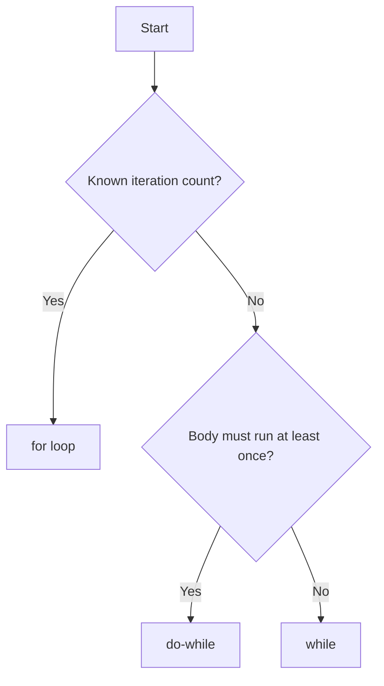

---
prev:
  text: "Lecture 3"
  link: "/College/yearTwo/secondTerm/Java/Lectures/Lecture-3"
next:
  text: "Lecture 5"
  link: "/College/yearTwo/secondTerm/Java/Lectures/Lecture-5"
title: Lecture 4
---

# Java Programming - Lecture 4

## Java Loops

### 1. Loop Fundamentals

A **loop** repeatedly executes a block of code while a **boolean condition** remains true.

- Purpose: reduce code duplication, handle variable repetition, and iterate over data structures.

---

### 2. The `for` Loop – Known Iteration Count

Use when the **number of iterations is known in advance**.

```java
for (initialization; condition; update) {
    // body
}
```

- **initialization**: runs once before loop starts (usually declares a counter).
- **condition**: checked before each iteration; if `false`, loop exits.
- **update**: executed after each iteration (often increments/decrements counter).

```java
for (int i = 0; i < 5; i++) {
    System.out.print(i);   // prints 01234
}
```

> [!important]
> **Why order matters**: The initialization is performed only once; condition is evaluated before each execution; update happens after the body. Changing the order alters loop behavior.

---

### 3. The `while` Loop – Unknown Iteration Count

Use when the **number of iterations is not known beforehand** (e.g., reading until sentinel).

```java
int i = 0;
while (i < 5) {
    System.out.println(i);
    i++;
}
```

- Condition checked **at the top**; if initially false, the body is **never executed**.

> [!TIP]
> A `while` loop can become **infinite** if the condition never becomes false. Always ensure the loop variable changes inside the body.

---

### 4. The `do-while` Loop – Execute at Least Once

Use when the **body must execute at least once** regardless of condition.

```java
int i = 0;
do {
    System.out.println(i);
    i++;
} while (i < 5);
```

- Condition checked **after** the body; guarantees **minimum one execution**.

| Loop Type  | Check Time | Minimum Executions |
| ---------- | ---------- | ------------------ |
| `for`      | top        | 0                  |
| `while`    | top        | 0                  |
| `do-while` | bottom     | 1                  |

> [!caution]
> **Exam Trap**: `do-while` ends with a semicolon after `while(condition);`. Omitting it causes a compilation error.

---

### 5. Nested Loops – Multi‑Dimensional Patterns

A **nested loop** is a loop inside another loop. The inner loop completes all its iterations for each single iteration of the outer loop.

#### Pattern Analysis Example

```java
for (int i = 0; i < 5; i++) {                // outer loop controls rows
    for (int x = 0; x < 5 - i; x++) {        // inner loop 1: prints 'x'
        System.out.print("x");
    }
    for (int p = 0; p <= i; p++) {           // inner loop 2: prints '+'
        System.out.print("+");
    }
    System.out.println();                    // move to next line
}
```

**Pattern Table (i from 0 to 4):**

| i   | x count = 5 – i | + count = i + 1 | Output |
| --- | --------------- | --------------- | ------ |
| 0   | 5               | 1               | xxxxx+ |
| 1   | 4               | 2               | xxxx++ |
| 2   | 3               | 3               | xxx+++ |
| 3   | 2               | 4               | xx++++ |
| 4   | 1               | 5               | x+++++ |

- **Inverse relationship**: As `i` increases, `x` count decreases, `+` count increases.
- **Constant total symbols per line**:  
  $(5 - i) + (i + 1) = 6$

> [!note]
> **Why this matters**: Nested loops produce patterns where the iteration counts depend on the outer loop index. Recognizing formulas helps predict output without execution.

---

### 6. Loop Control & Common Mistakes

#### Infinite Loops

- `for (int i = 0; i < 5; i--)` -> i never reaches 5.
- `while (true)` without a `break` inside.

#### Off-by-One Errors

- Using `<` vs. `<=` changes iteration count.
- Example: `i < 5` runs 5 times (i = 0..4); `i <= 5` runs 6 times.

#### Scope of Loop Variables

- In `for (int i = 0; ...)`, `i` is **local to the loop**; cannot be used outside.
- In `while` and `do-while`, the counter must be declared before the loop, making it accessible afterward.

#### Empty Body Pitfall

```java
while (i < 5);   // semicolon terminates loop – infinite if i unchanged
{
    System.out.println(i);
    i++;
}
```

---

### 7. Choosing the Right Loop – Decision Flow



- Use **for** when you have an index that changes predictably.
- Use **while** for conditions that depend on external input.
- Use **do-while** when the action must occur before checking (e.g., menu display).

---

### 8. Formulas for Pattern Generation (Testable)

Given an outer loop variable `i` (starting at 0),

- **Decreasing sequence**: `n - i` characters (where `n` is starting count).
- **Increasing sequence**: `i + 1` characters.
- **Constant total**: `(decreasing) + (increasing) = constant`.

Example: if outer loop runs from `0` to `m-1`, and pattern has `a – i` of one symbol and `i + b` of another, the total is `a + b` (constant).

> [!IMPORTANT]  
> In nested loops, the **inner loops** execute completely for each outer iteration. Execution count = (outer iterations) × (inner iterations) when independent. For dependent counts (as above), it's the sum of inner iterations.
