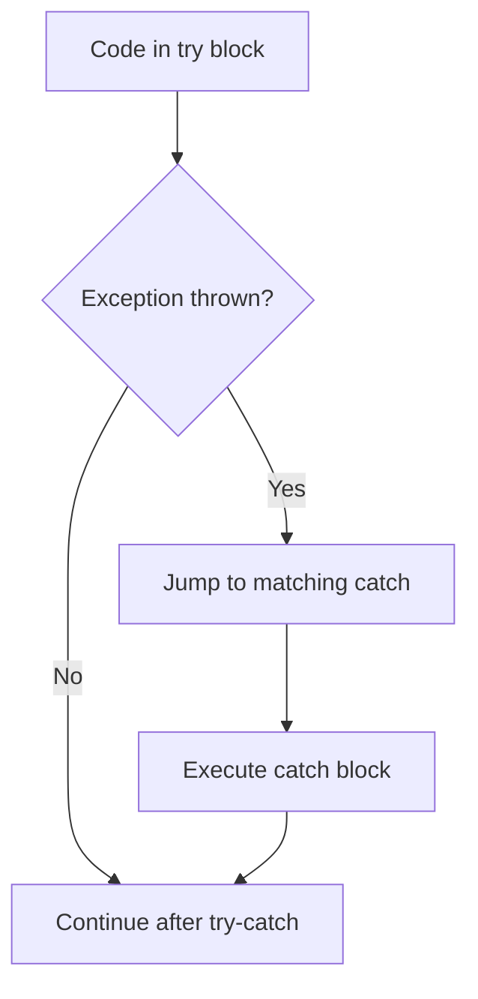

---
prev:
  text: "Lecture 4"
  link: "/College/yearTwo/secondTerm/Java/Lectures/Lecture-4"
next: false
title: Lecture 5
---

# Java Programming - Lecture 5

## Java Arrays & Exception Handling

### 1. Arrays – Fixed-Size Homogeneous Collections

An **array** is a container that holds a **fixed number** of elements of the **same data type** in a single variable.

- **Fixed size**: once created, length cannot change.
- **Zero‑based indexing**: first element at index `0`, last at `length - 1`.

#### Declaration & Initialization

```java
// Declaration with type and brackets
String[] fruits;                // preferred style
int[] numbers;

// Initialization with literal values
String[] fruits = {"Banana", "Apple", "Orange"};
int[] scores = {90, 85, 78};
```

- The `new` keyword can also be used: `int[] nums = new int[5];` (all elements set to default: 0 for int, null for objects).

#### Accessing Elements

```java
System.out.println(fruits[0]);     // prints "Banana"
fruits[0] = "Watermelon";          // changes element at index 0
```

> [!WARNING]  
> **ArrayIndexOutOfBoundsException**: accessing index < 0 or ≥ length throws this runtime exception.

#### Array Length

`array.length` (not a method) returns the number of elements.

```java
for (int i = 0; i < fruits.length; i++) {
    System.out.println(fruits[i]);
}
```

#### Enhanced for‑loop (for‑each)

Simplifies iteration when index is not needed.

```java
for (String fruit : fruits) {
    System.out.println(fruit);
}
```

#### Calculating Average – Example

```java
int[] deg = {30, 33, 24, 35, 40, 36};
float sum = 0;
for (int score : deg) {
    sum += score;
}
float avg = sum / deg.length;   // length used as divisor
```

---

### 2. Multi‑Dimensional Arrays

A **multidimensional array** is an array of arrays. Useful for tabular data (rows and columns).

```java
int[][] myNumbers = { {1, 2, 3, 4}, {5, 6, 7} };
// myNumbers[0] is the first row (array of 4 elements)
// myNumbers[1] is the second row (array of 3 elements)
```

#### Accessing & Modifying

- Two indices: `[row][column]`.

```java
myNumbers[1][2] = 9;      // changes third element of second row
System.out.println(myNumbers[1][2]); // prints 9
```

- Rows can have different lengths (jagged arrays).

---

### 3. Exception Handling – try‑catch

An **exception** is an event that disrupts normal program flow. Java uses `try` and `catch` to handle them gracefully instead of crashing.

```java
try {
    // code that may throw an exception
} catch (ExceptionType e) {
    // code to handle the exception
}
```

#### Why Order Matters

- If an exception occurs in the `try` block, execution jumps immediately to the matching `catch`.
- Only the first matching `catch` is executed.

#### Common Example: ArrayIndexOutOfBoundsException

```java
String[] names = {"Belal", "Youssef"};
try {
    System.out.println(names[3]);   // index 3 does not exist
} catch (Exception x) {
    System.err.println("Index out of bounds!");
}
```

#### `System.err` vs `System.out`

- `System.out` prints to standard output stream.
- `System.err` prints to standard error stream (often used for error messages).  
  Both appear in console, but can be redirected separately.

#### Getting the Error Message

```java
catch (Exception x) {
    System.err.println(x.getMessage());   // prints "Index 3 out of bounds for length 2"
}
```

| Stream       | Purpose         | Typical Use               |
| ------------ | --------------- | ------------------------- |
| `System.out` | Standard output | Normal program output     |
| `System.err` | Standard error  | Error messages, debugging |

---

### 4. Key Exam Traps & Comparisons

| Concept                             | Rule / Trap                                                                 |
| ----------------------------------- | --------------------------------------------------------------------------- |
| Array size                          | Declared size is final; cannot be resized after creation.                   |
| Index range                         | First index = 0; last index = `length - 1`.                                 |
| `array.length` vs `String.length()` | `length` is a **field** for arrays; `length()` is a **method** for strings. |
| Enhanced for‑loop                   | Cannot modify array elements (iteration variable is a copy).                |
| Multi‑dimensional access            | `array[row][col]`; rows may have different lengths.                         |
| Try‑catch scope                     | Variables declared inside `try` are not visible in `catch`.                 |

#### Exception Handling Flow



- If no `catch` matches, the exception propagates up (may crash program).
- A `finally` block (not covered in lecture) can be added to always execute cleanup.

---

### 5. Code Patterns to Memorize

#### 1. Iterate over array with index

```java
for (int i = 0; i < arr.length; i++) {
    // use arr[i]
}
```

#### 2. Iterate over array with for‑each

```java
for (Type element : arr) {
    // use element
}
```

#### 3. Safe access with exception handling

```java
try {
    int value = arr[index];
} catch (ArrayIndexOutOfBoundsException e) {
    System.err.println("Invalid index");
}
```

> [!IMPORTANT]  
> Always validate indices before access when possible, but use exception handling for unpredictable inputs (e.g., user‑supplied index).
