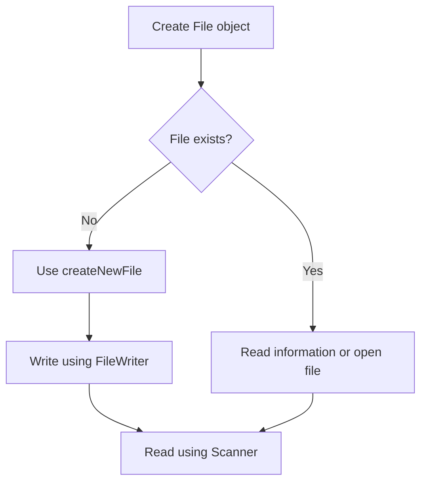

---
prev:
  text: "Lecture 5"
  link: "/College/yearTwo/secondTerm/Java/Lectures/Lecture-5"
next: false
title: Lecture 6
---

# Java Programming - Lecture 6

## Java File Handling

### 1. File Handling Overview

Java file handling means working with files through the `File` class to create, inspect, write, read, and delete files.

- Common tasks in this lecture: create a file, get file information, write text, and read file contents.
- The lecture uses classes from the `java.io` package and `Scanner` from `java.util`.

---

### 2. The `File` Class

The `File` class belongs to the `java.io` package and represents a file or directory path.

#### Steps to use `File`

1. Import the class.
2. Create a `File` object.
3. Pass the file name or full path.

```java
import java.io.File;

File myObj = new File("filename.txt");
```

> [!IMPORTANT]
> On Windows, file paths inside Java strings must escape backslashes, for example: `C:\\Users\\Name\\file.txt`.

> [!note]
> A `File` object does not automatically create a physical file. It only represents the path until methods such as `createNewFile()` are used.

---

### 3. Common `File` Methods

The lecture introduced several important methods for checking file properties and working with directories.

| Method              | Return Type | Purpose                             |
| ------------------- | ----------- | ----------------------------------- |
| `canRead()`         | `boolean`   | Checks whether the file is readable |
| `canWrite()`        | `boolean`   | Checks whether the file is writable |
| `createNewFile()`   | `boolean`   | Creates a new empty file            |
| `delete()`          | `boolean`   | Deletes a file                      |
| `exists()`          | `boolean`   | Checks whether the file exists      |
| `getName()`         | `String`    | Returns the file name               |
| `getAbsolutePath()` | `String`    | Returns the full path               |
| `length()`          | `long`      | Returns file size in bytes          |
| `list()`            | `String[]`  | Returns directory contents          |
| `mkdir()`           | `boolean`   | Creates a directory                 |

> [!TIP]
> `length()` returns `0` for an empty file, which is why the first example displays a size of zero bytes.

---

### 4. Reading File Information

The first example creates a `File` object that points to an existing text file, then prints information about it.

```java
import java.io.File;

public class Firstgeneral {
  public static void main(String[] args) {
    File readlect6 = new File("/home/othman/Documents/lec6.txt");

    System.out.println("File name: " + readlect6.getName());
    System.out.println("File Path: " + readlect6.getAbsolutePath());
    System.out.println("Read File: " + readlect6.canRead());
    System.out.println("Write File: " + readlect6.canWrite());
    System.out.println("Size file: " + readlect6.length());
  }
}
```

Expected output:

```text
File name: lec6.txt
File Path: /home/othman/Documents/lec6.txt
Read File: true
Write File: true
Size file: 0
```

- `getName()` returns only the final file name.
- `getAbsolutePath()` returns the complete location.
- `canRead()` and `canWrite()` return `true` or `false`.

---

### 5. Creating a New File

Use `createNewFile()` inside a `try-catch` block because file operations may throw exceptions.

```java
import java.io.File;

public class Createnewfile {
  public static void main(String[] args) {
    try {
      File myfile = new File("/home/othman/Documents/Createfile.txt");

      if (myfile.createNewFile()) {
        System.out.println("The file Created: " + myfile.getName());
      } else {
        System.out.println("the File is aleardy Exists");
      }
    } catch (Exception d) {
      System.err.println(d.getMessage());
    }
  }
}
```

First run:

```text
The file Created: Createfile.txt
```

If the program runs again, the file already exists, so the `else` block executes.

```text
the File is aleardy Exists
```

> [!WARNING]
> `createNewFile()` does not overwrite existing files. It only creates the file if it does not already exist.

---

### 6. Writing to a File with `FileWriter`

The lecture uses `FileWriter` to write text into an external file.

```java
import java.io.FileWriter;

public class Write {
  public static void main(String[] args) {
    try {
      FileWriter writex = new FileWriter("/home/othman/Documents/Createfile.txt");
      writex.write("hello in NCTU");
      writex.close();
    } catch (Exception d) {
      System.err.println(d.getMessage());
    }
  }
}
```

- `write()` sends text to the file.
- `close()` is necessary to save changes and release the resource.

> [!IMPORTANT]
> If you forget to close the `FileWriter`, data may not be fully written to the file.

---

### 7. Reading from a File with `Scanner`

The lecture reads external file contents using `Scanner`.

```java
import java.io.File;
import java.util.Scanner;

public class readex4 {
  public static void main(String[] args) {
    try {
      File myfile = new File("/home/othman/Documents/Createfile.txt");
      Scanner read = new Scanner(myfile);

      while (read.hasNextLine()) {
        String data = read.nextLine();
        System.out.println(data);
      }
    } catch (Exception x) {
      System.err.println(x.getMessage());
    }
  }
}
```

Output:

```text
hello in NCTU
```

- `hasNextLine()` checks whether there is another line to read.
- `nextLine()` reads one full line at a time.

---

### 8. Key Differences to Remember

| Concept             | Meaning                                        |
| ------------------- | ---------------------------------------------- |
| `File`              | Represents a file or directory path            |
| `createNewFile()`   | Creates a real empty file if it does not exist |
| `FileWriter`        | Writes text into a file                        |
| `Scanner` with file | Reads text from a file                         |
| `System.out`        | Prints normal output                           |
| `System.err`        | Prints error messages                          |

---

### 9. File Handling Flow



---

### 10. Important Notes and Exam Traps

- `import java.io.File;` is correct for the `File` class.
- Linux paths can be written directly, for example: `/home/othman/Documents/Createfile.txt`.
- File paths in Java strings on Windows use escaped backslashes like `C:\\Users\\Name\\file.txt`.
- `createNewFile()` returns a `boolean`, so it is often used inside an `if` statement.
- `Scanner` can read from a file, not only from keyboard input.
- File operations should be placed inside `try-catch` because they may fail due to missing files or invalid paths.

> [!NOTE]
> The lecture learning outcomes also mention deleting files, directories, and I/O streams, but the detailed examples in this PDF focus mainly on file information, creating files, writing, and reading.
