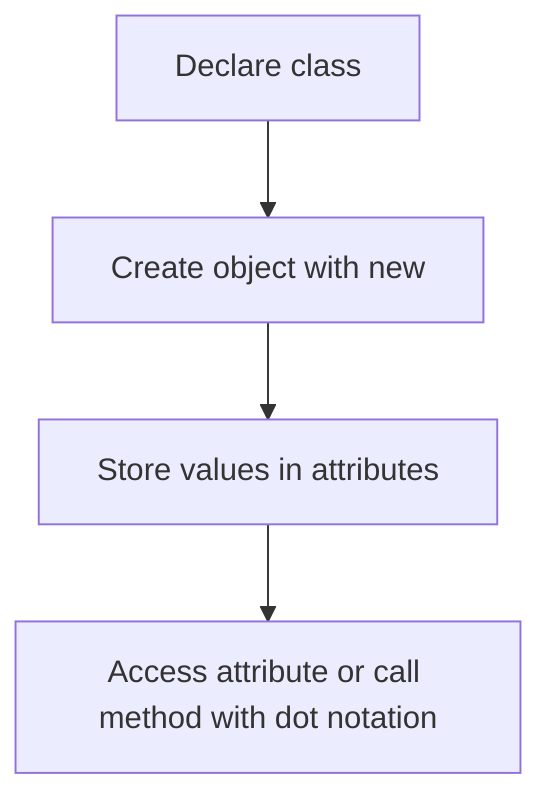

---
prev:
  text: "Lecture 7"
  link: "/College/yearTwo/secondTerm/Java/Lectures/Lecture-7"
next: false
title: Lecture 8
---

# Java Programming - Lecture 8

## Object-Oriented Programming Basics

**Object-Oriented Programming (OOP)** is a programming **paradigm** that organizes software using **classes** and **objects**. An **object** represents a real-world entity, while a **class** defines the structure and behavior that objects follow.

- **Class** = blueprint or template.
- **Object** = instance created from that blueprint.
- **OOP** includes data and behavior in one model.

> [!IMPORTANT]
> **The source file is `Lecture-8.pdf`, so this note follows Lecture 8 even though the slide cover is mislabeled.** The file number is the authoritative lecture number.

| Concept    | Definition                                   | Not the same as             | Why exam questions confuse them                                |
| ---------- | -------------------------------------------- | --------------------------- | -------------------------------------------------------------- |
| **Class**  | Template that defines attributes and methods | A single created entity     | A class describes; it does not represent one specific object   |
| **Object** | Actual instance created from a class         | The class definition itself | An object stores concrete values and can use the class methods |

## Class, Object, Attributes, and Methods

A **class** is a blueprint from which **objects** are created. A class contains **attributes** and **methods**. **Attributes** are the properties or state of an object, while **methods** are the actions an object can perform. Every object from the same class shares the same member definitions.

- **Attributes** are also called **fields** or **member variables**.
- **Methods** define behavior.
- Objects contain both data and methods through their class.

```java
// Purpose: define a class with attributes, then create one object.
class NewCairo {
  String name = "Mohamed";
  String year = "2024-2025";
}

public class FirstClass {
  public static void main(String[] args) {
    NewCairo student = new NewCairo();
    System.out.println("student name is: " + student.name);
    System.out.println("student registration year is: " + student.year);
  }
}
```

Why this works: `student` is an object, so dot notation such as `student.name` accesses the attributes defined in `NewCairo`.

## Rules for Class Creation

The lecture gives naming and declaration rules for Java classes. A class name should start with a capital letter, and if the name has two words, the first letter of each word should be capitalized. The lecture also states that **two public classes are not allowed in the same program**.

```java
// Purpose: show the lecture's basic class declaration form.
class NewCairo {
  // attributes or methods go here
}
```

> [!WARNING]
> _Common exam trap:_ **`class NewCairo`** defines a class, but it does not create an object. An object exists only after a statement such as `new NewCairo()` runs.

### Naming Rules

- **Class names** should begin with a capital letter.
- Multi-word class names should use capital letters for each word, such as **`NewCairo`**.
- A class can contain attributes, methods, or both.

## Creating Objects and Accessing Members

An **object** is created from a class using the **`new`** keyword. The lecture pattern is declaring a reference variable, creating the object, and then using **dot notation** to access attributes or call methods.

```java
// Purpose: create an object, assign values, and access one field.
class Nctu {
  String Name1, Name2, Name3, Name4;
}

public class Second {
  public static void main(String[] args) {
    Nctu student = new Nctu();
    student.Name1 = "Mohamed";
    student.Name2 = "youssef";
    student.Name3 = "Belal";
    student.Name4 = "Nada";
    System.out.println(student.Name2);
  }
}
```



1. Define the **class**.
2. Create an **object** with `new`.
3. Save the object in a reference variable.
4. Access attributes with `objectName.attribute`.
5. Call methods with `objectName.method()`.

> [!NOTE]
> _The PDF example assigns `student.Name3` twice; the intended four-name pattern clearly implies the last assignment should be `student.Name4 = "Nada";`._

## Attributes vs. Methods

**Attributes** store state, while **methods** perform actions. Attributes answer "what data does the object have?" and methods answer "what can the object do?".

| Feature              | **Attributes**          | **Methods**               |
| -------------------- | ----------------------- | ------------------------- |
| Purpose              | Store object data       | Perform actions           |
| Example from lecture | `name`, `year`, `Name2` | `empdata()`, `Addition()` |
| Access form          | `student.name`          | `emp.empdata()`           |

## Methods Inside Classes

An object can use methods defined in its class. In the lecture, class `Employees` contains method **`empdata()`**, and an `Employees` object calls it with `emp.empdata();`.

```java
// Purpose: define a behavior inside a class and call it through an object.
class Employees {
  void empdata() {
    String name = "belal";
    String gener = "male";
    String add = "Cairo";
    System.out.println("Name is: " + name);
    System.out.println("Gener is: " + gener);
    System.out.println("Add is: " + add);
  }
}

public class MethodClass {
  public static void main(String[] args) {
    Employees emp = new Employees();
    emp.empdata();
  }
}
```

> [!IMPORTANT]
> **Object method call** uses dot notation: `objectName.methodName()`. Without an object, a non-static class method from this lecture style cannot be called directly from `main()`.

## Return Values in Object Methods

A class method can also return a value. In the lecture, `Addition(int n1, int n2)` belongs to class `Calc` and returns an **`int`**. The caller stores the returned value in variable `x`, then prints it. `return` sends the result back to the caller.

```java
// Purpose: return a computed result from a class method.
class Calc {
  int Addition(int n1, int n2) {
    return n1 + n2;
  }
}

public class MethodCalc {
  public static void main(String[] args) {
    Calc calcus = new Calc();
    int x = calcus.Addition(10, 5);
    System.out.println(x);
  }
}
```

| Call style               | Returns value? | Lecture example                | Main use               |
| ------------------------ | -------------- | ------------------------------ | ---------------------- |
| `emp.empdata()`          | No             | `void empdata()`               | Perform an action      |
| `calcus.Addition(10, 5)` | Yes            | `int Addition(int n1, int n2)` | Compute and reuse data |

## Exam Traps and Recall Rules

- **OOP** organizes programs using **classes** and **objects**.
- **Class** is a blueprint; **object** is an instance.
- **Attributes** store data; **methods** perform actions.
- **Fields**, **attributes**, and **member variables** refer to the same idea in this lecture.
- Use **`new`** to create an object.
- Access members with **dot notation**.
- A class definition alone does not create an object.
- A method inside a class can be **`void`** or return a value such as **`int`**.
