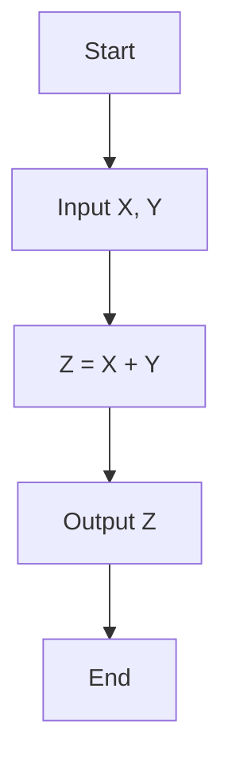
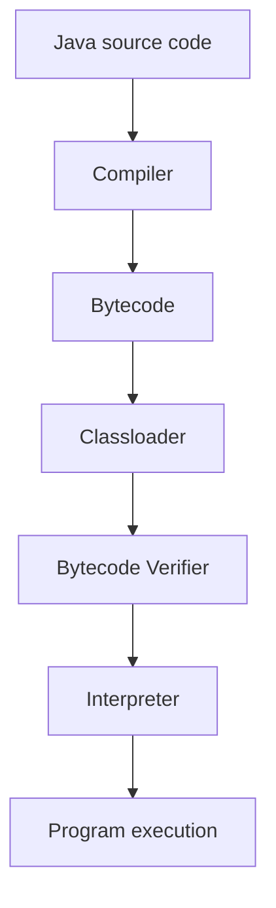

---
prev:
  text: "Java"
  link: "/College/yearTwo/secondTerm/Java/index"
next:
  text: "Section 2"
  link: "/College/yearTwo/secondTerm/Java/Sections/Section-2"
title: Section 1
---

# Java Programming - Section 1

## Flowcharts and Program Logic

**Flowchart** means a diagram that represents a **workflow** or **process** using ordered symbols and arrows. It is used before coding to plan logic step by step.

- **Start / End**: marks where the process begins or finishes.
- **Process**: represents an action such as calculation or assignment.
- **Input / Output**: represents reading data or displaying results.
- **Decision**: represents a condition that can change the path.
- **Flow line**: shows direction of execution.



Why this matters: a flowchart shows **sequence** and **branching**, so each symbol has a different role.

## Java, Applications, and Platforms

**Java** is a **high-level**, **object-oriented** programming language designed to be simple, secure, and portable. **Portable** means the same compiled Java program can run on any system with a **Java Virtual Machine (JVM)** installed.

### Java Application Types

- **Desktop applications**: standalone programs running on one machine.
- **Web applications**: applications delivered through web technologies.
- **Mobile applications**: applications for mobile devices.
- **Enterprise applications**: large systems such as banking applications.

### Java Platforms

| Platform    | Main use                        | Includes / built on                                                 | Excludes                        |
| ----------- | ------------------------------- | ------------------------------------------------------------------- | ------------------------------- |
| **Java SE** | Core Java programming           | APIs such as `java.lang`, OOP, `String`                             | Enterprise-specific APIs        |
| **Java EE** | Web and enterprise applications | Built on **Java SE**; includes Servlet, JSP, Web Services, EJB, JPA | Not the basic core-only edition |
| **Java ME** | Mobile-focused development      | Micro platform                                                      | Full enterprise stack           |
| **JavaFX**  | Rich Internet applications      | Lightweight UI API                                                  | General backend platform        |

> [!IMPORTANT]
> **Java SE** is the base platform in this section. **Java EE** is built on top of it, so they are related but not interchangeable.

## JDK, JRE, and JVM

The **Java environment** is the software needed to run Java programs. Its three core terms are **JDK**, **JRE**, and **JVM**.

| Term    | Meaning                      | Main role                                                                | Boundary                                                      |
| ------- | ---------------------------- | ------------------------------------------------------------------------ | ------------------------------------------------------------- |
| **JVM** | **Java Virtual Machine**     | Loads, verifies, and executes **bytecode**; provides runtime environment | Executes code but is not the full development kit             |
| **JRE** | **Java Runtime Environment** | Provides JVM plus libraries and runtime files                            | Runs Java programs but does not include all development tools |
| **JDK** | **Java Development Kit**     | Provides JRE plus compiler, debugger, and development tools              | Used to develop, compile, and run Java                        |

Why this works: Java source code is compiled once, then the **JVM** executes the resulting **bytecode**.

> [!WARNING]
> _Do not confuse **JRE** with **JDK**._ If you only need to run Java, **JRE** is enough; if you need to compile and develop, you need **JDK**.

## Program Structure and Execution Stages

Every Java program must contain at least one **class**, and execution starts from the **`main` method**.

```java
// Purpose: show the minimum structure of a runnable Java program.
public class Welcome {
  public static void main(String[] args) {
    System.out.println("Welcome");
  }
}
```

At **compile time**, the Java compiler converts source code into **bytecode**. At **runtime**, the **Classloader** loads class files, the **Bytecode Verifier** checks for illegal code, and the **Interpreter** executes instructions.



1. Write source code.
2. Compile it into bytecode.
3. Load the class files.
4. Verify bytecode safety.
5. Execute instructions at runtime.

## Keywords, Comments, and Identifiers

**Keywords** are reserved words with predefined meaning to the compiler, such as **`class`**, **`public`**, **`static`**, and **`void`**. They cannot be used as variable, class, or method names.

**Comments** explain code and are ignored by the compiler.

```java
// Purpose: show valid comment syntax in Java.
// Single-line comment
/* Multi-line comment */
```

**Identifiers** are names used for program elements such as variables, constants, methods, and classes. They can contain letters, digits, `_`, and `$`, must start with a letter, `_`, or `$`, cannot be a reserved keyword, and cannot be **`true`**, **`false`**, or **`null`**.

> [!NOTE]
> _Identifiers are **case sensitive**._ `x` and `X` are different names, so using the wrong case can create a logic or compilation problem.

## Variables and Data Types

**Variable** means a named memory location used to store a value. Every variable must have a **data type**, because the data type defines what kind of value the variable can hold.

```java
// Purpose: declare and initialize a variable.
int number = 5;
```

**Data types** in Java are divided into **primitive** and **non-primitive** types.

- **Primitive data types**: `boolean`, `char`, `byte`, `short`, `int`, `long`, `float`, `double`
- **Non-primitive data types**: **Classes**, **Interfaces**, **String**, **Arrays**

| Type group        | Includes                                          | Main boundary                     |
| ----------------- | ------------------------------------------------- | --------------------------------- |
| **Primitive**     | Fixed built-in types such as `int` and `double`   | Not objects like `String`         |
| **Non-primitive** | Reference-based types such as `String` and arrays | Not the eight built-in primitives |

> [!IMPORTANT]
> _`float` literals need `f` in examples like `3.8f`; otherwise Java treats decimal literals as `double` by default._

## Operators and Error Types

**Operators** are symbols that perform operations on values and variables. The section lists eight categories: **Arithmetic**, **Unary**, **Relational**, **Ternary**, **Assignment**, **Bitwise**, **Logical**, and **Shift** operators. The arithmetic operators shown are `+`, `-`, `*`, `/`, and `%`, where **`%`** returns the remainder.

```java
// Purpose: show shorthand assignment operators.
i += 8;  // i = i + 8
i -= 8;  // i = i - 8
i *= 8;  // i = i * 8
i /= 8;  // i = i / 8
i %= 8;  // i = i % 8
```

**Programming errors** are grouped into three exam-critical categories.

| Error type        | When it occurs       | Example        | Key boundary                 |
| ----------------- | -------------------- | -------------- | ---------------------------- |
| **Syntax error**  | During compilation   | Missing `;`    | Program does not compile     |
| **Runtime error** | During execution     | Divide by zero | Program starts, then fails   |
| **Logic error**   | After successful run | Wrong result   | No syntax or runtime failure |

> [!WARNING]
> _A program with a **logic error** may compile and run normally, which makes it harder to detect than syntax errors._
