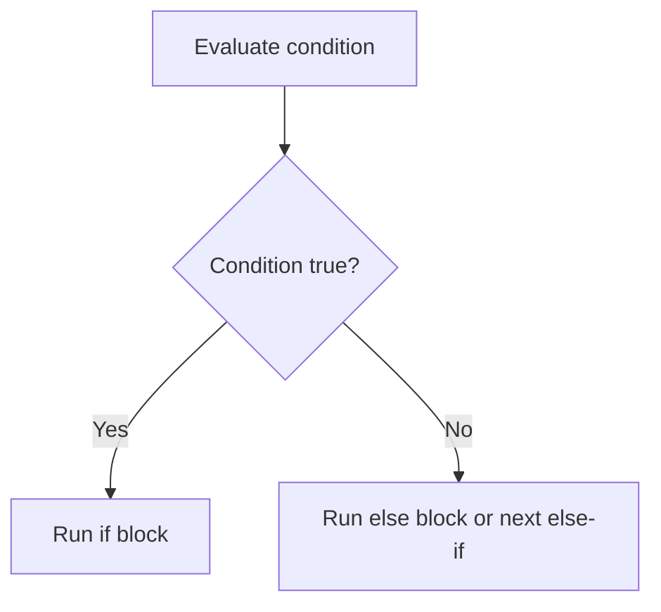

---
prev:
  text: "Section 1"
  link: "/College/yearTwo/secondTerm/Java/Sections/Section-1"
next:
  text: "Section 3"
  link: "/College/yearTwo/secondTerm/Java/Sections/Section-3"
title: Section 2
---

# Java Programming - Section 2

## Reading Input with `Scanner`

**`Scanner`** is a Java class used to read input from sources such as the keyboard, files, strings, or streams. It belongs to the **`java.util`** package, so it must be imported before use. It reads input token by token or line by line, then converts it into the requested type.

### Keyboard Input Steps

1. Import **`Scanner`** with `import java.util.Scanner;`.
2. Create an object using **`System.in`**.
3. Call the method that matches the needed data type.
4. Close the scanner when input is complete.

```java
// Purpose: read one full line of text from the keyboard.
import java.util.Scanner;

public class ScannerExample1 {
  public static void main(String[] args) {
    Scanner sc = new Scanner(System.in);
    System.out.print("Enter your name: ");
    String name = sc.nextLine();
    System.out.println("Name is: " + name);
    sc.close();
  }
}
```

> [!IMPORTANT]
> **`next()`** reads the next token only, but **`nextLine()`** reads the whole line. Use `nextLine()` when spaces must be preserved.

## `Scanner` Methods and Input Boundaries

Each **`Scanner` method** reads a specific kind of token. Choosing the wrong method causes wrong parsing.

| Method | Reads | Main boundary |
| --- | --- | --- |
| **`nextByte()`** | next token as `byte` | Not for large integers |
| **`nextShort()`** | next token as `short` | Not for text |
| **`nextInt()`** | next token as `int` | Not for decimals |
| **`nextLong()`** | next token as `long` | Larger integer range |
| **`nextFloat()`** | next token as `float` | Decimal input |
| **`nextDouble()`** | next token as `double` | Higher-precision decimal input |
| **`next()`** | next complete token | Stops at whitespace |
| **`nextLine()`** | full line of text | Keeps spaces |

```java
// Purpose: read multiple data types in one program.
import java.util.Scanner;

public class ScannerExample2 {
  public static void main(String[] args) {
    Scanner sc = new Scanner(System.in);
    String name = sc.next();
    int age = sc.nextInt();
    double salary = sc.nextDouble();
    System.out.println("Name: " + name);
    System.out.println("Age: " + age);
    System.out.println("Salary: " + salary);
  }
}
```

> [!WARNING]
> *If the input contains spaces, **`next()`** stops at the first space. For full names or full sentences, use **`nextLine()`** instead.*

## Unary Operators and Evaluation Order

**Unary operators** act on one operand only. The section emphasizes **`+`**, **`-`**, **`++`**, and **`--`**. The key exam boundary is **prefix vs. postfix** evaluation: **prefix** changes the variable before use, while **postfix** uses the current value first and then changes it.

| Operator | Meaning | Order rule |
| --- | --- | --- |
| **`+`** | positive value | Keeps sign positive |
| **`-`** | negative value | Reverses sign |
| **`++x`** | pre-increment | Increment first, then use |
| **`x++`** | post-increment | Use first, then increment |
| **`--x`** | pre-decrement | Decrement first, then use |
| **`x--`** | post-decrement | Use first, then decrement |

```java
// Purpose: show prefix and postfix difference.
int a = 5;
int b = 5;
int x = ++a;
int y = b++;
```

Why this matters: after `int x = ++a;`, both `a` and `x` become `6`, but after `int y = b++;`, `y` is `5` and `b` becomes `6` afterward.

> [!NOTE]
> *String concatenation also depends on evaluation order.* `"i + j = " + i + j` joins text left to right, while `"i + j = " + (i + j)` forces arithmetic first.

## Relational Operators and Boolean Results

**Relational operators** compare two operands and produce a **Boolean** result: either **`true`** or **`false`**. They answer whether a relationship holds.

| Operator | Meaning |
| --- | --- |
| **`<`** | less than |
| **`>`** | greater than |
| **`<=`** | less than or equal |
| **`>=`** | greater than or equal |
| **`==`** | equal to |
| **`!=`** | not equal to |

```java
// Purpose: compare two values and print Boolean results.
int a = 10;
int b = 20;
System.out.println(a < b);
System.out.println(a != b);
```

Why this matters: decision statements such as **`if`** depend on Boolean results.

## Control Statements and `if` Variants

**Control statements** change the normal top-to-bottom execution order of a program. The section groups them into **decision-making**, **loop**, and **jump** statements.

- **Decision-making**: `if`, `switch`
- **Loops**: `do while`, `while`, `for`, `for-each`
- **Jump statements**: `break`, `continue`

The section focuses on **`if` statements**, which execute code only when a condition is true. Java uses four forms:

| Form | When to use | Boundary |
| --- | --- | --- |
| **Simple `if`** | One action only when condition is true | No false branch |
| **`if-else`** | Choose between two paths | Exactly one branch runs |
| **`if-else-if` ladder** | Test multiple conditions in order | First true condition stops further checks |
| **Nested `if`** | Test a second condition inside another condition | Inner test depends on outer test |

> [!IMPORTANT]
> **`if` conditions must evaluate to a Boolean value.** If the condition is false, the `if` body is skipped.

## `if` Execution Flow and Nested Logic

The order of checks matters in decision-making. In an **`if-else-if` ladder**, Java tests conditions from top to bottom and executes only the first true branch. In a **nested `if`**, the inner condition is checked only after the outer condition is true.

```java
// Purpose: show a standard if-else structure.
if (x + y < 10) {
  System.out.println("x + y is less than 10");
} else {
  System.out.println("x + y is greater than 20");
}
```



1. Evaluate the condition.
2. If it is **`true`**, run the current block.
3. If it is **`false`**, skip to `else` or the next `else if`.
4. In nested `if`, the inner check runs only after the outer check passes.

> [!WARNING]
> *In an `if-else-if` ladder, later conditions are ignored after the first true one. Order can therefore change the final result.*

## Exam Tasks: Number Logic Patterns

The tasks in this section all depend on **input**, **operators**, and **conditions** working together. A **three-digit number** can be separated into **hundreds**, **tens**, and **ones** digits using division and remainder.

- **Palindrome number**: reversed number equals the original number.
- **Armstrong number** in the section example: for `153`, calculate `1^3 + 5^3 + 3^3`; if the sum equals the original number, it is Armstrong.
- **Positive or negative check**: compare the number with zero.
- **Greatest, smallest, and average**: compare three inputs, then compute the mean.

```java
// Purpose: show the Armstrong logic pattern from the section.
int sum = 1 * 1 * 1 + 5 * 5 * 5 + 3 * 3 * 3;
System.out.println(sum == 153);
```
