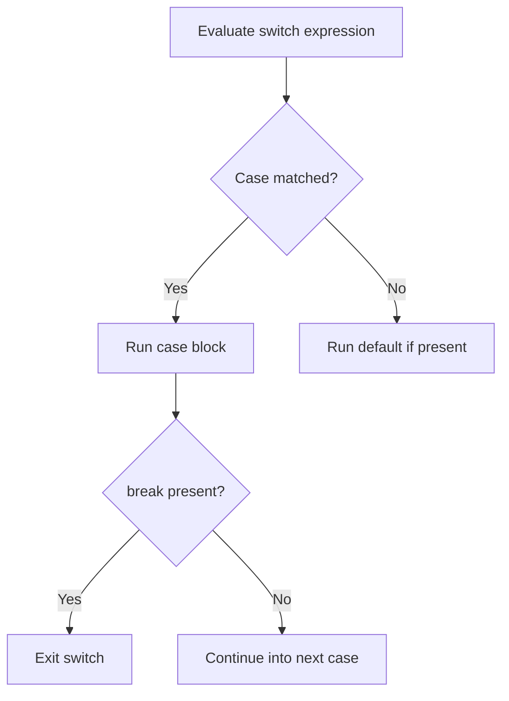

---
prev:
  text: "Section 2"
  link: "/College/yearTwo/secondTerm/Java/Sections/Section-2"
next:
  text: "Section 4"
  link: "/College/yearTwo/secondTerm/Java/Sections/Section-4"
title: Section 3
---

# Java Programming - Section 3

## `switch` Statement Basics

**`switch`** is a **control flow statement** that selects one branch of code by testing whether an expression is equal to one of several **`case`** values. It is used for equality checking only, which is why it works well for fixed known values but not for relational conditions such as `>` or `<`.

| Part                     | Role                       | Boundary                                     |
| ------------------------ | -------------------------- | -------------------------------------------- |
| **`switch(expression)`** | value being tested         | Must produce a supported switch type         |
| **`case value:`**        | branch for one exact value | Value must be literal or constant            |
| **`break;`**             | exits the switch           | Optional, but missing it causes fall-through |
| **`default:`**           | runs if no case matches    | Optional                                     |

```java
// Purpose: choose a branch based on one exact value.
switch (month) {
  case 1:
    monthString = "1 - January";
    break;
  default:
    System.out.println("Invalid Month!");
}
```

> [!IMPORTANT]
> **`switch` checks equality only.** If the question needs ranges or complex conditions, use **`if`** instead.

## `switch` Rules, Types, and Fall-Through

The **case values** in a switch must match the type of the switch expression, must be unique, and must be **literal or constant** values rather than variables. Duplicate case values produce a **compile-time error** because Java would not know which branch should own the repeated value.

- Supported switch expression types in the section: **`byte`**, **`short`**, **`int`**, **`long`** with wrapper types, **`enum`**, and **`String`**.
- One switch can contain one or many **`case`** labels.
- **`break`** is optional, but omission changes control flow.

**Fall-through** means execution continues into the next case when `break` is missing. This happens because matching a case does not automatically stop the switch.



> [!WARNING]
> _Missing **`break`** does not skip the next case; it executes it._ This is the main switch exam trap.

## Classic `switch` vs. Java 12 `switch` Expression

Before Java 12, `switch` was mainly a statement that assigned or printed values through case blocks. Starting from Java 12, Java also supports a **switch expression**, which can directly return a value. The relationship matters because both forms choose by equality, but the newer form is shorter and expression-based.

| Form                         | Syntax style                    | Output behavior     |
| ---------------------------- | ------------------------------- | ------------------- |
| **Classic switch statement** | `case x:` with optional `break` | Executes statements |
| **Switch expression**        | `case x -> value`               | Returns a value     |

```java
// Purpose: assign a result using switch expression syntax.
String result = switch (day) {
  case 1 -> "Sunday";
  case 2 -> "Monday";
  default -> "Unknown";
};
```

Why this works: the arrow form binds each matching case directly to a returned value instead of relying on manual assignment plus `break`.

## `for` Loop Structure and Execution Order

**`for` loop** repeats a block of code several times and is recommended when the number of iterations is fixed. Its four logical parts are **initialization**, **condition**, **increment/decrement**, and the **statement body**. This structure works because Java evaluates them in a strict order on every cycle.

```java
// Purpose: print numbers from 1 to 10.
for (int i = 1; i <= 10; i++) {
  System.out.println(i);
}
```

1. Run **initialization** once.
2. Check the **condition**.
3. If the condition is `true`, execute the body.
4. Run **increment/decrement**.
5. Repeat from the condition check.

> [!NOTE]
> _Initialization, condition, and increment are individually optional in syntax, but removing the termination logic can create an infinite loop._

## Nested, Labelled, and Infinite `for` Loops

A **nested `for` loop** places one for loop inside another. The **inner loop** completes all its iterations for every one iteration of the **outer loop**, which is why nested loops are used for tables, matrices, and pair combinations such as `(i, j)`.

```java
// Purpose: show outer and inner loop interaction.
for (int i = 1; i <= 3; i++) {
  for (int j = 1; j <= 3; j++) {
    System.out.println(i + " " + j);
  }
}
```

**Labelled loop** adds a label name before a loop so control statements can target that loop directly. **Infinite `for` loop** uses `for(;;)` and never stops unless an external action, `break`, or exception ends it.

| Loop form        | Main use                                | Boundary                                 |
| ---------------- | --------------------------------------- | ---------------------------------------- |
| **Nested for**   | Repeated inner work for each outer pass | Inner loop restarts each outer iteration |
| **Labelled for** | Direct control of a named outer loop    | Mostly useful with `break` or `continue` |
| **Infinite for** | Continuous repetition                   | No built-in termination condition        |

## `break` Statement in Loops and `switch`

**`break`** immediately terminates the current **loop** or **switch statement**. In loops, control resumes at the first statement after the loop. In nested loops, a normal `break` stops only the **innermost loop**, while a **labelled break** such as `break aa;` exits the named outer loop.

```java
// Purpose: stop a loop when a condition is met.
for (int i = 1; i <= 10; i++) {
  if (i == 5) {
    break;
  }
  System.out.println(i);
}
```

Why this matters: if `break` appears when `i == 5`, the loop ends before printing `5`, so the output stops at `4`.

> [!WARNING]
> _Inside nested loops, plain **`break`** does not stop every loop._ It stops only the current inner loop unless a label is used.

## `for-each` Loop and Task Patterns

**`for-each`** or **enhanced for loop** traverses each element of an array or collection automatically. It improves readability and reduces **index-out-of-bound** mistakes because it does not use explicit index positions. Its limitation is that it cannot move in reverse, skip selected index positions, or directly target only odd/even indexes because it is not index-based.

```java
// Purpose: traverse every element of an array.
int arr[] = {12, 13, 14, 44};
for (int i : arr) {
  System.out.println(i);
}
```

- **Power task**: multiply the base by itself repeatedly with a `for` loop.
- **Factors task**: test divisibility from `1` to the number.
- **Multiplication table**: use **nested loops** because each row contains repeated inner calculations.
- **Square root task**: read input, then compute or display the square root as required by the question.
