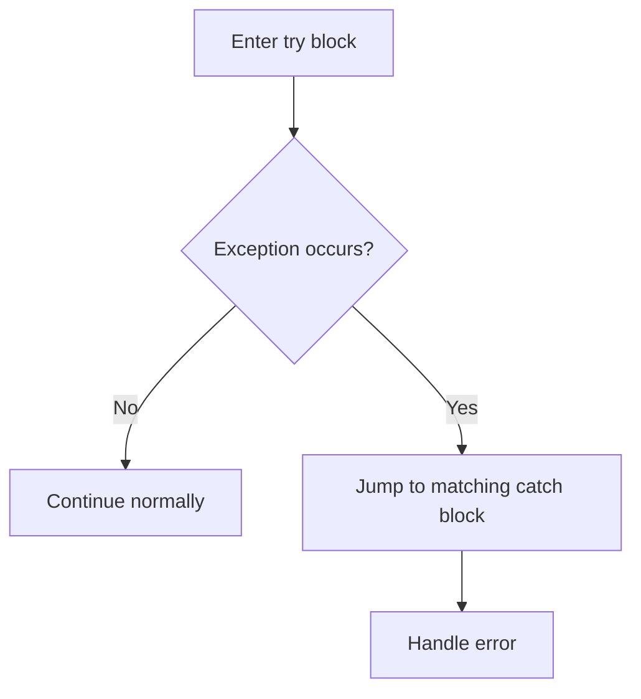
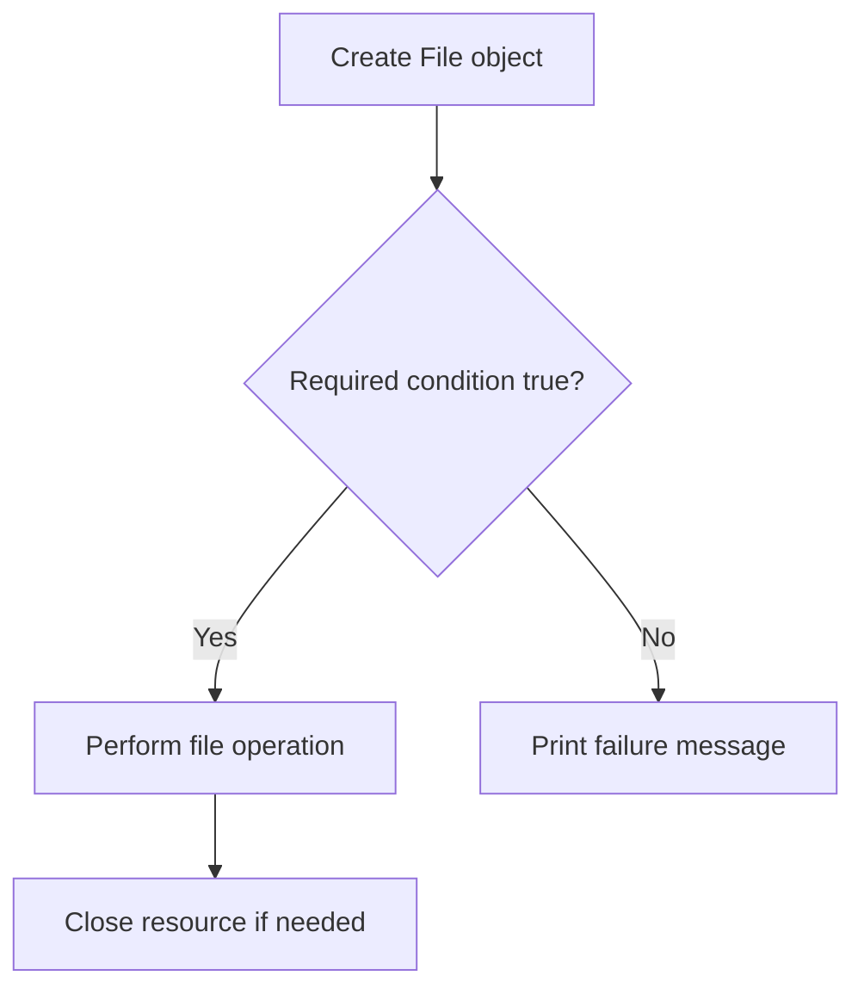

---
prev:
  text: "Section 5"
  link: "/College/yearTwo/secondTerm/Java/Sections/Section-5"
next: false
title: Section 6
---

# Java Programming - Section 6

## Exception Definition and Why It Matters

An **exception** is an **abnormal condition** that disrupts the normal flow of a Java program at **runtime**. The section also states that an exception is an **object**, which means Java represents the problem as data that can be thrown and handled. That matters in exams because you may be asked whether an exception is only a message or a full object carrying information.

- It contains information about the **error type**.
- It captures the **program state** when the error happened.
- It may also carry **custom information**.

Why this matters: if an exception is not handled, the normal execution path is interrupted, so the program may stop before finishing later statements.

> [!IMPORTANT]
> **Exception handling** is presented as the mechanism used to handle runtime errors such as `ClassNotFound`, `IO`, `SQL`, and `Remote` errors.

## Exception Handling Keywords and Control Structure

The lecture identifies five Java exception-handling keywords: **`try`**, **`catch`**, **`finally`**, **`throw`**, and **`throws`**. In this section, the detailed focus is on `try` and `catch`. A **`try` block** encloses code that might throw an exception, and it must be used inside a method. It also must be followed by either a **`catch`** block or a **`finally`** block. A **`catch` block** handles the exception after the `try` block.



Why this works: Java separates risky code from recovery code so the program can respond to runtime problems in a controlled way.

## `try`, `catch`, and Multi-Catch Rules

Java allows **multiple catch blocks** with one `try` block when different exceptions require different handling. The section gives two important exam rules. First, **only one exception occurs at a time**, so **only one catch block executes** for that failure. Second, catch blocks must be ordered from the **most specific** type to the **most general** type.

| Rule | Meaning | Exam trap |
| --- | --- | --- |
| **One exception at a time** | one thrown error selects one handler | Do not expect all catches to run |
| **Specific before general** | narrower type goes first | `ArithmeticException` before `Exception` |
| **`catch` after `try`** | handler follows risky code | `catch` cannot stand alone |

> [!WARNING]
> *If a general catch like `Exception` appears before a specific one like `ArithmeticException`, the ordering is wrong for the rule shown in the section.*

## File Handling and Java Streams

**File handling** means managing files programmatically. The section lists common tasks: creating a file, retrieving file information, writing data, reading data, and deleting a file. Java performs file handling through **streams**, which represent a sequence of data.

There are two stream categories in the source:

| Stream type | Used for | Example classes |
| --- | --- | --- |
| **Byte Stream** | byte-oriented data such as images, audio, and binary files | `FileInputStream`, `FileOutputStream` |
| **Character Stream** | character-oriented data such as text files | `FileReader`, `FileWriter`, `BufferedReader`, `BufferedWriter` |

Why this distinction matters: the data type of the file content decides which stream family is appropriate, especially when comparing text processing with binary data processing.

## `File` Class Methods You Should Recognize

The **`File`** class is used to work with file paths and file properties. The lecture highlights several methods that are common in direct exam questions. You should know both the method name and its exact purpose.

| Method | Purpose |
| --- | --- |
| **`canRead()`** | checks whether the file can be read |
| **`canWrite()`** | checks whether the file can be written |
| **`createNewFile()`** | creates a new empty file |
| **`exists()`** | checks whether the file is present |
| **`delete()`** | deletes the file |
| **`mkdir()`** | creates a new directory |
| **`length()`** | returns file size in bytes |
| **`getName()`** | returns the file name |
| **`getAbsolutePath()`** | returns the absolute path |

> [!NOTE]
> *`length()` returns the file size in bytes, not the number of lines or characters as written on the page.*

## Core File Operations in the Examples

The examples show the standard workflow for file operations. To **create a file**, the code builds a `File` object and calls `createNewFile()` inside a `try` block because an **`IOException`** may occur. To **get file information**, the code checks `exists()` first, then prints name, absolute path, readability, writability, and size. To **write**, it uses **`FileWriter`**, calls `write(...)`, and then `close()`. To **read**, it uses **`Scanner`** with a `File` object and loops with `hasNextLine()`. To **delete**, it calls `delete()`. To create a directory, it calls **`mkdir()`**.

```java
// Purpose: read a text file line by line using Scanner.
File f1 = new File("D:FileOperationExample.txt");
Scanner dataReader = new Scanner(f1);
while (dataReader.hasNextLine()) {
  String fileData = dataReader.nextLine();
  System.out.println(fileData);
}
dataReader.close();
```

## File-Handling Flow and Common Exam Checks

The section’s file examples follow a repeated decision pattern: create or open a `File` object, test a condition, perform the action, then report success or failure. This pattern is useful because most file operations can fail due to missing files or input/output problems.



- **Creation** checks whether a new file was actually created.
- **Information retrieval** checks `exists()` before printing properties.
- **Reading** may throw `FileNotFoundException`.
- **Writing** may throw `IOException`.

> [!WARNING]
> *Do not forget `close()` after using `FileWriter` or `Scanner` in the shown examples, because the lecture code explicitly closes both resources after use.*
