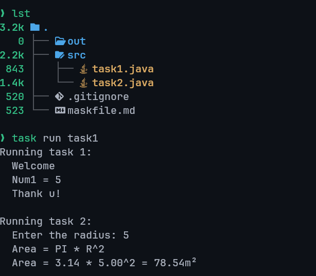

---
prev:
  text: "Tasks"
  link: "/College/yearTwo/secondTerm/Java/Tasks/index"
next:
  text: "Task Two"
  link: "/College/yearTwo/secondTerm/Java/Tasks/Task-2"
title: Task 1
---

| Name    | ‎أحمد علي أحمد علي عثمان |
| :------ | :----------------------- |
| Code    | 20240592                 |
| Section | 1                        |

# Java Programming Task 1

## Question 1

Write a program that produced the following output :

```txt
Welcome
Num1=5
Thank u
```

## Question 2

Write a program that produced the following output :

```txt
Area = pi * r^2
Area = 3.14 * 5^2 = 78.5
```

## Output



## Answers

```java
import java.io.PrintStream; // Type of System.out
import java.util.Scanner;   // Import the Scanner package

public class Main {
  // `static final` defines a constant value
  static final Scanner stdin = new Scanner(System.in);
  static final PrintStream stdout = System.out;

  public static void task1() {
    stdout.println("Running task 1:");
    stdout.println("  Welcome");
    int num1 = 5;
    stdout.println("  Num1 = " + num1);
    stdout.println("  Thank u!");
  }

  public static void task2() {
    stdout.println("\nRunning task 2:");
    stdout.print("  Enter the radius: ");
    double radius = stdin.nextDouble();
    double area = Math.pow(radius, 2) * Math.PI;

    stdout.println("  Area = PI * R^2");
    stdout.printf("  Area = %.2f * %.2f^2 = %.2fm²\n", Math.PI, radius, area);
  }

  public static void main(String[] args) {
    task1();
    task2();

    stdin.close();
  }
}
```

