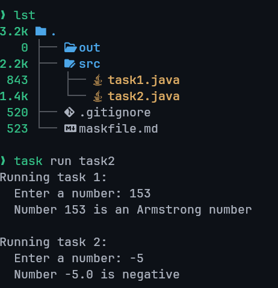

---
prev:
  text: "Task One"
  link: "/College/yearTwo/secondTerm/Java/Tasks/Task-1"
next: false
title: Task 2
---

| Name    | ‎أحمد علي أحمد علي عثمان |
| :------ | :----------------------- |
| Code    | 20240592                 |
| Section | 1                        |

# Java Programming Task 2

## Question 1

Write a Java program that reads a number from the user and checks whether the number is an Armstrong number or not.

### Example

$153 \rightarrow 1^3 + 5^3 + 3^3$
$1 + 125 + 27 = 153$

## Question 2

Write a java program that take a number from user then check this number is positive or negative

## Output



## Answers

```java
import java.io.PrintStream; // Type of System.out
import java.util.Scanner;   // Import the Scanner package

public class Main {
  // `static final` defines a constant value
  static final Scanner stdin = new Scanner(System.in);
  static final PrintStream stdout = System.out;

  public static void task1() {
    stdout.println("Running task 1:");
    stdout.print("  Enter a number: ");
    int sum = 0;
    int number = stdin.nextInt();
    int len = Integer.toString(number).length(); // get the length of the number

    for (int i = 0; i < len; i++) {
      int divisor = (int) Math.pow(10, i);

      // To get the nth digit we use (number / 10^n) % 10
      int currentDigit = (number / divisor) % 10;
      sum += (int) Math.pow(currentDigit, len);
    }

    if (sum == number) {
      stdout.printf("  Number %d is an Armstrong number\n", number);
    } else {
      stdout.printf("  Number %d is not an Armstrong number\n", number, sum, number);
      stdout.printf("  %d does not equal %d\n", sum, number);
    }
  }

  public static void task2() {
    stdout.println("\nRunning task 2:");
    stdout.print("  Enter a number: ");
    double number = stdin.nextDouble();

    if (number < 0) {
      stdout.printf("  Number %.1f is negative\n", number);
    } else {
      stdout.printf("  Number %.1f is positive\n", number);
    }
  }

  public static void main(String[] args) {
    task1();
    task2();

    stdin.close();
  }
}
```
