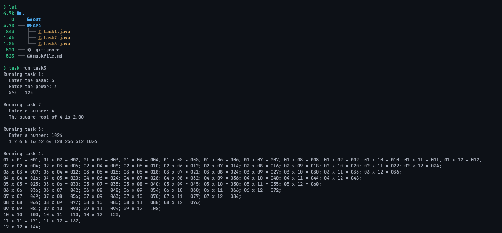

| Name    | ‎أحمد علي أحمد علي عثمان |
| :------ | :----------------------- |
| Code    | 20240592                 |
| Section | 1                        |

# Java Programming Task 3

## Question 1

Write a java program that take two numbers from the user: a base and a power.
Compute the result using a `for` loop.

### Example

$5^3 = 125$
$5 * 5 * 5 = 125$

## Question 2

Write a java program that take a number from the user and find its square root.

## Question 3

Write a java program that take a number from the user and print all its factors.

## Question 4

Write a java program that print a multiplication table in the following format:

```
1*1=1, 1*2=2, ...... 1*12=12
2*2=4, 2*3=6, ...... 2*12=24
...
12*12=144
```

## Output



## Answers

```java
import java.io.PrintStream; // Type of System.out
import java.util.Scanner;   // Import the Scanner package

public class Main {
  // `static final` defines a constant value
  static final Scanner stdin = new Scanner(System.in);
  static final PrintStream stdout = System.out;
  public static void task1() {
    stdout.println("Running task 1:");

    stdout.print("  Enter the base: ");
    int base = stdin.nextInt();

    stdout.print("  Enter the power: ");
    int power = stdin.nextInt();

    int result = 1;
    for (int i = 0; i < power; i++) {
      result *= base;
    }

    stdout.printf("  %d^%d = %d\n", base, power, result);
  }

  public static void task2() {
    stdout.println("\nRunning task 2:");

    stdout.print("  Enter a number: ");
    int number = stdin.nextInt();

    stdout.printf("  The square root of %d is %.2f\n", number, Math.sqrt(number));
  }

  public static void task3() {
    stdout.println("\nRunning task 3:");

    stdout.print("  Enter a number: ");
    int number = stdin.nextInt();
    stdout.print("  ");

    for (int i = 1; i <= number; i++) {
      if (number % i == 0) {
        stdout.printf("%d ", i);
      }
    }
    stdout.println();
  }

  public static void task4() {
    stdout.println("\nRunning task 4:");

    for (int i = 1; i <= 12; i++) {
      for (int j = i; j <= 12; j++) {
        // Pad the numbers with zeros for constant width
        stdout.printf("%02d x %02d = %03d; ", i, j, i * j);
      }
      stdout.println();
    }
  }

  public static void main(String[] args) {
    task1();
    task2();
    task3();
    task4();

    stdin.close();
  }
}
```
