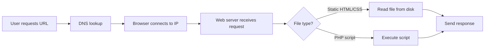

---
prev:
  text: "Lectures"
  link: "/College/yearTwo/secondTerm/WebDev2/Lectures/index"
next:
  text: "Lecture 2"
  link: "/College/yearTwo/secondTerm/WebDev2/Lectures/Lecture-2"
title: Lecture 1
---

# Web Development II - Lecture 1

## The Web Request Lifecycle

When a URL is entered, the **DNS** resolves the domain to an **IP address**. The browser connects to this IP and requests the file. **Web server software** (e.g., Apache) maps the URL path to a file on its local filesystem. If the file is static, the server returns its contents.

**Server-Side Programs:** URLs like `home.php` instruct the server to execute a program. The server runs the code and sends its **output** (usually HTML) back to the client. The source code is never visible to the browser.



## PHP Fundamentals

**PHP (PHP Hypertext Preprocessor)** is a **server-side scripting language** used to create dynamic web pages. Code is embedded within XHTML/HTML files. The server executes the code between `<?php` and `?>` tags; all other content is output as-is.

**Why Server-Side?** It allows dynamic content editing, form data processing, database access, user customization, and security (code is hidden from the client).

## PHP Syntax Basics

### Hello World & Embedding

```php
<?php
print "Hello, world!"; // Outputs to browser
?>
```

- **`print`** outputs text. `\n` is for source formatting, not HTML line breaks.
- Strings can use `"` (interpreted) or `'` (literal).

### Variables

- **Always begin with `$`** (e.g., `$name`).
- **Case-sensitive** (`$Name` != `$name`).
- **Loosely typed:** Type is assigned by context.
- **Types:** `int`, `float`, `boolean`, `string`, `array`, `object`, `NULL`.
- **Type checking:** `is_int()`, `is_string()`; `gettype()` returns type as string.
- **Type juggling:** PHP auto-converts types (e.g., `5 + "7"` -> `12`).
- **Casting:** `$age = (int) "21";`

### Strings

- **Zero-based indexing:** `$favorite_food[2]` accesses the third character.
- **Concatenation:** Use **`.` (period)**, not `+`. `"Hello " . "World"`
- **Interpretation:**
  - **Double quotes (`"`):** Variables are expanded. `"You are $age years old."`
  - **Single quotes (`'`):** Literal output. `'You are $age years old.'` prints as is.
  - Use `{}` for variable ambiguity: `"Today is {$g}eth birthday."`

### String Functions (vs. Java)

| PHP                  | Java Equivalent | Example                         |
| :------------------- | :-------------- | :------------------------------ |
| `strlen($str)`       | `length()`      | `strlen("cat")` -> 3            |
| `strpos($str, "e")`  | `indexOf`       | Finds first index of substring. |
| `substr($str, 9, 5)` | `substring`     | Extracts 5 chars from index 9.  |
| `strtoupper($str)`   | `toUpperCase`   | Converts to uppercase.          |
| `trim($str)`         | `trim`          | Removes whitespace.             |
| `explode(",", $str)` | `split`         | Converts string to array.       |
| `strcmp($a, $b)`     | `compareTo`     | Returns <0, 0, or >0.           |

### Control Structures (Java-like syntax)

```php
if ($age >= 21) {
    print "Allowed";
} elseif ($age > 18) {
    print "Maybe";
} else {
    print "No";
}

for ($i = 0; $i < 10; $i++) {
    print "$i squared is " . $i * $i;
}

while ($count < 5) { $count++; }
do { $count--; } while ($count > 0);
```

## Boolean Logic & Edge Cases

> [!NOTE]
> Values considered **FALSE** (all others are TRUE):
>
> - `0` and `0.0` (but _not_ `0.00` or `0.000`)
> - `""` (empty string), `"0"`, and `NULL` (including undefined variables)
> - Arrays with 0 elements
> - `TRUE` prints as `1`; `FALSE` prints as an empty string.

## Operators

- **Arithmetic:** `+ - * / %` (division yields float)
- **Assignment:** `= += -= *= /= %= .=` (`.` concatenates strings)
- **Arithmetic with strings:** `5 + "2 turtle doves"` -> `7` (numeric conversion)
- **Comparison:** `==`, `===` (identical), `!=`, `!==`

## Math Functions & Constants

| Function      | Purpose          | Constant | Value |
| :------------ | :--------------- | :------- | :---- |
| `abs($n)`     | Absolute value   | `M_PI`   | π     |
| `round($n)`   | Round to nearest | `M_E`    | e     |
| `pow($a, $b)` | Exponentiation   | `M_LN2`  | ln 2  |
| `sqrt($n)`    | Square root      |          |       |

## Advanced Variable Behavior

- **`NULL`:** A variable is NULL if unset, assigned `NULL`, or deleted with `unset()`.
- **`isset($var)`:** Returns `TRUE` if variable exists and is not `NULL`.
- **Variable variables:** `$foo = "bar"; $$foo = "baz";` creates `$bar`.

## Arithmetic-Assignment Operators

These perform an operation _and_ assign simultaneously:

```php
$value = 8;
$value += 2; // $value = 10
$value -= 4; // $value = 6
$value *= 5; // $value = 30
$value /= 3; // $value = 10
$value++;    // $value = 11
$value--;    // $value = 10
```

## Key Exam Traps & Nuances

> [!WARNING]
> **String concatenation** uses `.`, not `+`. `$a = 5 . "2";` -> `"52"`.
> **Division** of integers can produce a float: `7 / 2` -> `3.5`.
> **`print` vs. `echo`:** `print` returns 1 (behaves like a function), `echo` is faster.
> **Undefined variables** are treated as `NULL` and may cause warnings unless suppressed.
