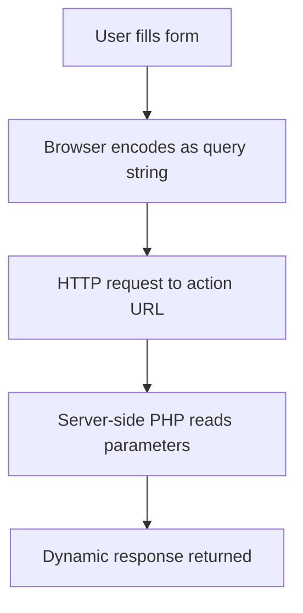

---
prev:
  text: "Lecture 2"
  link: "/College/yearTwo/secondTerm/WebDev2/Lectures/Lecture-2"
next:
  text: "Lecture 4"
  link: "/College/yearTwo/secondTerm/WebDev2/Lectures/Lecture-4"
title: Lecture 3
---

# Web Development II - Lecture 3

## Query Strings & Form Data Flow

A **query string** is a set of `name=value` parameters appended to a URL, delimited by `?` and joined by `&`. This is the mechanism by which both direct URL parameters _and_ HTML form submissions transmit data to the server.

```
URL?name=value&name=value
http://example.com/login.php?username=xenia&sid=1234567
```



> [!NOTE] The `action` attribute of `<form>` determines _where_ the query string is sent. Without `action`, form data goes nowhere useful.

## The `<form>` Element

**`<form>`** = a container for UI controls that collects and submits user input as a query string to a server URL.

```html
<form action="http://destination.com/process.php">
  <div>
    <!-- wrap controls in block element -->
    <input name="q" />
    <input type="submit" />
  </div>
</form>
```

- **`action`** attribute (required): URL that receives the form data
- Best practice: wrap controls in `<div>` for valid block-level structure
- _A form without `action` silently submits to the current page_

## `<input>` — The Universal Control

**`<input>`** is an inline, **self-closing** element that renders as different controls based on its `type` attribute. The `name` attribute becomes the query parameter key sent to the server — _omitting `name` means the field is never submitted_.

| `type` value | Renders as                        |
| ------------ | --------------------------------- |
| `text`       | Single-line text field            |
| `password`   | Masked text field                 |
| `checkbox`   | Toggleable box                    |
| `radio`      | Mutually exclusive button         |
| `hidden`     | Invisible field (still submitted) |
| `submit`     | Submission button                 |
| `reset`      | Clears form to defaults           |
| `file`       | File upload picker                |
| `button`     | Generic clickable button          |

**Key attributes for text inputs:**

- `value` — initial content displayed in the field
- `size` — visible width in characters (_display only, not a data limit_)
- `maxlength` — hard cap on characters the user can type

> [!CAUTION] `size` vs. `maxlength`: `size="10"` makes the box 10 chars wide visually; `maxlength="8"` limits input to 8 chars. They are independent — a field can look wide but reject long input.

## Checkboxes vs. Radio Buttons

| Feature            | Checkbox                   | Radio                                |
| ------------------ | -------------------------- | ------------------------------------ |
| Selection          | 0, 1, or many              | Exactly 1 per group                  |
| Grouping mechanism | Independent `name` per box | Shared `name` across buttons         |
| Submitted value    | Field `name` if checked    | `value` attribute of selected button |
| Default checked    | `checked="checked"`        | `checked="checked"`                  |

```html
<!-- Checkboxes: each has its own name -->
<input type="checkbox" name="lettuce" /> Lettuce
<input type="checkbox" name="tomato" checked="checked" /> Tomato

<!-- Radio: grouped by identical name; value required -->
<input type="radio" name="cc" value="visa" checked="checked" /> Visa
<input type="radio" name="cc" value="mastercard" /> MasterCard
```

> [!CAUTION] Radio buttons without a `value` attribute submit `"on"` regardless of which button is selected — all buttons in a group would submit the same value, making them indistinguishable server-side.

## `<textarea>` vs. `<input type="text">`

| Feature         | `<textarea>`               | `<input type="text">` |
| --------------- | -------------------------- | --------------------- |
| Lines           | Multi-line                 | Single-line           |
| Size attrs      | `rows` + `cols` (required) | `size` (optional)     |
| Initial content | Between open/close tags    | `value` attribute     |
| Self-closing    | No — needs `</textarea>`   | Yes — self-closed     |

```html
<textarea rows="4" cols="20">
Initial text here.
</textarea>
```

> [!CAUTION] Any whitespace between `<textarea>` tags appears as initial content in the box — indentation or newlines in your HTML source become visible text to the user.

## `<select>`, `<option>`, `<optgroup>`

**`<select>`** = a dropdown (or scrollable list) where `<option>` tags define each choice. It works because the browser submits the `value` of the selected `<option>` (or the text content if no `value` is set) under the `select`'s `name`.

```html
<!-- Single-select dropdown -->
<select name="character">
  <option>Frodo</option>
  <option selected="selected">Gandalf</option>
</select>

<!-- Multi-select: name MUST use [] suffix -->
<select name="character[]" size="3" multiple="multiple">
  <option>Frodo</option>
  <option selected="selected">Aragorn</option>
</select>
```

**`<optgroup label="...">`** visually groups options under a bold label — the group itself is _not_ selectable.

> [!IMPORTANT] Multi-select requires **two** changes together: `multiple="multiple"` on `<select>` AND `[]` appended to the `name` (e.g., `name="picks[]"`). Missing either means only one value is ever received by the server.

## `<label>` — Accessibility & Usability

**`<label>`** links descriptive text to a control so clicking the text activates the control — critical for checkboxes and radio buttons where click targets are small.

```html
<!-- Wrapping method — no extra attribute needed -->
<label><input type="radio" name="cc" value="visa" /> Visa</label>

<!-- for/id method — label and input can be non-adjacent -->
<label for="visaBtn">Visa</label>
<input type="radio" id="visaBtn" name="cc" value="visa" />
```

`<label>` is also a valid CSS selector target, allowing style rules to visually style the entire label region on selection.
