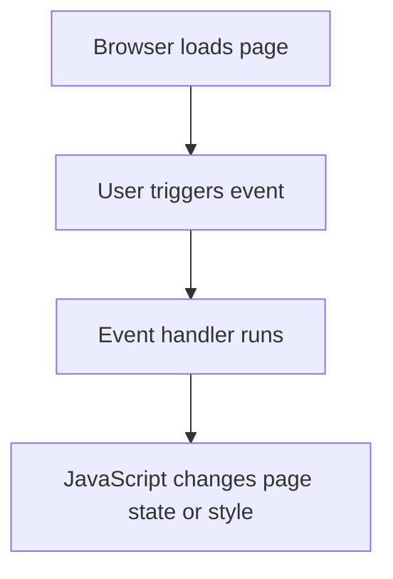

---
prev:
  text: "Lecture 4"
  link: "/College/yearTwo/secondTerm/WebDev2/Lectures/Lecture-4"
next:
  text: "Lecture 6"
  link: "/College/yearTwo/secondTerm/WebDev2/Lectures/Lecture-6"
title: Lecture 5
---

# Web Development II - Lecture 5

## Client-Side Scripting and Execution Model

**Client-side scripting** means code runs in the user's **browser** instead of on the **web server**. In this lecture, that language is **JavaScript**, a lightweight scripting language used to make web pages interactive. It works because the browser can execute JavaScript immediately after loading the page, so small interface changes do not require a new server request. This improves **usability** and **efficiency**, especially for actions such as reacting to clicks, validating form input, or changing page content.

| Concept | JavaScript | PHP |
| --- | --- | --- |
| **Execution place** | Browser | Server |
| **Main strength** | Fast interface response | Secure data processing |
| **Typical focus** | Events, page interaction, document changes | HTML output, files, forms, databases |
| **Visibility of code** | User can inspect source | Server logic stays hidden |

> [!IMPORTANT]
> **JavaScript** improves speed and interaction, but it does _not_ replace **server-side programming**. If an exam asks which side is more secure, the answer is **server-side code**, because browser code is visible and controllable by the user.

## JavaScript Boundaries and Language Identity

**JavaScript** is a web standard, but browsers do not all support it identically. That boundary matters because code that works in one browser may behave differently in another. JavaScript is **not Java**; they share some syntax, but they are different languages with different execution models and design goals. JavaScript is generally **interpreted**, not compiled, uses looser syntax rules, and centers heavily on **functions** rather than **classes**.

### JavaScript vs. Java

| Feature | JavaScript | Java |
| --- | --- | --- |
| **Translation model** | Interpreted | Compiled |
| **Typing style** | Loosely typed | More strict typing |
| **Core program unit** | **Function** | **Class** |
| **Web page integration** | Embedded into HTML/CSS pages | Separate application/runtime model |

> [!CAUTION]
> _Do not equate similar syntax with identical behavior._ A common exam trap is assuming **JavaScript** follows Java's stricter type rules or object model.

## Adding JavaScript and the Event-Driven Model

A page can load external JavaScript with the **`<script>`** tag. The preferred style is linking a separate `.js` file so content, presentation, and behavior stay separate.

```html
<!-- Load external JavaScript from the page head -->
<script src="filename" type="text/javascript"></script>
```

**Event-driven programming** means code waits for an **event** such as a click, key press, or page load, then runs a function in response. This works differently from the usual "start at `main`" model because the browser dispatches events as the user interacts with the page.



### Button Response Sequence

1. Choose the **control** and the **event**.
2. Write the **function** that should run.
3. Attach that function as the **event handler**.

This order matters because an event handler cannot call a function that has not been defined conceptually in the program design.

## Functions, Event Handlers, and DOM Access

A **function** is a named block of JavaScript statements that can be executed later. In web pages, functions are often triggered by events.

```html
<!-- Attach a click event handler directly in HTML -->
<button onclick="changeText();">Click me!</button>
<span id="output">replace me</span>
<input id="textbox" type="text" />
```

```js
// Respond to the click by reading DOM elements and changing presentation
function changeText() {
  var span = document.getElementById("output");
  var textbox = document.getElementById("textbox");
  span.innerHTML = textbox.value;
  textbox.style.color = "red";
}
```

The **Document Object Model (DOM)** is the browser's object representation of the HTML page. It works by exposing each element as an object whose content, state, and style can be read or modified. **`document.getElementById("id")`** returns the DOM object for the element with that exact `id`. Use **`innerHTML`** to change text or markup inside most elements, and **`value`** to read or change form control contents.

> [!IMPORTANT]
> **`innerHTML`** and **`value`** are not interchangeable. _Use `value` for form controls and `innerHTML` for normal page elements._

## Style Changes and Core Data Types

An element's inline CSS can be changed through **`element.style`**. HTML/CSS property names that use hyphens become **camelCase** in JavaScript, such as **`backgroundColor`** and **`fontSize`**. This works because the `style` object exposes CSS properties as JavaScript fields.

**Variables** are declared with **`var`** in this lecture's syntax. JavaScript is **loosely typed**, so the variable type is not declared explicitly, but values still have types such as **Number**, **Boolean**, **String**, **Array**, **Object**, **Function**, **Null**, and **Undefined**. The language combines integers and real numbers into one **Number** type.

| Concept | Meaning | Exam Trap |
| --- | --- | --- |
| **null** | Variable exists but was assigned an empty value | Not the same as undeclared |
| **undefined** | Variable does not exist or was not assigned | Not the same as `null` |
| **Number** | One numeric type for integers and decimals | No separate `int`/`double` |

## Operators, Strings, Arrays, and Conversion Rules

JavaScript supports standard comparison and logical operators, but many perform **automatic type conversion**. For example, **`==`** checks value with coercion, while **`===`** checks both value and type. This distinction matters because **`"5.0" == 5`** is true, but **`"5.0" === 5`** is false.

> [!CAUTION]
> _Use strict equality mentally on exams when type matters._ Loose equality can hide conversions that change the answer.

**Strings** support methods such as **`substring`**, **`indexOf`**, **`split`**, and **`charAt`**. The **`length`** of a string is a property, not a method. **Arrays** can act like lists, queues, or stacks because methods such as **`push`**, **`pop`**, **`shift`**, and **`unshift`** add or remove elements from either end.

```js
// Convert and compare values with attention to coercion
var s = "the quick brown fox";
var a = s.split(" ");
a.reverse();
s = a.join("!");

var n1 = parseInt("42 is the answer");
var n2 = parseFloat("booyah");   // NaN
var strict = ("5.0" === 5);      // false
```

**`split`** breaks a string into an array using a delimiter, while **`join`** merges an array into one string using a delimiter between elements. **`parseInt`** and **`parseFloat`** convert strings to numbers, but conversion can fail and produce **`NaN`**.
