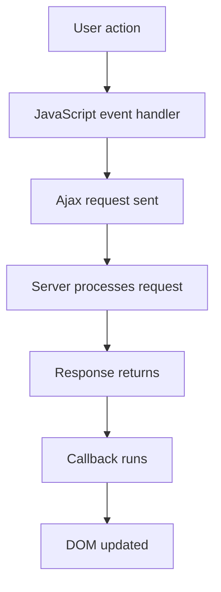

---
prev:
  text: "Lecture 6"
  link: "/College/yearTwo/secondTerm/WebDev2/Lectures/Lecture-6"
next: false
title: Lecture 7
---

# Web Development II - Lecture 7

## Ajax and the Shift from Synchronous to Asynchronous Communication

**Synchronous web communication** means the user must wait while a new page loads after each request. This is the classic **click-wait-refresh** model of ordinary web pages. **Asynchronous web communication** means data can load in the background while the user continues interacting with the current page. This matters because it changes the web from a sequence of page replacements into a more continuous interface.

**Ajax** stands for **Asynchronous JavaScript and XML**. It is _not_ a programming language; it is a technique for using **JavaScript** to request server data in the background and update the page dynamically. That works because JavaScript can send a request independently of full-page navigation, then modify the page through the **DOM** after the response arrives.

| Communication model | User experience    | Page behavior                 | Exam boundary             |
| ------------------- | ------------------ | ----------------------------- | ------------------------- |
| **Synchronous**     | User waits         | Whole page reloads            | Traditional request cycle |
| **Asynchronous**    | User keeps working | Current page updates in place | Ajax-style interaction    |

> [!IMPORTANT]
> **Ajax** does not eliminate server communication. _It changes when and how the page updates_, not whether the server is involved.

## Web Applications and Why Ajax Matters

A **web application** is a dynamic website that imitates the feel of a desktop application. Its defining boundary is that the user experiences one continuous interface instead of disconnected page loads. Ajax supports this by fetching new data without forcing the entire document to refresh.

Examples given in the lecture include **Gmail**, **Google Maps**, **Google Docs**, **Google Spreadsheets**, **Flickr**, and **A9**. These examples matter because they show the main purpose of Ajax: preserving interaction continuity while background communication happens. A common exam distinction is that Ajax is about **interaction style**, not about a specific syntax feature.

## `XMLHttpRequest` and the Basic Ajax Lifecycle

The browser provides **`XMLHttpRequest`**, an object that can fetch files from a web server. Its major benefit is that it can run **asynchronously**, so the request happens in the background and becomes transparent to the user. Once data returns, JavaScript can insert that result into the current page using the **DOM**.

### Ajax Request Sequence

1. The user triggers an **event**, such as a click.
2. The event handler creates an **`XMLHttpRequest`** object.
3. The request is sent to the server.
4. The server retrieves the needed data and sends it back.
5. The request object fires an event when the response arrives.
6. A **callback** function processes the response and updates the page.

This order matters because the callback cannot run until the response exists; asynchronous code separates request creation from response handling.



> [!CAUTION]
> _Do not confuse the request with the callback._ Sending the request starts the process; the page update happens later, after the response event fires.

## Why the Lecture Uses Prototype Instead of Raw `XMLHttpRequest`

Although **`XMLHttpRequest`** is powerful, the lecture says it is **clunky** and has browser compatibility issues. The course therefore uses **Prototype**, which wraps Ajax behavior in a simpler interface. This matters because the exam may ask why the wrapper is preferred: the answer is easier syntax plus reduced browser-specific handling.

The core Prototype pattern is **`new Ajax.Request(...)`**, which constructs an Ajax request object.

```js
// Send an Ajax request through Prototype
new Ajax.Request("url", {
  method: "get",
  onSuccess: handleRequest,
  onFailure: ajaxFailure,
  onException: ajaxFailure,
});
```

The constructor takes two parameters:

1. The **URL** to fetch as a string.
2. An **options object** written as `{ key: value }` pairs.

## Request Options, Response Properties, and Failure Handling

The **`method`** option controls how the request is sent; the default is **`"post"`**. The **`parameters`** option passes query data to the server as name-value pairs. Important request events are **`onSuccess`**, **`onFailure`**, and **`onException`**. These work by attaching functions that run only under those conditions.

| Option or property | Meaning                             | Exam note                      |
| ------------------ | ----------------------------------- | ------------------------------ |
| **`method`**       | HTTP method such as `get` or `post` | Default is `post`              |
| **`parameters`**   | Data sent to server                 | Written as object pairs        |
| **`onSuccess`**    | Request succeeded                   | Normal callback path           |
| **`onFailure`**    | Request failed                      | Handles unsuccessful response  |
| **`onException`**  | Syntax/security/etc. error          | Different from normal failure  |
| **`status`**       | HTTP status code                    | `200` means OK                 |
| **`statusText`**   | Text for status code                | Human-readable response status |
| **`responseText`** | Entire response as string           | Most direct text access        |
| **`responseXML`**  | Entire response as XML DOM tree     | Use when response is XML       |

```js
// Show detailed failure information for debugging
function ajaxFailure(ajax, exception) {
  alert(
    "Error making Ajax request:\n\nServer status:\n" +
      ajax.status +
      " " +
      ajax.statusText +
      "\n\nServer response text:\n" +
      ajax.responseText
  );
  if (exception) {
    throw exception;
  }
}
```

## POST Requests, Security Restrictions, and `Ajax.Updater`

A **POST request** with Prototype uses **`Ajax.Request`** again, but the data is passed in **`parameters`** and the method is `post` or omitted because `post` is the default.

```js
// Send named values to the server with POST
new Ajax.Request("url", {
  method: "post",
  parameters: { name: value, otherName: otherValue },
  onSuccess: handleRequest,
});
```

> [!IMPORTANT]
> **`XMLHttpRequest`** has security restrictions: it cannot run from a page opened directly from the hard drive, it must run from a **web server**, and it can fetch files only from the **same site** as the page. _This same-origin rule is a major exam condition._

**`Ajax.Updater`** is a specialized Prototype helper that fetches content and inserts it directly into an element as **`innerHTML`**. Use it when the goal is immediate page injection rather than manual response processing.

```js
// Fetch server content and inject it into the target element
new Ajax.Updater("id", "url", {
  method: "get",
});
```

Compared with **`Ajax.Request`**, **`Ajax.Updater`** is more specific: it automatically updates one page element, while **`Ajax.Request`** gives lower-level control over the response.
