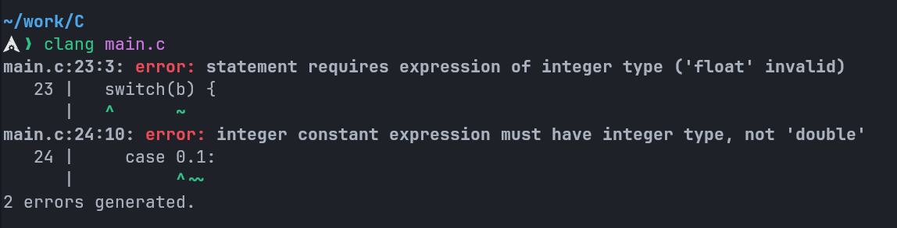

# C Programming From Basics to Mastery

## Switch Statement in C

Using floating-point numbers in `switch` statements in C is not recommended (and in many cases not even possible) due to several reasons:

### 1. Precision Issues

Floating-point numbers are stored in binary with finite precision, which can lead to subtle inaccuracies. This means that even if two floating-point numbers look equal in source code, they might not match exactly in memory due to rounding errors.

For example:

```C
float a = 0.1;
float b = 0.1 * 3 / 3;
if (a == b) {
  printf("a == b\n"); // this will work
}
```

In a `switch` statement, the `case` labels must have exact matches, and such precision issues make it unreliable to use floating-point numbers.

```C
float a = 0.1;
float b = 0.1 * 3 / 3;
switch(b) { // error: Statement requires expression of integer type ('float' invalid)
  case 0.1: // error: Integer constant expression must have integer type, not 'double'
    printf("\n");
    break;
}
```

Attempting to write a switch statement with a float would result in the following errors:



---

### 2. Standard Restriction

The C standard (ISO C99 and later) specifies that the expression in a `switch` statement must evaluate to an **integer or an enumerated type**. Floating-point numbers are explicitly disallowed. The syntax is defined this way to ensure predictable and efficient behavior.

## `printf` Format Specifiers

This table is listing the common `printf` format specifiers for various data types in C language

| Data Type                     | Format Specifier | Description                                        | Example Usage            |
| ----------------------------- | ---------------- | -------------------------------------------------- | ------------------------ |
| `int`                         | `%d` or `%i`     | Signed decimal integer                             | `printf("%d", 42);`      |
| `unsigned int`                | `%u`             | Unsigned decimal integer                           | `printf("%u", 42);`      |
| `float`                       | `%f`             | Decimal floating-point                             | `printf("%f", 3.14);`    |
| `double`                      | `%lf`            | Double floating-point                              | `printf("%lf", 3.14);`   |
| `char`                        | `%c`             | Single character                                   | `printf("%c", 'A');`     |
| `char*` (string)              | `%s`             | String of characters                               | `printf("%s", "hello");` |
| `short`                       | `%hd`            | Short signed integer                               | `printf("%hd", 42);`     |
| `unsigned short`              | `%hu`            | Short unsigned integer                             | `printf("%hu", 42);`     |
| `long`                        | `%ld` or `%li`   | Long signed integer                                | `printf("%ld", 42L);`    |
| `unsigned long`               | `%lu`            | Long unsigned integer                              | `printf("%lu", 42UL);`   |
| `long long`                   | `%lld` or `%lli` | Long long signed integer                           | `printf("%lld", 42LL);`  |
| `unsigned long long`          | `%llu`           | Long long unsigned integer                         | `printf("%llu", 42ULL);` |
| `int` (octal)                 | `%o`             | Unsigned octal integer                             | `printf("%o", 42);`      |
| `int` (hexadecimal)           | `%x` or `%X`     | Unsigned hexadecimal integer (lowercase/uppercase) | `printf("%x", 42);`      |
| `float`/`double` (scientific) | `%e` or `%E`     | Exponential notation (lowercase/uppercase)         | `printf("%e", 3.14);`    |
| `float`/`double` (auto)       | `%g` or `%G`     | Shortest representation of `%f` or `%e`/`%E`       | `printf("%g", 3.14);`    |
| `void*` (pointer)             | `%p`             | Pointer address (hexadecimal)                      | `printf("%p", &var);`    |
| Literal `%`                   | `%%`             | Prints a percent sign                              | `printf("%%");`          |

### Notes:
1. **Precision and Width**: You can modify these specifiers with width and precision, e.g., `%5.2f` for a float with 5 total characters and 2 after the decimal.
2. **Platform Dependence**: Some specifiers (like `%lf` for `double`) may behave differently depending on the compiler or standard (e.g., C89 vs. C99).
3. **Size Modifiers**: Use `h` (short), `l` (long), or `ll` (long long) to adjust for specific integer sizes.
