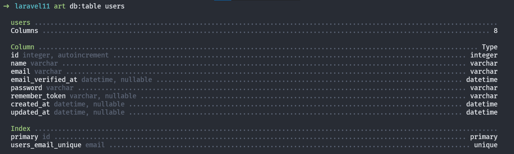

---
prev:
  text: "Courses"
  link: "/Courses/index"
next: false
---

# Mastering Laravel 10 Query Builder, Eloquent and Relationships

## Migrations:

### Column Modifiers:

```php
$col = $table->string('email');

$col->unique(); // Unique column that can't have duplicates

$table->unique(['email', 'username']);
// Define multiple unique columns at once

$table->id()->from(startingValue: 5000);
// Changes the starting value of the autoincrement property.
// Equivalent to `ALTER TABLE tableName AUTO_INCREMENT = 5000;`

$table->bigIncrements('user_id'); // Custom primary key

// Creating a foreign key manually:
$table->unsignedBigInteger('post_id'); // Datatype for the foreign key
$table->foreign('post_id') // Creates a foreign key `post_id`
      ->references('id')->on('posts') // Refers to posts.id
      ->cascadeOnDelete();
// If a record in the parent table is deleted,
// All related records in the child table will also be automatically deleted.

// creating a foreign key (modern way):
$table->foreignId(column: 'post_id', model: Post::class)
// Model is optional (automatically inferred, use it when having weird names).
// Or
$table->foreignId('post_id')->constrained('posts');
// Constrained by default sets up an `ON DELETE CASCADE` constraint.

$col->comment('message');
// Adds a comment to your columns (visible on the database view software).

$col->default('any value'); // Adds a default value to the column

$col->first(); // Change order in the database

$col->nullable(default: true);
// Declares a column as nullable (accept null values)
```

`art migrate:status` => Show the status of each migration.

`art migrate:status --database[=DATABASE]` => The database connection to use.

`art migrate:status --pending` => Only list pending migrations.

`art migrate --pretend` => Dump the SQL queries that **would be run**, it **doesn't actually run**.

`art migrate --force` => Force the operation to run when in production, all data is lost.

`art migrate:reset` => Rollback all database migrations.

`art migrate:rollback` => Rollback the last database migration.

`art migrate:rollback --step[=STEP]` => The number of migrations to be reverted.

`art migrate:fresh` => **Drop all tables** and re-run all migrations.

`art migrate:refresh` => **Reset** (runs the `down()` method of the migration) and re-run all migrations.

`art migrate:refresh --step[=STEP]` => The number of migrations to be reverted & re-run.

`art schema:dump` => Dump the given database schema (exports it to raw SQL).

`art schema:dump --prune` => Delete all existing migration files and replace them with the SQL file.

`art make:migration` => Create a new migration file.

`art make:migration --create[=CREATE]` => The table to be created.

`art make:migration --table[=TABLE]` => The table to migrate.

**Migration naming conventions:**

- adding a column: `add_email_in_users_table`.
- rename a column: `rename_name_to_username_on_users_table`.
- dropping a column: `drop_email_from_users_table`.
- adding a column: `add_email_in_users_table`.

```php
$table->softDeletes(); // Adds `deleted_at` timestamp.

$table->renameColumn(oldname: 'name', newname: 'fullName'); // Rename a column.

$table->dropColumn('col1'); // Drop one column

$table->dropColumn(['votes', 'avatar', 'location']);
// Drop multiple columns by passing an array of column names.

$table->dropSoftDeletes(); // Drop the `deleted_at` column.

$table->dropTimestamps(); // Drop the `created_at` and `updated_at` columns.
```

---

## Factories & Seeders:

**Note:** Utilize seeders for crucial and necessary data, whereas factories should be used for generating fake data for testing purposes.

```php
// inside DatabaseSeeder.php
$this->call(Seeder::class); // run single seeder

$this->call([
	UserSeeder::class,
	PostSeeder::class
]); // run multiple seeders.
```

**Reading data from JSON files:**

```php
// 1. Create a JSON file in `database\json`.
// 2. Name it as the table name e.g. `users.json`.

// 3. Read the file content:
$json = File::get('database/json/users.json'); // Returns the json text

// 4. Convert it, there are two ways:
// First way:
$data = json_decode($json, associative: true);
// Returns an associative array with the content of the file

// Second way:
$data = collect(json_decode($json)); // Convert to collection

// 5. Insert the data:
// First way:
foreach ($data as $item) { // Loop over the associative array
	User::create($item);
}

// Second way:
$data->each(function ($item) { // Loop over the collection with the callback
    User::create([
        "name" => $item->name,
        "email" => $item->email,
        "password" => $item->password,
    ]);
});
```

---

## Query Builder:

`art db:table [<table>]` => Display information about the given database table.

Example:


### Reading Data:

```php
$t = DB::table(table: 'users'); // Specify the table you are working on.

$q1 = $t->select(columns: ["name", "email"]);
// Specify which columns to retrieve default is ["*"] (all columns).

$q1 = $t->get(); // Get the result as an array of rows

$t->select('name as username'); // Changes the output name of the column.

$t->distinct(); // Force the query to only return distinct results.
// if a value is repeated more than once, it will take only the first row
// that contains it.

$q2 = $t->select(['name', 'email']);
$q2->addSelect('password')->get();
// Adds more columns to your SELECT clause of a query.
// You MUST add the `get()` method to the last statement.

$q3 = $t->where(column: "id", value: 2); // where`id` = 2;
// This will select the user of id `1` only.

$q3->first(); // Get the first column that matches this clause.
// Returns an object not an array.

$q3->value(column: 'name'); // Returns a single value from the query.
// Useful when you only need one value from a record.

$q4 = $t->find(id: 1); // searches for a record by its primary key (id).
// Returns an Object.
```

The `pluck()` method is used to retrieve a single column's value from the first result of a query. It takes two arguments the first is the `column` that you want to pluck the second an optional `key` to the values. Returns an array.

`pluck('name')` method output:


`pluck('email', 'name')` method output:


## Creating Data:

```php
$t = DB::table(table: 'users'); // Specify the table you are working on
$data = [
  "name"     => "John Doe",
  "email"    => "JohnDoe@mail.com",
  "password" => "password"
];

$t->insert($data);
// Inserts a new record, timestamps are null. Returns true on success

$t->insertOrIgnore($data);
// Returns the number of affected rows (0 => data exists).
// Allows you to insert data only if it doesn't already exist in the table.

$values = [
  'email'   => 'john.doe@example.com',
  'name'    => 'John Doe updated',
  'revenue' => 1000,
];
$uniqueBy = 'email';
$update = ['name', 'revenue'];

$t->upsert($values, $uniqueBy, $update);
// Insert new records or update the existing ones. Tries to insert first.

$t->insertGetId($data);
// Insert new record and grab its id in a single query.
```

## Updating Data:

```php
$t = DB::table(table: 'users'); // Specify the table you are working on
$q = DB::table('users')->where('id', 2); // Specific row to operate on.

// Finds the user and updates its password field to `newPassword`.
$q->update(["password" => "newPassword"]);
// Returns the number of affected rows (int).

// Insert or update a record matching the attributes, and fill it with values.
// Tries to update first.
$t->updateOrInsert(
  attributes: ['age' => 67],
  values    : [
    "name"    => "new user",
    "email"   => "newest@email.com",
    "revenue" => 5000,
  ]
); // Searches for a row with the given `attributes` (age of 67).
// If it exists update it with the `values` array.
// Else create a new row with the two arrays combined.
```

## Deleting Data:

```php
$t = DB::table(table: 'users'); // Specify the table you are working on
$q = DB::table('users')->where('id', 2); // Specific row to operate on.
```

## Modifiers:

```php
$t = DB::table(table: 'users'); // Specify the table you are working on.
$q = DB::table('users')->where('id', 2); // Specific row to operate on.

$t->where(column: "id", value: 2); // where`id` = 2;
// This will select the user of id `1` only.

$t->where(column: 'age', operator: '<=', value: '18');
// The `where()` method takes three arguments:
// `column` to match.
// Optional `operator` with default value of `==`.
// And a `value` to compare against.

$t->orWhere(column: 'type', value: 'admin');
// Use `orWhere()` method to match multiple records at once. Order matters.
// Always put where clause at the top of the query.

// The increment() and decrement() methods are used to increment or decrement
// The value of a column by a given amount, default 1.
$t->increment(column: 'age'); // Increments the `age` column by one
$t->decrement(column: 'revenue', amount: 1000); // Decrements the `revenue` column by 1000.

$q->incrementEach(['age' => 2, 'revenue' => 50]);
// Increment the given column's values by the given amounts.
```

---

## Collections:

`Collection` class provides a fluent, convenient wrapper for working with arrays of data. the `Collection` class allows you to chain its methods to perform fluent mapping and reducing of the underlying array. In general, collections are immutable, meaning every `Collection` method returns an entirely new `Collection` instance.

the `collect` helper to create a new collection instance from the given data:

```php
$collection = collect(['taylor', 'abigail']);
// Creates a collection instance from the given value.
```

The `each` method iterates over the items in the collection and passes each item to a closure:

```php
$collection = collect([1, 2, 3, 4]); 

$collection->each(function (int $item, int $key) {
	// actual functionality...
});
```

---

## Miscellaneous:

`art db:show` => Shows current database information.

`art db:show --database=db_type` => Shows info about specific database, useful when having multiple db connections. db type can be MySQL, SQLite, etc.

`art tinker` => Interact with your application, runs a REPL interface to do database operations.

```php
env(key: 'APP_NAME', default: "Laravel");
// Helper function that retrieves the value of an environment variable
// Or returns a default value if given.

Str::slug(title: "John Doe", separator: '-'); // Returns john-doe.
// Generate a URL friendly "slug" from a given string.
// Default `separator` is '-'.
```
